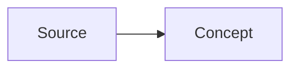

# Personal LLM Wiki

这是一个由 LLM 维护的个人 wiki。核心规则很简单：`raw/` 保存不可变的 source material；`wiki/` 保存由 Codex 维护的、经过编译和互链的 knowledge layer。

## Directory Layout

```text
raw/                 # 原始 source files。ingest 之后不要编辑。
wiki/
  index.md           # 所有 wiki pages 的目录。
  log.md             # append-only operation history。
  overview.md        # 跨 source 的 living synthesis。
  sources/           # 每个已 ingest source 一页。
  entities/          # 人物、组织、项目、产品等 entities。
  concepts/          # ideas、methods、themes、frameworks。
  syntheses/         # 保存过的重要 query answers、distill summaries、learning scaffolds。
graph/               # 可选的 generated graph artifacts。
  extracts/          # 从 PDF/HTML/Markdown 生成的可再生阅读缓存。
tools/               # deterministic helper scripts，不代替 agent synthesis。
```

## Core Rules

- 把 `raw/` 当作 read-only evidence。不要 rewrite、in-place summarize 或清理 source files。
- `raw/` 优先保存 canonical source：官方 PDF、官方 HTML capture、repo README/metadata snapshot 等。不要把 LLM 生成摘要或 extraction cache 放进 `raw/`。
- `graph/extracts/` 保存可再生的 reading cache，例如 PDF text extraction、HTML text extraction、Markdown normalized text。extract 可以重建，不作为 canonical evidence。
- 把 `wiki/` 当作 agent-owned layer。内容要 concise、linked、current。
- `wiki/` 中每个 non-obvious claim 都应该能追溯到某个 source page。
- 内部引用使用 `[[WikiLinks]]`。
- 只要 wiki content 发生变化，就同步更新 `wiki/index.md` 和 `wiki/log.md`。
- 优先写小而稳定的 Markdown pages，不要把重要知识只留在长聊天回复里。
- 除非用户明确要求，不要添加 dependencies 或 automation。

## Publishing Workflow

- `wiki/` 是唯一 content source，同时服务 Obsidian、Codex 和 Quartz。
- 用 Obsidian 打开 `wiki/`，不要把 repo root 当作 vault。
- Quartz 作为 publishing layer 接在 repo root；不要把 `wiki/` 内容复制到 `content/`。
- 本地预览：`npm run wiki:preview`。
- 生产构建：`npm run wiki:build`，输出到 `public/`。
- GitHub Pages 使用 `.github/workflows/deploy.yml`，从 `main` 分支运行 `npm run wiki:build`。
- 运行 Quartz 命令时必须显式指定 `-d wiki`，避免默认读取不存在或过期的 `content/`。

## Language Style

- `wiki/` 的默认写作语言是简体中文。
- 使用 hybrid style：解释、判断、synthesis 用中文；专业术语、论文术语、tool names、algorithm names 和代码相关名词保留英文，例如 `rigid contact`、`NCP`、`PGS`、`differentiable physics`。
- 专业术语第一次出现时优先写成“English term（中文解释）”，之后可直接使用英文术语。
- Source titles、paper titles、direct quotes 和专有名词保持原文；必要时在旁边补充中文解释。
- 文件名、slugs、frontmatter 字段名、`type` 枚举值和 `[[WikiLinks]]` target 保持稳定，不要为了翻译而 rename 页面，除非用户明确要求。
- Obsidian 展示文本可以用 alias，例如 `[[ContactSolvers|contact solvers（接触求解器）]]`。
- Query answers 默认用中文回答，并使用 `[[WikiLinks]]` 作为 citations。

## Markdown Formatting

- 普通 prose 不做 hard wrap：一个自然段写成一行，让 Obsidian、Quartz 和 browser 自己换行。
- 保留 Markdown 结构性换行：frontmatter、headings、lists、tables、block quotes、code fences、Mermaid blocks、LaTeX display blocks。
- 列表项尽量一条 item 一行；只有嵌套列表、代码块、表格或可读性确实需要时才手动断行。
- 不要为了 80/100 column width 主动拆中文段落。中文/hybrid 文档的编辑体验优先于终端定宽排版。
- Quartz 当前通过 `remark-math` + KaTeX 渲染公式；inline math 使用 `$...$`，display math 使用 `$$...$$`。不要使用 `\(...\)` 或 `\[...\]`，它们在发布构建中不会被解析为公式。
- `raw/` 保持原样，不做 reflow。

## Depth Standard

- 默认知识解析不能停留在摘要层。对 math-heavy、simulation、robotics、optimization、ML、systems 相关 sources，必须补充可复习的 mechanism-level explanation。
- Concept pages 应优先包含：
  - `## 数学结构`：核心 variables、constraints、objective、residual 或 update rule。
  - `## 直觉`：用中文解释公式在系统里控制什么、放松了什么、牺牲了什么。
  - `## Failure Modes`：列出 source 支持的 failure modes，不做无证据扩展。
  - `## 实践含义`：说明对 MPC、RL、differentiable optimization、sim-to-real 等工作流的影响。
- Source pages 负责记录 evidence、claims、quotes 和 source-specific conclusions；deeper derivation 应放到 concept pages，并从 source page 链接过去。
- 数学表达优先使用 LaTeX；变量第一次出现时必须说明含义，例如 gap、normal force、tangential force、velocity、residual、dual variable。
- 当一个概念涉及 pipeline、taxonomy、causal chain 或 architecture 时，优先添加 Mermaid diagrams。图应解释结构，不要装饰性作图。
- Mermaid diagrams 应保持 Obsidian/Quartz 兼容，使用 fenced code block：

````markdown

````

- 图表也要有文字解释：图说明结构，正文说明 assumptions、tradeoffs 和 consequences。

## Page Frontmatter

wiki pages 使用这个 frontmatter：

```yaml
---
title: "Human Readable Title"
type: source | entity | concept | synthesis
tags: []
sources: []
last_updated: YYYY-MM-DD
---
```

source pages 还要包含：

```yaml
source_file: raw/path/to/source.md
source_kind: pdf | html | repo | image | office | audio | markdown | unknown
source_url: https://...
extracted_text: graph/extracts/path.md
source_date: YYYY-MM-DD | unknown
```

`source_file` 指 canonical evidence；`extracted_text` 是 optional Markdown reading cache。PDF、HTML、Office、image/audio 或编码不稳定的 source ingest 时，应优先用 MarkItDown 生成并记录 `extracted_text`，但 claims 仍追溯到 source page 与 canonical source。

## Ingest Workflow

触发方式：`ingest <path>`，或用户要求把 source 加入 wiki。

1. 完整阅读 source file。
2. 若 source 不是稳定的 UTF-8 Markdown，先运行 `uv run python tools/extract_source.py <path>` 生成 `graph/extracts/` Markdown reading cache。该 tool 使用 MarkItDown，支持 PDF、HTML、Office docs、images/OCR、audio transcription 等格式；需要 plugins 或 image LLM descriptions 时用 `--use-plugins`、`--llm-model` 或对应环境变量。
3. 阅读 `wiki/index.md` 和 `wiki/overview.md`。
4. 创建 `wiki/sources/<slug>.md`，包含摘要、核心主张、有用 quotes、links 和开放问题。
5. 创建或更新 `wiki/entities/` 与 `wiki/concepts/` 中的相关页面。
6. 只有当新 source 改变 broader synthesis 时，才更新 `wiki/overview.md`。
7. 把所有新增或变更页面加入 `wiki/index.md`。
8. 在 `wiki/log.md` 追加条目，格式为：`## [YYYY-MM-DD] ingest | Source Title`
9. 运行 `python3 tools/health.py` 或等价确定性检查。
10. 报告 changed files、contradictions，以及值得补充的 follow-up sources。

source page body 默认使用中文 heading：

```markdown
## 摘要

## 核心主张

## 关键引文

## 关联

## 开放问题
```

## Query Workflow

触发方式：`query: <question>`，或用户要求 ask the wiki。

1. 阅读 `wiki/index.md`。
2. 选择并阅读最小相关集合的 wiki pages。
3. 用中文/hybrid style 回答，并使用 `[[WikiLinks]]` 作为 citations。
4. 如果答案以后可能复用，询问是否保存到 `wiki/syntheses/<slug>.md`。
5. 如果保存，同步更新 `wiki/index.md`，并在 `wiki/log.md` 追加 `query` 条目。

## Distill Workflow

触发方式：`distill`、`distill this`、`把刚才讨论沉淀进 wiki`，或用户明确要求把对话中的洞见、判断、假设、研究路线或框架整合进知识库。

`distill` 的输入是当前对话，不是 external canonical source。它用于把 conversation-derived knowledge 编译进 `wiki/`，同时明确 evidence boundary，避免把讨论中的想法伪装成 source-backed claim。

1. 回顾当前对话，提取有长期价值的信息：新概念或已有概念的澄清、研究判断、假设、decision rationale、framework/taxonomy、open questions、follow-up source candidates。
2. 阅读 `wiki/index.md`、`wiki/overview.md` 和最小相关集合的 wiki pages。
3. 将提炼结果分成三类：
   - `source-backed`：已有 wiki source 支持的判断，必须链接到相关 source/concept page。
   - `conversation-derived`：来自本次讨论的框架、偏好、解释或 meta-level 判断，不能写成外部证据结论。
   - `hypothesis`：值得保留但仍需外部 source 验证的想法，优先进入 open questions 或 follow-up sources。
4. 根据内容写入合适位置：
   - 稳定研究判断：更新相关 `wiki/concepts/`、`wiki/syntheses/` 或 `wiki/overview.md`。
   - 可复用讨论结果：新建 `wiki/syntheses/<slug>.md`。
   - 待验证方向：更新 `wiki/syntheses/research-questions.md` 或目标 synthesis 的 `开放问题` / `Follow-up Sources` 部分。
5. 新建或更新一个 distillation 摘要页，通常放在 `wiki/syntheses/`：
   - frontmatter 使用 `type: synthesis` 与 `tags: [distill]`。
   - `sources:` 只填已有 wiki source links；不要把 conversation 当作 source。
   - body 默认包含 `## 讨论背景`、`## 提炼结果`、`## Evidence Boundaries`、`## 写入位置`、`## Follow-up Sources`。
6. 同步更新 `wiki/index.md`。
7. 在 `wiki/log.md` 追加条目，格式为：`## [YYYY-MM-DD] distill | <Title>`。
8. 运行 `python3 tools/health.py` 或等价确定性检查。
9. 报告 changed files、`source-backed` / `conversation-derived` / `hypothesis` 分类，以及值得后续 ingest 的 source 类型。

推荐在 distill synthesis 中使用简短表格：

```markdown
| Insight | Evidence Level | Wiki Target |
| --- | --- | --- |
| ... | source-backed / conversation-derived / hypothesis | ... |
```

## Learn Workflow

触发方式：`learn <topic>`、`系统学习 <topic>`，或用户希望 wiki 帮助理解一个当前没有明确 source 的主题，例如 `learn MPC and RL`。

`learn` 的目标是从 unknown topic 启动学习，生成 learning scaffold（学习脚手架）和后续 source plan；它不是 ingest，不应创建 `wiki/sources/` 页面，也不应把 LLM explanation 写成 source-backed claim。

1. 阅读 `wiki/index.md`、`wiki/overview.md` 和最小相关集合的 wiki pages。
2. 判断当前 wiki 是否已有相关 source-backed coverage；如果没有，明确说明当前回答主要是 `conversation-derived` / `unsourced learning scaffold`。
3. 用中文/hybrid style 生成学习脚手架，优先包含：
   - topic boundary：这个主题包含什么、不包含什么。
   - prerequisite map：需要先理解的数学、系统或工程概念。
   - core concepts：核心概念、变量、对象和常见 notation。
   - mechanism-level explanation：核心机制、公式直觉、pipeline 或算法 loop。
   - misconception map：常见误解和概念混淆。
   - practice hooks：和当前 wiki 主题、用户研究方向或工程任务的连接。
4. 对所有非 wiki-source 支持的解释标注为 `conversation-derived` 或 `unsourced learning note`；不要把它们写成 external evidence。
5. 产出 Source Acquisition Plan，列出值得后续 `source <topic>` 或 `ingest` 的资料类型，例如 textbook chapters、lecture notes、survey papers、seminal papers、implementation docs、tutorial repos。
6. 如果 learning scaffold 以后可能复用，询问是否保存到 `wiki/syntheses/<slug>-learning-map.md`；如果保存，frontmatter 使用 `type: synthesis`、`tags: [learn]`，`sources:` 只填已有 wiki source links。
7. 保存时同步更新 `wiki/index.md`，并在 `wiki/log.md` 追加条目，格式为：`## [YYYY-MM-DD] learn | <Topic>`。
8. 保存后运行 `python3 tools/health.py` 或等价确定性检查。

learning scaffold 不进入 `raw/`。如果后续找到 canonical external source，必须通过 `ingest` 才能升级为 source-backed wiki knowledge。

## Source Workflow

触发方式：`source <topic>`、`find sources for <topic>`、`sources for <topic>`、`learn <topic> --with-sources`，或用户要求 wiki 帮忙搜集某个学习主题的资料来源。

`source` 的目标是建立候选 source 清单和 ingest priority；它不直接生成知识结论。只有用户选定资料并执行 `ingest` 后，才创建 `wiki/sources/` 页面。

1. 阅读 `wiki/index.md`、`wiki/overview.md` 和相关 pages，确认当前 wiki 已有哪些 source-backed coverage 与缺口。
2. 如果用户要求联网搜集，或 topic 依赖最新资料，使用 web search；优先官方课程、教材、经典论文、survey papers、作者/机构主页、官方 docs、维护良好的 repo。避免把 SEO 内容、二手摘要或低可信博客作为优先 source。
3. 对候选资料按用途分类：
   - `intro`：入门解释和 intuition。
   - `mathematical`：定义、定理、推导、notation。
   - `implementation`：代码、API、工程实践、tutorial repo。
   - `survey`：taxonomy、历史脉络、open problems。
   - `seminal`：奠基论文或领域内高影响 source。
4. 对每个候选 source 记录 title、URL/path、source kind、推荐理由、适合的学习阶段、是否建议 ingest。
5. 给出 ingest priority：哪些资料最应该先进入 `raw/` 并执行 `ingest`，哪些只适合作为背景阅读。
6. 如果用户要求保存 source plan，创建或更新 `wiki/syntheses/<slug>-source-plan.md`，frontmatter 使用 `type: synthesis`、`tags: [source-plan]`，并把候选资料作为 follow-up ingest queue，而不是 source-backed claims。
7. 保存时同步更新 `wiki/index.md`，并在 `wiki/log.md` 追加条目，格式为：`## [YYYY-MM-DD] source | <Topic>`。
8. 保存后运行 `python3 tools/health.py` 或等价确定性检查。

`source` 可以推荐 source，但不能替代 `ingest`。不要把候选 source 的内容直接写入 concepts，除非已经完成对应 source 的 ingest。

## Health Workflow

触发方式：`health`。

优先运行：

```bash
uv run python tools/health.py
```

确定性检查：

- Broken `[[WikiLinks]]`。
- 没有登记到 `wiki/index.md` 的 wiki pages。
- `wiki/index.md` 中指向 missing files 的 links。
- 缺少对应 ingest entry 的 source pages。
- source page frontmatter 中 `source_file` / `extracted_text` 指向 missing artifacts。

除非用户要求修复，否则只报告 findings，不编辑。

## Lint Workflow

触发方式：`lint`。

检查内容质量：

- 没有 inbound links 的 orphan pages。
- outbound links 太少的 sparse pages。
- sources 之间的 contradictions。
- stale 的 overview、entity 或 concept pages。
- 值得单独建页的重要 recurring topics。

做 broad rewrites 前先询问用户。

## Graph Workflow

触发方式：`build graph`。

运行：

```bash
uv run python tools/build_graph.py --report
```

当前 graph tool 是 deterministic v1：只解析显式 `[[WikiLinks]]`，生成 `graph/graph.json`、`graph/graph.html` 和可选 `graph/graph-report.md`。不要自动创建 broken-link target pages；missing targets 只报告。

## Naming

- Source slugs 使用 `kebab-case`。
- Entity 和 concept pages 使用 `TitleCase.md`。
- Synthesis slugs 使用 `kebab-case`。
- filenames 可以紧凑，但 titles 要 human-readable。
