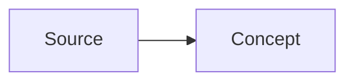

# Personal LLM Wiki

这是一个由 LLM 维护的个人 wiki。核心规则很简单：`raw/` 保存不可变的 source material；`wiki/` 保存由 Codex 维护的、经过编译和互链的 knowledge layer。

## Directory Layout

```text
raw/                 # 原始 source files。ingest 之后不要编辑。
wiki/
  index.md           # 所有 wiki pages 的目录。
  log.md             # append-only operation history。
  overview.md        # 跨 source 的 living synthesis。
  sources/           # 每个已 ingest source 一页。
  entities/          # 人物、组织、项目、产品等 entities。
  concepts/          # ideas、methods、themes、frameworks。
  syntheses/         # 保存过的重要 query answers。
graph/               # 可选的 generated graph artifacts。
```

## Core Rules

- 把 `raw/` 当作 read-only evidence。不要 rewrite、in-place summarize 或清理 source files。
- 把 `wiki/` 当作 agent-owned layer。内容要 concise、linked、current。
- `wiki/` 中每个 non-obvious claim 都应该能追溯到某个 source page。
- 内部引用使用 `[[WikiLinks]]`。
- 只要 wiki content 发生变化，就同步更新 `wiki/index.md` 和 `wiki/log.md`。
- 优先写小而稳定的 Markdown pages，不要把重要知识只留在长聊天回复里。
- 除非用户明确要求，不要添加 dependencies 或 automation。

## Publishing Workflow

- `wiki/` 是唯一 content source，同时服务 Obsidian、Codex 和 Quartz。
- 用 Obsidian 打开 `wiki/`，不要把 repo root 当作 vault。
- Quartz 作为 publishing layer 接在 repo root；不要把 `wiki/` 内容复制到 `content/`。
- 本地预览：`npm run wiki:preview`。
- 生产构建：`npm run wiki:build`，输出到 `public/`。
- GitHub Pages 使用 `.github/workflows/deploy.yml`，从 `main` 分支运行 `npm run wiki:build`。
- 运行 Quartz 命令时必须显式指定 `-d wiki`，避免默认读取不存在或过期的 `content/`。

## Language Style

- `wiki/` 的默认写作语言是简体中文。
- 使用 hybrid style：解释、判断、synthesis 用中文；专业术语、论文术语、tool names、algorithm names 和代码相关名词保留英文，例如 `rigid contact`、`NCP`、`PGS`、`differentiable physics`。
- 专业术语第一次出现时优先写成“English term（中文解释）”，之后可直接使用英文术语。
- Source titles、paper titles、direct quotes 和专有名词保持原文；必要时在旁边补充中文解释。
- 文件名、slugs、frontmatter 字段名、`type` 枚举值和 `[[WikiLinks]]` target 保持稳定，不要为了翻译而 rename 页面，除非用户明确要求。
- Obsidian 展示文本可以用 alias，例如 `[[ContactSolvers|contact solvers（接触求解器）]]`。
- Query answers 默认用中文回答，并使用 `[[WikiLinks]]` 作为 citations。

## Markdown Formatting

- 普通 prose 不做 hard wrap：一个自然段写成一行，让 Obsidian、Quartz 和 browser 自己换行。
- 保留 Markdown 结构性换行：frontmatter、headings、lists、tables、block quotes、code fences、Mermaid blocks、LaTeX display blocks。
- 列表项尽量一条 item 一行；只有嵌套列表、代码块、表格或可读性确实需要时才手动断行。
- 不要为了 80/100 column width 主动拆中文段落。中文/hybrid 文档的编辑体验优先于终端定宽排版。
- `raw/` 保持原样，不做 reflow。

## Depth Standard

- 默认知识解析不能停留在摘要层。对 math-heavy、simulation、robotics、optimization、ML、systems 相关 sources，必须补充可复习的 mechanism-level explanation。
- Concept pages 应优先包含：
  - `## 数学结构`：核心 variables、constraints、objective、residual 或 update rule。
  - `## 直觉`：用中文解释公式在系统里控制什么、放松了什么、牺牲了什么。
  - `## Failure Modes`：列出 source 支持的 failure modes，不做无证据扩展。
  - `## 实践含义`：说明对 MPC、RL、differentiable optimization、sim-to-real 等工作流的影响。
- Source pages 负责记录 evidence、claims、quotes 和 source-specific conclusions；deeper derivation 应放到 concept pages，并从 source page 链接过去。
- 数学表达优先使用 LaTeX；变量第一次出现时必须说明含义，例如 gap、normal force、tangential force、velocity、residual、dual variable。
- 当一个概念涉及 pipeline、taxonomy、causal chain 或 architecture 时，优先添加 Mermaid diagrams。图应解释结构，不要装饰性作图。
- Mermaid diagrams 应保持 Obsidian/Quartz 兼容，使用 fenced code block：

````markdown

````

- 图表也要有文字解释：图说明结构，正文说明 assumptions、tradeoffs 和 consequences。

## Page Frontmatter

wiki pages 使用这个 frontmatter：

```yaml
---
title: "Human Readable Title"
type: source | entity | concept | synthesis
tags: []
sources: []
last_updated: YYYY-MM-DD
---
```

source pages 还要包含：

```yaml
source_file: raw/path/to/source.md
source_date: YYYY-MM-DD | unknown
```

## Ingest Workflow

触发方式：`ingest <path>`，或用户要求把 source 加入 wiki。

1. 完整阅读 source file。
2. 阅读 `wiki/index.md` 和 `wiki/overview.md`。
3. 创建 `wiki/sources/<slug>.md`，包含摘要、核心主张、有用 quotes、links 和开放问题。
4. 创建或更新 `wiki/entities/` 与 `wiki/concepts/` 中的相关页面。
5. 只有当新 source 改变 broader synthesis 时，才更新 `wiki/overview.md`。
6. 把所有新增或变更页面加入 `wiki/index.md`。
7. 在 `wiki/log.md` 追加条目，格式为：`## [YYYY-MM-DD] ingest | Source Title`
8. 报告 changed files、contradictions，以及值得补充的 follow-up sources。

source page body 默认使用中文 heading：

```markdown
## 摘要

## 核心主张

## 关键引文

## 关联

## 开放问题
```

## Query Workflow

触发方式：`query: <question>`，或用户要求 ask the wiki。

1. 阅读 `wiki/index.md`。
2. 选择并阅读最小相关集合的 wiki pages。
3. 用中文/hybrid style 回答，并使用 `[[WikiLinks]]` 作为 citations。
4. 如果答案以后可能复用，询问是否保存到 `wiki/syntheses/<slug>.md`。
5. 如果保存，同步更新 `wiki/index.md`，并在 `wiki/log.md` 追加 `query` 条目。

## Health Workflow

触发方式：`health`。

确定性检查：

- Broken `[[WikiLinks]]`。
- 没有登记到 `wiki/index.md` 的 wiki pages。
- `wiki/index.md` 中指向 missing files 的 links。
- 缺少对应 ingest entry 的 source pages。

除非用户要求修复，否则只报告 findings，不编辑。

## Lint Workflow

触发方式：`lint`。

检查内容质量：

- 没有 inbound links 的 orphan pages。
- outbound links 太少的 sparse pages。
- sources 之间的 contradictions。
- stale 的 overview、entity 或 concept pages。
- 值得单独建页的重要 recurring topics。

做 broad rewrites 前先询问用户。

## Naming

- Source slugs 使用 `kebab-case`。
- Entity 和 concept pages 使用 `TitleCase.md`。
- Synthesis slugs 使用 `kebab-case`。
- filenames 可以紧凑，但 titles 要 human-readable。
