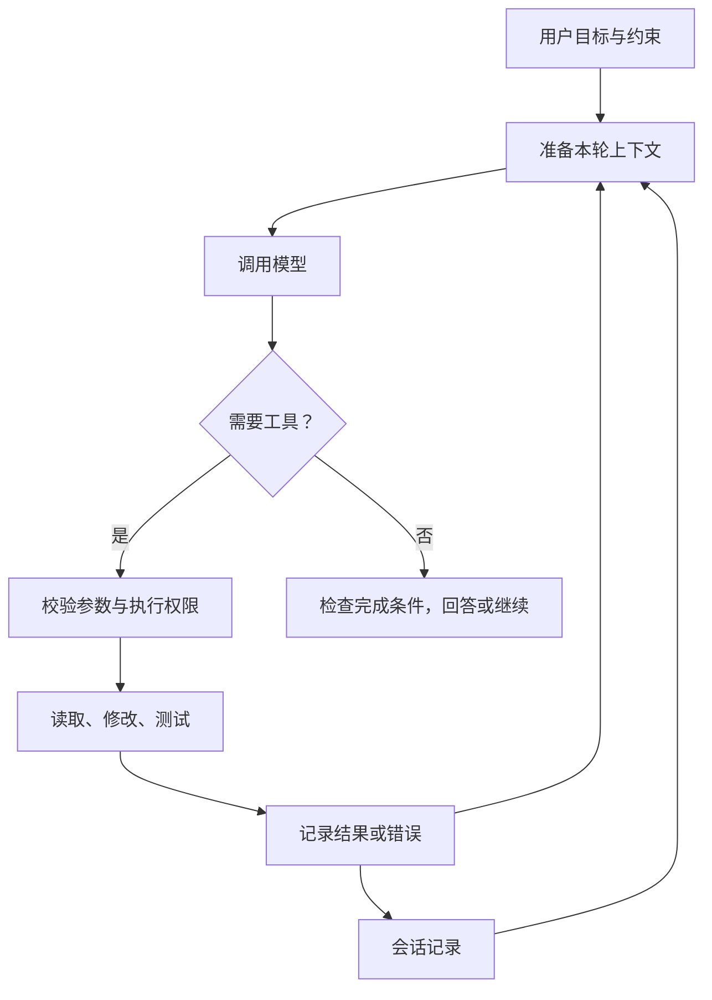

# Agent Harness

**Agent Harness 是围绕模型组织实际工作的程序：准备输入、执行工具、保存状态，并决定什么时候继续或停止。** 模型生成下一步建议，harness 把建议接到具体操作与反馈上。这个用法来自 [[deepseek-harness|DSH]]、[[pi-agent-harness|pi]] 与 [[anthropic-managed-agents|Anthropic]] 的实现／架构说明；各项目的边界并不完全一致，本页给出便于比较的共同解释。

## 先跟完一次完整工作

假设用户说：“找到测试失败原因，修复，再验证。”下面是教学例子，不是某个框架的实际运行记录。

模型第一次请求读取文件，工具返回内容；模型据此提出修改，执行器完成修改；模型再请求测试，并根据结果决定是否继续。关键不在于调用了多少次模型，而在于每次动作是否有可识别的结果，下一次请求是否包含必要信息，结束时是否有对应验收证据。[[pi-agent-harness|pi 的循环]]、[[opencode-harness|OpenCode 的停止条件]]分别展示这条链的实际处理方式。

工具失败也应成为反馈。文件不存在、参数不合法、权限拒绝、进程中断是不同情况：重新生成参数可能解决第一类输入问题，却不会自动解决缺少权限或执行环境不可用。框架需要保留错误的类别与执行状态，否则模型可能只会反复尝试同一动作。[[deepseek-harness|DSH 的工具结果与沙箱错误]]

## 最重要的区别：历史、上下文、执行状态

| 对象 | 回答的问题 | 例子 |
| --- | --- | --- |
| 会话历史 | 之前发生了什么？ | 用户输入、工具调用、完整输出、错误、摘要记录 |
| 模型上下文 | 这一次模型实际看到了什么？ | 指令、近期对话、摘要、选中的工具结果 |
| 执行状态 | 现在做到哪一步，下一步由谁执行？ | 正在等哪个工具、待处理输入、下一节点、已提交结果 |

三者可以共享存储，但不能混成同一个概念。DSH 从事件导出模型消息，pi 的会话分支和 context edit 改变模型可见内容，LangGraph 的检查点还保存下一批节点。**有聊天记录不意味着能接着执行；能显示流式文字也不意味着文字已落盘。** [[deepseek-harness]]、[[pi-agent-harness]]、[[langgraph-persistence]]

再加上工作区就更容易看出边界：历史里记录“启动了测试”，不代表重启进程后那个测试仍在运行；历史里记录“修改成功”，也不代表切换到另一台机器还能找到同一份文件。[[anthropic-managed-agents|会话、驱动和执行环境的分离]]提供架构视角，[[agentsserver|AgentsServer]] 则说明客户端如何重新取得后端事件。

## 上下文有限，怎样继续理解任务

一次请求要同时容纳指令、输入历史和输出预留。作为教学记账方式，设窗口上限为 $W$，本轮输入 token 数为 $I$，预留输出为 $R$，应让 $I+R\leq W$；实际计数与提供方限制还需要具体适配。pi 的自动压缩就按输入估算量和预留量判断是否接近窗口边界。[[pi-agent-harness|Compaction]]

常见处理是删去本轮不需要的长输出、为旧阶段生成摘要、保留近期完整交互。压缩应保留目标、约束、已做决定、失败证据和下一步所需信息。它减少的是本轮输入，不应被误认为原历史自然消失；DSH 和 pi 都为摘要／替换另记条目。[[deepseek-harness]]、[[pi-agent-harness]]

**教学例子：**“测试失败，继续修复”太模糊；“修改了配置 A，测试 B 仍因超时失败，尚未检查 C；用户要求不改公共接口”更有利于接续。后者仍是有损摘要，精确错误输出应能按记录重新读取。长期任务还需要可检查的完成标准，不能只靠模型记得自己想做什么。[[anthropic-long-running-harness]]

## 工具调用不是一段任意字符串

一个可管理的工具调用至少要能关联名称、参数、调用标识、完成结果与错误。模型看到的工具声明不等于工具已有执行权限；策略检查回答“是否允许”，执行隔离回答“实际能触碰哪些资源”。pi 的钩子、DSH 的审批和进程沙箱处在不同层，不能互相替代。[[pi-agent-harness]]、[[deepseek-harness]]

并行也有三个顺序：模型提出的顺序、工具实际完成的顺序、结果写入上下文的顺序。两个独立文件的读取可以重叠；同一文件的修改和依赖该修改的测试应保持先后。DSH 的屏障和 pi 的批次串行覆盖都提供调度手段，但依赖仍需要正确声明和使用。

## 中断后继续，为什么比保存 JSON 难

最容易出错的是操作与记录之间的空隙：外部修改已成功，程序在保存结果前崩溃。重启只看到“尚未完成”，直接重试可能重复操作。检查点保证的范围是其保存的状态，不能自动覆盖外部系统。[[langgraph-persistence|检查点与重放]]、[[pi-agent-harness|pi-durable 工具恢复]]

**我们的工程解释：**读取通常可重试；有副作用的操作应提供去重标识、先查询实际结果，或在结果不明时报告中断。不要仅因为函数名字像“保存”就将其标成 replay-safe。进程、数据库和外部服务是否共同提交，要另行验证。

取消也不等于撤销：停止下一轮模型请求、终止工具进程、取消子任务、回滚已写文件，是不同动作。框架的所有权和清理机制只覆盖它明确管理的部分；对其余效果应保留已知状态与不确定性。

## 扩展时先找真正需要改变的地方

| 想改变什么 | 优先修改的位置 |
| --- | --- |
| 换模型或提供方 | 模型适配与请求转换 |
| 增加一项操作 | 工具定义与执行实现 |
| 注入资料、压缩旧消息 | 上下文构造与会话投影 |
| 审批、限额、记录开销 | 明确的前后处理位置与执行边界 |
| 长时间等待后继续 | 持久任务或图状态 |
| 接入另一种 UI | 会话查询与事件订阅 |

这是依据几个实现整理的设计建议，不是要求每个项目都建立六层抽象。DSH 把替换能力系统化成插件和服务；pi 核心提供循环钩子，实验持久包另提供任务与存储；LangGraph 显式描述状态转换。选择依据应是任务失败在哪里，而不是组件更多看起来更完整。具体比较与可动手验证的问题见 [[topics/agent-execution|Agent Systems]]。
