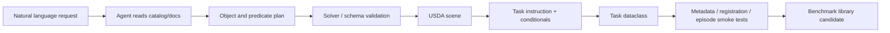

# Agentic Scene/Task Generation

Agentic scene/task generation（agentic 场景/任务生成）指用 LLM/code agent 把自然语言需求转成可运行 simulation artifacts，同时用 catalog、predicate solver、schema、validation 和 duplicate checks 约束生成结果。[[RoboLab]] repo 的 `/robolab-scenegen` 与 `/robolab-taskgen` Claude Code skills 是一个 concrete example：scene generation 生成 USDA scene，task generation 生成 `Task` dataclass；两者共同服务于可扩展 benchmark task library。

## 数学结构

一个 generation workflow 可以写成 constrained synthesis problem：

$$
\hat{a} = \arg\max_a P_\theta(a \mid u, C) \quad \text{s.t.} \quad V(a)=1,
$$

其中 $u$ 是 user natural language prompt，$C$ 是 source context（object catalog、scene format、conditional reference、existing tasks），$a$ 是 artifact（scene file 或 task file），$V(a)$ 是 validation predicate。对 scene generation，artifact 可以拆成 object selection $O$、predicate set $P$ 和 placement solution $X$：

$$
(O,P) = f_\theta(u,C), \quad X = \mathrm{Solve}(O,P), \quad V_{scene}(O,P,X)=\mathbb{1}[\text{collision-free and format-valid}].
$$

对 task generation，artifact 是：

$$
T=(S,L,G,H,A,Q),
$$

其中 $S$ 是 scene，$L$ 是 instruction variants，$G$ 是 success/termination conditions，$H$ 是 horizon，$A$ 是 attributes/tags，$Q$ 是 optional subtasks。Validation 包括 duplicate task class check、object names matching scene prims、conditional signatures、dataclass mutable-default hazards、metadata regeneration 和 environment registration tests。

## 直觉

LLM 生成 robotics scene/task 的难点不是写文本，而是让文本落到 simulator 的 hard constraints 上。RoboLab 的 scene skill 要求先读 object catalog，使用 exact object names，把 natural language spatial relations 编译成 predicates，再用 solver 找 collision-free placement；task skill 要求 scene 已存在、object names 对齐 prim names、成功条件显式映射到 conditional function、instruction variants 分清 default/vague/specific。这些约束把 “AI-generated scene” 从 freestyle content 变成可验证 artifact。

这类 workflow 应该属于 [[RoboticsSimulationInfrastructure|simulation infrastructure]]，因为它改变 benchmark 扩展成本和 failure surface。更低的 authoring cost 可以扩大 task library，但也引入 LLM bias、predicate expressivity limit 和 validation blind spots。它不能替代 human benchmark design；更像是把 human intent 转成 initial artifact，再通过 solver/test/review gates 筛选。

[[embodiedgen-v2-an-agentic-simulation-ready-3d-world-engine-for-embodied-ai|EmbodiedGen V2]] 把这个模式扩展到完整 simulation-ready world。它先把 task 分解成 scene requirements 和 functional roles（robot、background、context、manipulated object、distractor），再用 support relations、pairwise IoU、reachability、SAPIEN settling 和 task affordance checks 筛选布局；stateful vibe coding 还要求每次 edit 保持 persistent world state，并让失败操作保持 atomic、不能部分修改场景。这个 case 说明 agentic authoring 的核心 artifact 不只是生成代码或 USD 文件，而是 `world state + constraints + executable validation + edit transaction semantics`。

## Failure Modes

- Catalog mismatch：LLM 选中的 object name 不在 catalog 或与 USD prim name 不一致，导致 scene/task 无法运行。
- Predicate under-specification：自然语言中隐含的 spatial/containment/order constraints 没有被转成 predicates，solver 可能生成语义不符但 collision-free 的 scene。
- Solver feasibility failure：object count、dimensions 或 constraints 使 placement infeasible，需要减少 objects 或调整 predicates。
- Validation myopia：scene format 与 task dataclass 通过了，但 task semantic 仍可能不公平、过于 trivial、过于 ambiguous 或偏离 benchmark axis。
- Benchmark bias amplification：如果 LLM 倾向生成常见 object/relations，新 tasks 可能扩大数量但不扩大 true OOD coverage。
- Governance gap：自动生成 artifacts 需要 metadata、review、duplicate checks 和 possible community submission policy，否则 benchmark evolution 难以追溯。

## 实践含义

- 对 task-library expansion，agentic generation 应输出 artifact + validation evidence + rationale，而不是只提交 `.usda` 或 `.py` 文件。
- 对 [[TaskGeneralistPolicyEvaluation|task-generalist evaluation]]，LLM-generated tasks 必须标注 competency axis、difficulty、object distribution 和 instruction variants，才能避免把 benchmark 变成 unstructured prompt set。
- 对 [[SimulationBenchmarkReportingPipeline|reporting pipeline]]，generated tasks 需要 metadata regeneration 才能进入 dashboard、analysis grouping 和 confidence-interval reporting。
- 对 [[SimulationRealityGap|sim-to-real]]，agentic scene/task generation 可以提高 coverage，但不能证明 real-world transfer；仍需要 physics/rendering/contact validity 和 real-robot checks。

相关页面：[[nvlabs-robolab]]、[[RoboLab]]、[[EmbodiedGen]]、[[SimulationReady3DWorldGeneration]]、[[RoboticsSimulationInfrastructure]]、[[TaskGeneralistPolicyEvaluation]]、[[SimulationBenchmarkReportingPipeline]]、[[SimulationRealityGap]]。
