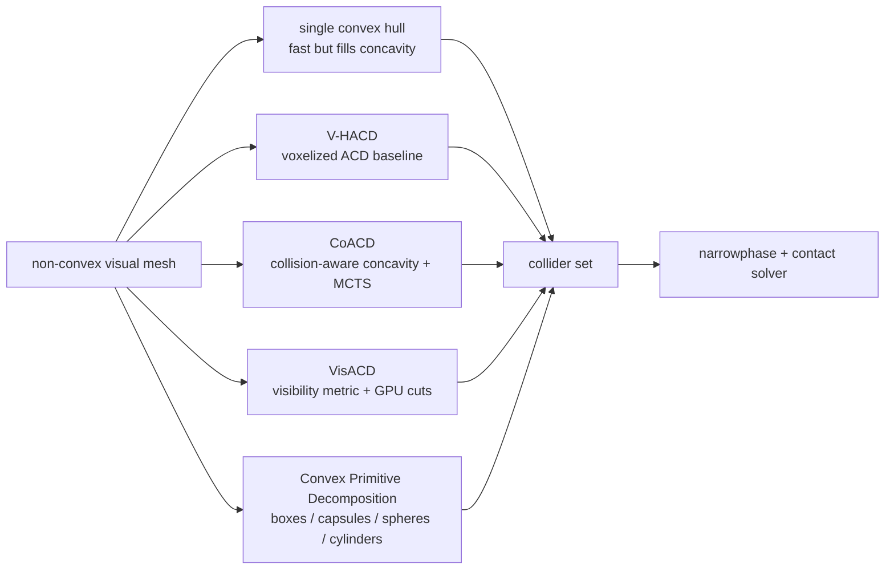

# Approximate Convex Decomposition

Approximate Convex Decomposition（ACD，近似凸分解）把 non-convex mesh 分解成一组 almost-convex components，并通常用每个 component 的 convex hull 作为 collider。它是 [[CollisionGeometryForRobotSimulation|robot simulation collision geometry]] 中最常见的中间层：比 single convex hull 更能保留 concavity，比 raw triangle mesh / SDF 更适合很多 runtime collision pipelines。

## 数学结构

给定目标形状 $S$，ACD 寻找一组 components $\{S_i\}_{i=1}^{K}$，使它们的 convex hulls 近似覆盖原形状：

$$
S \approx \bigcup_{i=1}^{K} \operatorname{CH}(S_i)
$$

其中 $\operatorname{CH}(S_i)$ 是 component $S_i$ 的 convex hull。典型目标可以写成：

$$
\min_{\{S_i\}} \quad K + \beta \cdot \operatorname{Cost}(\{\operatorname{CH}(S_i)\})
$$

subject to：

$$
\kappa(S_i, \operatorname{CH}(S_i)) \le \epsilon
$$

这里 $K$ 是 component count，$\kappa$ 是 concavity / approximation error metric，$\epsilon$ 是允许的 concavity threshold，$\beta$ 表示 runtime complexity 或 memory cost 的权重。[[v-hacd-repository|V-HACD README]] 与 [[coacd-approximate-convex-decomposition|CoACD paper]] 都强调 exact convex decomposition 是 NP-hard；ACD 的本质是用可控误差换 practical decomposition。

CoACD 的关键变化是把 $\kappa$ 设计成 collision-aware concavity：不仅看 shape boundary 与 convex hull 的距离，也检查 interior 中会改变 collision conditions 的误差。直觉上，它关心的不是“视觉上是否相似”，而是“这个 hull 是否把本该可进入的碰撞空间填掉”。VisACD 则用 visibility relationship 定义切分价值；Convex Primitive Decomposition 把输出空间从 generic hulls 换成 primitive family：

$$
C = \{p_j(\theta_j, t_j)\}_{j=1}^{K}, \quad t_j \in \{\text{sphere}, \text{capsule}, \text{cylinder}, \text{box}, \ldots\}
$$

其中 $t_j$ 是 primitive type，$\theta_j$ 是 size / pose / radius 等参数。这个 variant 把 ACD 的目标从“few convex hulls”转为“few cheap, editable, engine-optimized primitives”。

## 直觉

ACD 的直觉是避免两个极端。单个 convex hull 很快，但会把 cup handle、drawer slot、fork gap、tool notch 这类 task-relevant concavity 填满。Raw triangle mesh 或 SDF 可以更接近视觉形状，但在 many engines / real-time robotics workloads 中更贵、更 engine-specific。ACD 试图把“哪里需要细、哪里可以粗”编码进 decomposition。

[[CoACD]] 的贡献在于把 “collision condition” 作为 metric 的中心。它不是只追求 surface reconstruction，而是避免 collider 改变 object functionality。drawer handle example 说明这不是 aesthetic detail：collision hull 填满 handle hole 会改变 gripper / arm 是否能形成 shape closure。

[[convex-primitive-decomposition-for-collision-detection|Convex Primitive Decomposition]] 提醒另一条 engineering axis：即使 convex hull decomposition 准确，primitive colliders 也可能更快、更可编辑、更符合 engine optimization path。对 robot links、wheels、fixtures 和 coarse obstacles，primitive decomposition 可能比大量 hulls 更 practical。

## Failure Modes

- Filled concavity：single hull 或 poor decomposition 把 holes、handles、slots 填满，制造 false positive occupied space。
- Excess hull count：threshold 过低或 max hull count 过高会增加 narrowphase queries 和 solver constraints，导致 training throughput 下降或 contact jitter。
- Voxelization / preprocessing artifacts：V-HACD-style voxelization 可能在 thin features、small holes 或 already-convex shapes 上产生不必要误差。
- Intersecting hulls：某些 merging 或 post-processing 可能生成互相交叠的 hulls，改变 collision behavior；VisACD paper 在其 setup 中因此关闭 CoACD merging 做对比。
- Topology sensitivity：VisACD 和 Convex Primitive Decomposition 都指出 topology / remeshing / mesh orientation 或 degeneracy 会影响结果。
- Primitive overfit / underfit：primitive decomposition 对 clean mechanical shapes 很强，但 high-frequency organic curvature 或 task-critical fine contact patch 可能需要 hulls、SDF 或手工 collider。
- Metric mismatch：Hausdorff / Chamfer / byte complexity / runtime 都不是直接的 task success metric；manipulation 可能更关心 handle clearance、contact normal 和 friction cone。

## 实践含义

使用 ACD 时，先定义 task-critical contact surfaces：handles、holes、slots、feet、wheels、tool tips、gripper pads、support faces。然后选择 decomposition budget，而不是盲目追求 visual fit。[[CoACD]] 的 `threshold`、`max-convex-hull`、`max-ch-vertex` 和 MCTS parameters 需要和 simulator throughput、contact stability、object category 一起调。

如果目标是 large-scale RL asset pipeline，future trend 更可能是 hybrid：CoACD / VisACD 负责保留 collision-relevant concavity，primitive decomposition 负责把可用 sphere/capsule/box/cylinder 表达的 parts 压到更低 runtime cost，SDF 或 mesh collider 只留给少数 detail-critical static geometry。这个判断是 synthesis：不同 source 分别支持 collision-aware ACD、GPU ACD、primitive fitting 和 SDF/convexDecomposition modes，但还没有一个 source 证明统一 hybrid pipeline 最优。

对 evaluation，建议保存 decomposition settings 和 generated collider artifacts。否则同一个 object mesh 在不同 preprocessing thresholds 下可能对应完全不同的 contact world，benchmark 结果不可复现。

相关页面：[[CollisionGeometryForRobotSimulation]]、[[CoACD]]、[[VHACD]]、[[VisACD]]、[[MuJoCo]]、[[IsaacSim]]、[[SimulationRealityGap]]。
