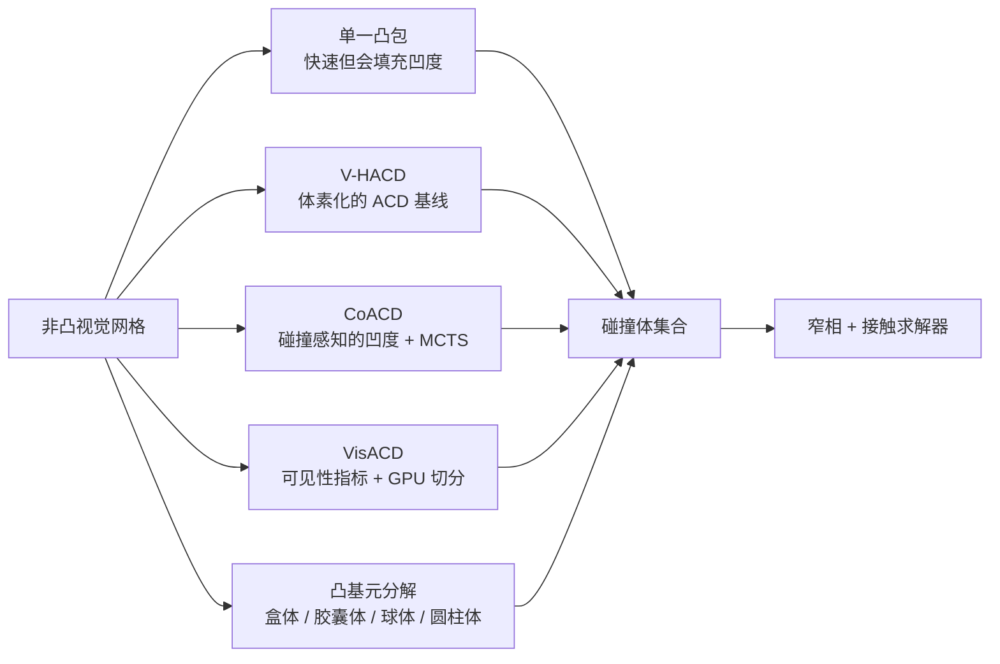

# 近似凸分解

近似凸分解（ACD）把非凸网格分解成一组近似凸的组件，并通常用每个组件的凸包作为碰撞体。它是 [[CollisionGeometryForRobotSimulation|机器人仿真的碰撞几何]] 中最常见的中间层：比单一凸包更能保留凹陷结构，比原始三角形网格 / SDF 更适合很多运行时碰撞流程。

## 数学结构

给定目标形状 $S$，ACD 寻找一组组件 $\{S_i\}_{i=1}^{K}$，使它们的凸包近似覆盖原形状：

$$
S \approx \bigcup_{i=1}^{K} \operatorname{CH}(S_i)
$$

其中 $\operatorname{CH}(S_i)$ 是组件 $S_i$ 的凸包。典型目标可以写成：

$$
\min_{\{S_i\}} \quad K + \beta \cdot \operatorname{Cost}(\{\operatorname{CH}(S_i)\})
$$

subject 到：

$$
\kappa(S_i, \operatorname{CH}(S_i)) \le \epsilon
$$

这里 $K$ 是组件数量，$\kappa$ 是凹陷结构 / 近似错误指标，$\epsilon$ 是允许的凹陷结构阈值，$\beta$ 表示运行时复杂度或内存成本的权重。[[v-hacd-repository|V-HACD README]] 与 [[coacd-approximate-convex-decomposition|CoACD 论文]] 都强调精确凸分解是 NP 困难；ACD 的本质是用可控误差换实用的分解。

CoACD 的关键变化是把 $\kappa$ 设计成碰撞感知凹陷结构：不仅看形状边界与凸包的距离，也检查 interior 中会改变碰撞条件的误差。直觉上，它关心的不是“视觉上是否相似”，而是“这个凸包是否把本该可进入的碰撞空间填掉”。VisACD 则用可见性关系定义切分价值；凸基元分解把输出空间从 generic 凸包换成基元族：

$$
C = \{p_j(\theta_j, t_j)\}_{j=1}^{K}, \quad t_j \in \{\text{sphere}, \text{capsule}, \text{cylinder}, \text{box}, \ldots\}
$$

其中 $t_j$ 是基元类型，$\theta_j$ 是尺寸 / 位姿 / 半径等参数。这个变体把 ACD 的目标从“少量凸包”转为“少量低成本的, 可编辑, 引擎优化后的基元”。

## 直觉

ACD 的直觉是避免两个极端。单个凸包很快，但会把杯子把手、抽屉槽、叉状差距、工具缺口这类任务相关的凹陷结构填满。原始三角形网格或 SDF 可以更接近视觉形状，但在大量引擎 / 实时机器人学工作负载中更贵、更引擎特定的。ACD 试图把“哪里需要细、哪里可以粗”编码进分解。

[[CoACD]] 的贡献在于把 “碰撞条件” 作为指标的中心。它不是只追求表面重建，而是避免碰撞体改变物体功能。抽屉把手示例说明这不是审美细节：碰撞凸包填满把手孔会改变夹爪 / 机械臂是否能形成形状闭合。

[[convex-primitive-decomposition-for-collision-detection|凸基元分解]] 提醒另一条工程轴：即使凸包分解准确，基元碰撞体也可能更快、更可编辑、更符合引擎优化路径。对机器人链接、车轮、固定设施和粗略障碍物，基元分解可能比大量凸包更实用的。

## 失效情形

- 填满的凹陷结构：单一凸包或粗劣的分解把孔、把手、槽填满，制造 false 正占用的空间。
- 过多的凸包数量：阈值过低或最大凸包数量过高会增加窄相查询和求解器约束，导致训练吞吐量下降或接触抖动。
- 体素化 / 预处理产物：V-HACD-风格体素化可能在细薄特征、小孔或已经-凸形状上产生不必要误差。
- 相交的凸包：某些合并或后处理-处理可能生成互相交叠的凸包，改变碰撞行为；VisACD 论文在其设置中因此关闭 CoACD 合并做对比。
- 拓扑敏感性：VisACD 和凸基元分解都指出拓扑 / 重新网格化 / 网格姿态或退化会影响结果。
- 基元过拟合 / 欠拟合：基元分解对规则机械形状很强，但高频有机曲率或任务关键精细接触 patch 可能需要凸包、SDF 或手工碰撞体。
- 指标不匹配：Hausdorff / Chamfer / 字节复杂度 / 运行时都不是直接的任务成功指标；操作可能更关心把手间隙、接触法向和摩擦锥。

## 实践含义

使用 ACD 时，先定义任务关键接触表面：把手、孔、槽、足部、车轮、工具尖端、夹爪接触垫、支撑面。然后选择分解预算，而不是盲目追求视觉拟合。[[CoACD]] 的 `threshold`、`max-convex-hull`、`max-ch-vertex` 和 MCTS 参数需要和仿真器吞吐量、接触稳定性、物体类别一起调。

如果目标是大规模 RL 资产流程，未来趋势更可能是混合：CoACD / VisACD 负责保留碰撞相关的凹陷结构，基元分解负责把可用球体/胶囊体/盒体/圆柱体表达的部件压到更低运行时成本，SDF 或网格碰撞体只留给少数细节关键静态几何。这个判断是综合整理：不同来源分别支持碰撞感知 ACD、GPU ACD、基元拟合和 SDF/convexDecomposition 模式，但还没有一个来源证明统一混合流程最优。

对评估，建议保存分解场景和生成的碰撞体产物。否则同一个物体网格在不同预处理阈值下可能对应完全不同的接触世界，基准结果不可复现。

相关页面：[[CollisionGeometryForRobotSimulation]]、[[CoACD]]、[[VHACD]]、[[VisACD]]、[[MuJoCo]]、[[IsaacSim]]、[[SimulationRealityGap]]。
