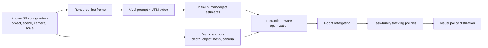

# Asset-Conditioned HOI Generation

Asset-conditioned HOI generation（资产条件化人-物交互生成）是一种把 3D assets、metric scene state、camera parameters 和 generated video prior 组合起来生成 robot-compatible human-object interaction trajectories 的路线。[[GRAIL]] source 的关键转向是：不要从 unconstrained in-the-wild videos 里事后推断 geometry / scale / camera / contact，而是先把这些变量在 3D world 中固定，再让 video foundation model（VFM）生成 plausible interaction，最后用已知 world 对 4D reconstruction 施加强约束。

## 数学结构

设输入 object asset 为 $\mathcal{M}_O$，scene geometry 为 $\mathcal{E}$，camera intrinsics/extrinsics 为 $C=(C_K,C_E)$，object 初始 pose 为 $\Theta^O_1$，robot-proportioned human character morphology 为 $\beta_H$。Renderer 先生成 initial frame：

$$
I_1 = \mathcal{R}(\mathcal{M}_O,\mathcal{E},\Theta^O_1,\beta_H,C).
$$

VLM 从 $I_1$ 生成 interaction prompt $p$，VFM 产生 reference HOI video：

$$
I_{1:T} \sim p_{\mathrm{VFM}}(I_{1:T}\mid I_1,p).
$$

这里 $I_{1:T}$ 不是直接可执行 demonstration，而是 interaction prior。Reconstruction stage 先估计初始 human/object trajectories $\hat{\Theta}^H_{1:T},\hat{\Theta}^O_{1:T}$，再优化 residual updates $\Delta\Theta^H_{1:T},\Delta\Theta^O_{1:T}$：

$$
\tilde{\Theta}^H_t=\hat{\Theta}^H_t \oplus \Delta\Theta^H_t,\qquad \tilde{\Theta}^O_t=\hat{\Theta}^O_t \oplus \Delta\Theta^O_t.
$$

GRAIL 的 joint objective 是：

$$
L=\lambda_{\mathrm{kp}}L_{\mathrm{kp}}+\lambda_{\mathrm{proj}}L_{\mathrm{proj}}+\lambda_{\mathrm{depth}}L_{\mathrm{depth}}+\lambda_{\mathrm{cont}}L_{\mathrm{cont}}+\lambda_{\mathrm{reg}}L_{\mathrm{reg}}.
$$

其中 $L_{\mathrm{kp}}$ 把 projected SMPL-X body/hand keypoints 对齐到 detected 2D keypoints；$L_{\mathrm{proj}}$ 保持 object vertices 的 image projection 与 tracker initial estimate 对齐；$L_{\mathrm{depth}}$ 把 visible human/object vertices 对齐到 metric point clouds；$L_{\mathrm{cont}}$ 用 contact-labeled frames 上的 depth-only Chamfer distance 处理 hand-object contact；$L_{\mathrm{reg}}=L_{\mathrm{foot}}+L_{\mathrm{vel}}+L_{\mathrm{smooth}}$ 约束 foot skating、pelvis velocity drift 和 temporal jitter。

Retargeting 把 optimized human trajectory 变成 robot joint-space reference：

$$
\tilde{q}_{1:T}=\mathcal{R}_{\mathrm{GMR}}(\tilde{\Theta}^H_{1:T}).
$$

Object-aware tracking 在 pretrained whole-body controller 的 latent token space 上做 residual adaptation：

$$
(\Delta z_t,a^{hand}_t)=\pi_\phi(s_t,o_t),\qquad a^{body}_t=\mathcal{G}(z_t+\lambda\Delta z_t).
$$

这里 $s_t$ 是 proprioception，$o_t$ 包含 object pose、future object-pose deltas、hand-to-object transforms、finger contact forces 和 BPS object-shape encoding；$\mathcal{G}$ 是 frozen SONIC action decoder，$\lambda=0.1$ 缩放 latent residual。Scene-aware tracking 则用 local height map $h_t$ 经 $\epsilon_h(h_t)$ 编码 terrain context，并 fine-tune controller 以处理 stairs、curbs、slopes 和 sitting。

Tracking reward 可抽象为 reference-simulation discrepancy 的 exponential kernel：

$$
R^{motion}_t=\sum_i w_i\exp\left(-\frac{\|\tilde{x}_{i,t}-x_{i,t}\|^2}{\sigma_i^2}\right),
$$

object-aware tracker 还加入 object pose reward 与 contact-gated grasp reward；scene-aware tracker 则主要使用 motion tracking 与 regularization terms。

## 直觉

这个 pipeline 的核心是把 video model 的强项和弱项分开。VFM 擅长给出 human-like interaction prior，但不可靠地保存 metric depth、rigid object identity、contact consistency 和 robot morphology。3D asset pipeline 擅长提供 object geometry、camera、scale、scene depth 和 simulator compatibility，但不会自己生成丰富 interaction。Asset-conditioned HOI generation 的思路是让 VFM 负责“应该怎么互动”，让 simulator-ready 3D configuration 负责“这个互动在几何上如何落地”。

相比 in-the-wild video reconstruction，这条路线减少了两个 ambiguity。第一是 depth/scale ambiguity：background depth 和 camera 已知，MoGe-2 estimated depth 可以对齐到 rendered environment depth。第二是 morphology mismatch：human character 在 generation 前就 prefitted 到 target humanoid proportions，retargeting 时不必把任意 human body shape 强行塞进 robot joint limits。

相比 teleoperation / mocap，这条路线把 new object、new terrain 和 new scene layout 的成本主要转成 asset setup、VFM generation、filtering 和 optimization cost。Source 报告单条 5-second sequence 的 4D HOI generation 大约 14 minutes，其中 joint optimization 约 8 minutes；tracking policy training 是按 task-family pool amortize，而不是每条 sequence 单独 fit controller。

## Failure Modes

- Asset availability：pipeline 假设已有 3D object assets 和 simulator-ready scene setup；没有 clean geometry、texture、scale 或 collision representation 时，known-world advantage 会减弱。
- VFM prompt following failure：VFM 可能不按 affordance、trajectory length、object identity 或 static-camera assumption 生成可恢复 interaction。
- Appearance inconsistency：object texture / geometry 在 video frames 中变化会让 FoundationPose tracking 失败；GRAIL 用 SAM2 masks 与 rendered silhouettes 做 failure filtering。
- Severe occlusion / fast motion：human hand、object 或 contact region 不可见时，keypoint/depth/contact losses 的约束会变弱。
- Contact realism gap：contact labels 和 depth-only contact loss 让 geometry 更接触，但不等于真实 contact force、friction、compliance 或 grasp stability 已被恢复。
- Pool boundary：task-general tracker amortizes related trajectories；当 motion family 改变很大时，source 明确说仍需要 training 或 fine-tuning。
- Deployment gap：egocentric visual policies 仍要面对 real camera、latency、lighting、object material、finger dynamics 和 hardware contact mismatch。

## 实践含义

- 对 humanoid data generation，不应只评价 generated video aesthetics；更关键的是 trajectory 是否能在 physics simulation 中被 humanoid tracker 执行，以及能否转成 task-general policy。
- 对 sim-to-real pipeline，known 3D configuration 可以把 reconstruction uncertainty 前置成 controlled inputs，但不能替代 hardware validation。它降低的是 video-to-4D ambiguity，不自动消除 actuator/contact/camera reality gap。
- 对 policy architecture，object-aware latent adaptor 是一种 conservative adaptation：冻结 locomotion controller 的主要 decoder，只在 latent token space 注入 manipulation residual，并补 hand primitives。这适合保护 pretrained locomotion prior，但也可能限制 out-of-family manipulation。
- 对 evaluation，GRAIL 提示要把 4D HOI quality、physics executability、task-general tracking 和 real visual deployment 分层报告。单独的 VLM interaction score 或 video smoothness 不足以证明 robot usefulness。

相关页面：[[GRAIL]]、[[grail-generating-humanoid-loco-manipulation-from-3d-assets-and-video-priors]]、[[VisualSimToReal]]、[[SimulationRealityGap]]、[[TaskGeneralistPolicyEvaluation]]、[[HumanoidRLWorkflow]]。
