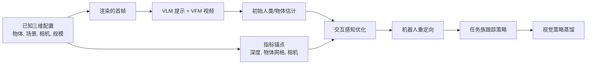

# 资产条件化人物—物体交互生成

资产条件化的 HOI 生成（资产条件化人物交互生成）是一种把 3D 资产、指标场景状态、相机参数和生成的视频先验组合起来生成机器人兼容的人类物体交互轨迹的路线。[[GRAIL]] 来源的关键转向是：不要从 unconstrained 自然场景视频里事后推断几何 / 规模 / 相机 / 接触，而是先把这些变量在 3D 世界中固定，再让视频基础模型（VFM）生成看似合理交互，最后用已知世界对 4D 重建施加强约束。

## 数学结构

设输入物体资产为 $\mathcal{M}_O$，场景几何为 $\mathcal{E}$，相机 intrinsics/extrinsics 为 $C=(C_K,C_E)$，物体初始位姿为 $\Theta^O_1$，机器人-proportioned 人类 character 形态为 $\beta_H$。渲染器先生成初始帧：

$$
I_1 = \mathcal{R}(\mathcal{M}_O,\mathcal{E},\Theta^O_1,\beta_H,C).
$$

VLM 从 $I_1$ 生成交互提示 $p$，VFM 产生参考基准 HOI 视频：

$$
I_{1:T} \sim p_{\mathrm{VFM}}(I_{1:T}\mid I_1,p).
$$

这里 $I_{1:T}$ 不是直接可执行示范，而是交互先验。重建阶段先估计初始人类/物体轨迹 $\hat{\Theta}^H_{1:T},\hat{\Theta}^O_{1:T}$，再优化残差更新 $\Delta\Theta^H_{1:T},\Delta\Theta^O_{1:T}$：

$$
\tilde{\Theta}^H_t=\hat{\Theta}^H_t \oplus \Delta\Theta^H_t,\qquad \tilde{\Theta}^O_t=\hat{\Theta}^O_t \oplus \Delta\Theta^O_t.
$$

GRAIL 的关节目标是：

$$
L=\lambda_{\mathrm{kp}}L_{\mathrm{kp}}+\lambda_{\mathrm{proj}}L_{\mathrm{proj}}+\lambda_{\mathrm{depth}}L_{\mathrm{depth}}+\lambda_{\mathrm{cont}}L_{\mathrm{cont}}+\lambda_{\mathrm{reg}}L_{\mathrm{reg}}.
$$

其中 $L_{\mathrm{kp}}$ 把 projected SMPL-X 刚体/手部关键点对齐到 detected 2D 关键点；$L_{\mathrm{proj}}$ 保持物体顶点的图像投影与跟踪器初始估计值对齐；$L_{\mathrm{depth}}$ 把可见人类/物体顶点对齐到指标点 clouds；$L_{\mathrm{cont}}$ 用接触标注的帧上的深度-仅 Chamfer 距离处理手部物体接触；$L_{\mathrm{reg}}=L_{\mathrm{foot}}+L_{\mathrm{vel}}+L_{\mathrm{smooth}}$ 约束 foot skating、pelvis 速度漂移和时间抖动。

重定向把优化后的人类轨迹变成机器人关节空间参考基准：

$$
\tilde{q}_{1:T}=\mathcal{R}_{\mathrm{GMR}}(\tilde{\Theta}^H_{1:T}).
$$

物体感知跟踪在 pretrained 全身控制器的潜在标记空间上做残差 adaptation：

$$
(\Delta z_t,a^{hand}_t)=\pi_\phi(s_t,o_t),\qquad a^{body}_t=\mathcal{G}(z_t+\lambda\Delta z_t).
$$

这里 $s_t$ 是本体感知，$o_t$ 包含物体位姿、未来物体位姿 deltas、手部到-物体 transforms、手指接触力和 BPS 物体形状编码；$\mathcal{G}$ 是冻结的 SONIC 动作解码器，$\lambda=0.1$ 缩放潜在残差。Scene-感知跟踪则用局部高度映射图 $h_t$ 经 $\epsilon_h(h_t)$ 编码地形上下文，并微调控制器以处理 stairs、curbs、slopes 和坐下。

跟踪奖励可抽象为参考基准仿真 discrepancy 的 exponential 内核：

$$
R^{motion}_t=\sum_i w_i\exp\left(-\frac{\|\tilde{x}_{i,t}-x_{i,t}\|^2}{\sigma_i^2}\right),
$$

物体感知跟踪器还加入物体位姿奖励与接触-gated 抓取奖励；场景感知跟踪器则主要使用运动跟踪与正则化项。

## 直觉

这个流程的核心是把视频模型的强项和弱项分开。VFM 擅长给出人类-like 交互先验，但不可靠地保存指标深度、刚性物体身份、接触一致性和机器人形态。3D 资产流程擅长提供物体几何、相机、规模、场景深度和仿真器兼容性，但不会自己生成丰富交互。资产条件化的 HOI 生成的思路是让 VFM 负责“应该怎么互动”，让仿真器就绪 3D 配置负责“这个互动在几何上如何落地”。

相比自然场景视频重建，这条路线减少了两个歧义。第一是深度/规模歧义：背景深度和相机已知，MoGe-2 estimated 深度可以对齐到渲染的环境深度。第二是形态不匹配：人类 character 在生成前就 prefitted 到目标人形机器人 proportions，重定向时不必把任意人类刚体形状强行塞进机器人关节限制。

相比遥操作 / 动作捕捉，这条路线把新物体、新地形和新场景布局的成本主要转成资产设置、VFM 生成、过滤和优化成本。来源报告单条 5-second 序列的 4D HOI 生成大约 14 minutes，其中关节优化约 8 minutes；跟踪策略训练是按任务族数据池 amortize，而不是每条序列单独拟合控制器。

## 失效情形

- 资产可用性：流程假设已有 3D 物体资产和仿真器就绪场景设置；没有 clean 几何、纹理、规模或碰撞表示时，已知世界优势函数会减弱。
- VFM 提示 following 失败：VFM 可能不按可供性、轨迹长度、物体身份或静态相机假设生成可恢复交互。
- 外观 inconsistency：物体纹理 / 几何在视频帧中变化会让 FoundationPose 跟踪失败；GRAIL 用 SAM2 掩码与渲染的 silhouettes 做失败过滤。
- Severe 遮挡 / 快速运动：人类手部、物体或接触区域不可见时，关键点/深度/接触损失项的约束会变弱。
- 接触 realism 差距：接触标签和深度-仅接触损失让几何更接触，但不等于真实接触力、摩擦、柔顺性或抓取稳定性已被恢复。
- 数据池边界：任务一般性跟踪器 amortizes 相关的轨迹；当运动族改变很大时，来源明确说仍需要训练或微调。
- Deployment 差距：第一视角视觉策略仍要面对真实相机、延迟、光照、物体材质、手指动力学和硬件接触不匹配。

## 实践含义

- 对人形机器人数据生成，不应只评价生成的视频 aesthetics；更关键的是轨迹是否能在物理仿真中被人形机器人跟踪器执行，以及能否转成任务一般性策略。
- 对仿真到现实迁移流程，已知三维配置可以把重建不确定性前置成受控输入，但不能替代硬件验证。它降低的是视频到-4D 歧义，不自动消除执行器/接触/相机现实差距。
- 对策略架构，物体感知潜在 adaptor 是一种 conservative adaptation：冻结移动控制器的主要解码器，只在潜在标记空间注入操作残差，并补手部基元。这适合保护 pretrained 移动先验，但也可能限制族外操作。
- 对评估，GRAIL 提示要把 4D HOI 质量、物理可执行性、任务一般性跟踪和真实视觉部署分层报告。单独的 VLM 交互得分或视频平滑性不足以证明机器人实用价值。

相关页面：[[GRAIL]]、[[grail-generating-humanoid-loco-manipulation-from-3d-assets-and-video-priors]]、[[VisualSimToReal]]、[[SimulationRealityGap]]、[[TaskGeneralistPolicyEvaluation]]、[[HumanoidRLWorkflow]]。
