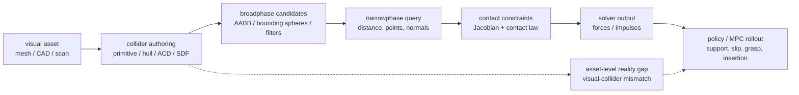

# Collision Geometry for Robot Simulation

Collision geometry 是 simulator 用来生成 contact candidates、contact points、normals、separations / penetration depths 和 contact constraints 的 surrogate geometry；它不等于 visual mesh。对 robotics 来说，这个 surrogate 不是小的 asset detail：它会进入 [[ContactModelsInRobotics|contact model]] 与 [[ContactSolvers|contact solver]]，改变 support、slip、grasp closure、insertion clearance、contact count 和 policy rollout distribution。

## 数学结构

把 visual mesh 记作 $M_{vis}$，collider set 记作：

$$
C = \{g_i(\theta_i)\}_{i=1}^{N}
$$

其中 $g_i$ 是 sphere、capsule、cylinder、box、convex hull、SDF 或 mesh-derived component，$\theta_i$ 包含 size、pose、radius、height、convex hull vertices、SDF resolution 等参数。给定 robot/object configuration $q$，narrowphase collision query 可以抽象为：

$$
Q(g_a(q), g_b(q)) \rightarrow (d, p, n, m)
$$

这里 $d$ 是 separation / penetration metric，$p$ 是 contact point，$n$ 是 contact normal，$m$ 是 contact manifold 或 contact point count。后续 solver 实际看到的是 $Q$ 的输出，而不是原始视觉 mesh：

$$
\lambda = S(x, u, Q(C(q)), \text{contact law}, \text{solver parameters})
$$

其中 $\lambda$ 是 normal / tangential contact force 或 impulse。由此，collider approximation error 不是只影响渲染，而是会改变 dynamics transition：

$$
x_{t+1}^{sim}=F(x_t,u_t,\lambda)
$$

从误差角度看，$C$ 和真实可碰撞体 $M$ 之间至少有三类 mismatch：

| Error type | 几何含义 | 动力学后果 |
| --- | --- | --- |
| False positive occupied space | $C \setminus M$，collider 填满了真实空洞或凹槽 | 抓手不能进入 handle / slot，policy 学到错误避障或滑脱行为 |
| False negative missing space | $M \setminus C$，collider 漏掉真实凸起或边缘 | 穿透、late contact、过小 support polygon |
| Contact manifold error | $p,n,m$ 与真实接触面不同 | friction direction、torque arm、stacking stability 和 solver residual 改变 |

这张图把 collision geometry 放在 contact pipeline 的最上游。[[mujoco-computation-collision-detection|MuJoCo docs]] 明确说 active contacts 存在 `mjData.contact` 中并用于 constraint construction；[[isaac-sim-core-api-collision-approximation|Isaac Sim Core API docs]] 列出的 collision approximation modes 会改变 contact force data 中的 points、normals 和 separations。

## 直觉

Primitive colliders 的直觉是用少量参数换速度和稳定性。Sphere 最稳定、orientation-free，适合 ball-like parts、padding、coarse safety envelope。Capsule 对 robot links、limbs、cables 和 rounded rods 很自然，因为 swept sphere segment 没有 sharp edge，contact normals 更平滑。Cylinder 适合 wheels、rollers、pins、bottles，但端盖边缘和 rolling contact 是否准确取决于 engine implementation。Box / cube 对 planar supports、tables、blocks 很便宜，但 edge contact 可能需要 multiple contact points 才稳定。

Convex hull 的直觉是“用一个凸包包住所有点”。它保留外部 envelope，但会填满 concavity。对 grasping handles、drawer slots、holes、fork gaps、tool notches，这个 false positive occupied space 可能直接改变 task。[[coacd-approximate-convex-decomposition|CoACD paper]] 的 drawer example 就显示 V-HACD-style collider 填满 handles 会导致 arm slip off handle，而 collision-aware decomposition 提高了 reported drawer-opening success。

Approximate convex decomposition 的直觉是把 single hull 拆成一组 hulls，试图在 runtime cost 和 non-convex fidelity 之间折中。[[v-hacd-repository|V-HACD]] 是历史上常用的 voxelized ACD baseline；[[CoACD]] 用 collision-aware concavity 和 tree search 关注 collision conditions；[[VisACD]] 用 visibility metric 和 GPU acceleration 减少 orientation sensitivity 与 runtime；[[convex-primitive-decomposition-for-collision-detection|Convex Primitive Decomposition]] 则进一步把 hulls 替换为 engine-optimized primitives。

SDF / triangle mesh collider 的直觉是用更多 geometry fidelity 换更高计算成本和更复杂的 solver behavior。[[isaac-sim-core-api-collision-approximation|Isaac Sim docs]] 把 SDF 和 Convex Decomposition列为能更好 capture details 的选项，同时明确警告 computational cost。

## Representation Tradeoffs

| Collider type | 适合场景 | 优点 | 主要风险 |
| --- | --- | --- | --- |
| Sphere | balls、padding、coarse envelope、cheap proximity | 最便宜，contact normal smooth，无 orientation state | 对 elongated / flat / concave shape 误差大 |
| Capsule | robot links、limbs、rounded rods、mobile robot bumpers | 比 cylinder 更 smooth，适合 swept-volume safety model | 会过度填充 link brackets、sharp ends、holes |
| Cylinder | wheels、rollers、pins、cans | 参数少，表达圆柱物体直观 | rim / cap edge contact、rolling friction 和 orientation dependence 需验证 |
| Box / bounding cube | tables、blocks、fixtures、coarse static obstacles | broadphase/narrowphase 通常便宜，易编辑 | 对斜面、曲面、凹槽误差大；edge contact 可能 under-sampled |
| Single convex hull | arbitrary convex-ish mesh | 自动、简单，避免 triangle soup | 填满 concavity；handles/holes/slots 失真 |
| Convex decomposition | non-convex objects、handles、tool shapes | 保留部分 concavity，仍使用 convex queries | hull count 过高会拖慢 broadphase/narrowphase，并增加 contact count |
| Primitive decomposition | game / large-asset pipeline，editable colliders | 使用 engine-optimized primitives，complexity 低，可手工调 | 对 high-frequency organic geometry 或 contact-critical details 可能过粗 |
| SDF / detailed mesh | detail-critical static or quasi-static collision | fidelity 高，能表达复杂形状 | memory / compute cost 高，engine-specific，可能不适合大规模 RL throughput |

[[embodiedgen-v2-an-agentic-simulation-ready-3d-world-engine-for-embodied-ai|EmbodiedGen V2]] 给出 generated assets 的 concrete pipeline evidence：mesh repair 后使用 CoACD 生成 collision geometry，再进入 URDF/MJCF/USD export 和 simulator validation。其 full asset pipeline 报告 98.6% collision success、2.6±0.4 分钟平均处理时间；关闭 mesh fix 后的人工处理时间为 21.3±22.8 分钟，asset size 为 51.63 MB。这里的 evidence 支持“collision preprocessing 是 simulation readiness 的关键 gate”，但不能直接推出 CoACD 在所有 engine/task 中最优，因为结果绑定于该系统的 asset distribution、repair pipeline 和 success definition。

## Failure Modes

- Visual-collider mismatch：视觉上能插入的 slot / handle，在 collider 中被 convex hull 或 capsule 填满；policy 学到的 grasp / insertion 行为会错。
- Over-conservative safety envelope：primitive padding 提高 robustness，但如果不区分 training collider 与 safety margin，会把可行动作误判为 collision。
- Under-conservative collider：为了速度删掉小凸起、尖角或薄结构，可能产生 late contact、penetration 或 unrealistic stability。
- Over-decomposition：太多 convex hulls / primitives 会增加 broadphase pairs、narrowphase queries 和 solver constraints，造成训练吞吐下降或 contact jitter。
- Contact manifold under-sampling：single-point convex collision 对面接触、box stacking、flat foot support 可能不足；MuJoCo 的 `multiccd` 正是为这类问题提供 optional remedy。
- Engine-specific semantics：同一个 collider set 在 MuJoCo、PhysX、Bullet、Drake 中可能有不同 contact offset、margin、manifold generation、friction combination 和 solver behavior。
- Optimization surrogate mismatch：[[DCOL]] / [[DiffPills]] 这类 differentiable collision metrics 对 trajectory optimization 很有用，但 $\alpha$ 或 $\phi$ 不是完整 frictional contact dynamics。

## 实践含义

对 robot simulation，collider 设计应从 task interaction surface 反推，而不是只从 visual mesh 自动生成。Robot links 默认可从 capsule / cylinder / box 开始；复杂 end-effector、gripper fingers、object handles、drawer pulls、holes、slots、feet 和 wheels 需要单独检查 contact-critical concavity、edge contact 和 manifold quality。

Asset pipeline 上，优先把 collider representation 作为可审计的 asset layer。[[IsaacSimAssetStructure]] 已经把 collider representation 放在 `instances.usda` 这类 shared asset composition role 中；这意味着 shared collider geometry 不应被混进 `mujoco.usda` 或 `physx.usda` 这类 runtime-specific tuning layer，除非该 collision semantics 只属于某个 backend。

评估时不要只看 visual overlay。更有用的 checks 包括：contact point locations、contact normals、contact count、penetration / separation distribution、grasp slip rate、drawer handle closure、foot support polygon、solver residual、policy success sensitivity to collider mode。对 sim-to-real，应该把 collider approximation 和 mass/friction/delay/camera alignment 一样纳入 [[SimulationRealityGap|reality-gap]] audit。

未来趋势可以概括为三条：更 collision-aware 的 decomposition（CoACD / VisACD）、更 runtime-oriented 的 primitive fitting（Convex Primitive Decomposition）、以及更 optimization-friendly 的 differentiable primitive collision（DCOL / DiffPills）。它们不是互相替代关系，而是服务不同 constraints：offline asset fidelity、runtime throughput、human editability、gradient availability 和 task-specific contact correctness。

相关页面：[[ApproximateConvexDecomposition]]、[[DifferentiableCollisionDetection]]、[[ContactModelsInRobotics]]、[[ContactSolvers]]、[[SimulationRealityGap]]、[[IsaacSimAssetStructure]]、[[MuJoCo]]、[[IsaacSim]]。
