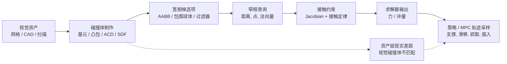

# 机器人仿真的碰撞几何

碰撞几何是仿真器用来生成接触候选、接触点、法向量、分离距离 / 穿透深度和接触约束的替代几何；它不等于视觉网格。对机器人学来说，这个替代不是小的资产细节：它会进入 [[ContactModelsInRobotics|接触模型]] 与 [[ContactSolvers|接触求解器]]，改变支撑、滑移、抓取闭合、插入间隙、接触数量和策略轨迹采样分布。

## 数学结构

把视觉网格记作 $M_{vis}$，碰撞体设置记作：

$$
C = \{g_i(\theta_i)\}_{i=1}^{N}
$$

其中 $g_i$ 是球体、胶囊体、圆柱体、盒体、凸包、SDF 或网格派生的组件，$\theta_i$ 包含尺寸、位姿、半径、高度、凸包顶点、SDF 分辨率等参数。给定机器人/物体配置 $q$，窄相碰撞查询可以抽象为：

$$
Q(g_a(q), g_b(q)) \rightarrow (d, p, n, m)
$$

这里 $d$ 是分离 / 穿透指标，$p$ 是接触点，$n$ 是接触法向，$m$ 是接触流形或接触点数量。后续求解器实际看到的是 $Q$ 的输出，而不是原始视觉网格：

$$
\lambda = S(x, u, Q(C(q)), \text{contact law}, \text{solver parameters})
$$

其中 $\lambda$ 是法向 / 切向接触力或冲量。由此，碰撞体近似错误不是只影响渲染，而是会改变动力学转移：

$$
x_{t+1}^{sim}=F(x_t,u_t,\lambda)
$$

从误差角度看，$C$ 和真实可碰撞体 $M$ 之间至少有三类不匹配：

| 误差类型 | 几何含义 | 动力学后果 |
| --- | --- | --- |
| 假阳性占用的空间 | $C \setminus M$，碰撞体填满了真实空洞或凹槽 | 抓手不能进入把手 / 槽，策略学到错误避障或滑脱行为 |
| 假阴性 missing 空间 | $M \setminus C$，碰撞体漏掉真实凸起或边缘 | 穿透、late 接触、过小支撑多边形 |
| 接触流形误差 | $p,n,m$ 与真实接触面不同 | 摩擦方向、力矩臂、堆叠稳定性和求解器残差改变 |

这张图把碰撞几何放在接触流程的最上游。[[mujoco-computation-collision-detection|MuJoCo 文档]] 明确说有效接触点存在 `mjData.contact` 中并用于约束结构；[[isaac-sim-core-api-collision-approximation|Isaac Sim Core API docs]] 列出的碰撞近似模式会改变接触力数据中的点、法向量和分离距离。

## 直觉

基元碰撞体的直觉是用少量参数换速度和稳定性。球体最稳定、姿态-free，适合 ball-like 部件、padding、粗略 safety 外包络。胶囊体对机器人链接、limbs、cables 和 rounded rods 很自然，因为 swept 球体 segment 没有 sharp 边，接触法向量更平滑。圆柱体适合车轮、rollers、pins、bottles，但端盖边缘和滚动接触是否准确取决于引擎实现。盒体 / cube 对平面 supports、tables、blocks 很便宜，但边接触可能需要 multiple 接触点才稳定。

凸包的直觉是“用一个凸包包住所有点”。它保留外部外包络，但会填满凹陷结构。对抓取把手、抽屉槽、孔、叉状 gaps、工具 notches，这个 false 正占用的空间可能直接改变任务。[[coacd-approximate-convex-decomposition|CoACD 论文]] 的抽屉示例就显示 V-HACD-风格碰撞体填满把手会导致机械臂滑脱把手，而碰撞感知分解提高了报告的抽屉-opening 成功。

近似凸分解的直觉是把单一凸包拆成一组凸包，试图在运行时成本和非凸保真度之间折中。[[v-hacd-repository|V-HACD]] 是历史上常用的 voxelized ACD 基线；[[CoACD]] 用碰撞感知凹陷结构和树搜索关注碰撞条件；[[VisACD]] 用可见性指标和 GPU 加速度减少姿态敏感性与运行时；[[convex-primitive-decomposition-for-collision-detection|凸基元分解]] 则进一步把凸包替换为引擎优化后的基元。

SDF / 三角形网格碰撞体的直觉是用更多几何保真度换更高计算成本和更复杂的求解器行为。[[isaac-sim-core-api-collision-approximation|Isaac Sim 文档]] 把 SDF 和凸分解列为能更好捕捉细节的选项，同时明确警告 computational 成本。

## 表示方式的取舍

| Collider 类型 | 适合场景 | 优点 | 主要风险 |
| --- | --- | --- | --- |
| 球体 | balls、padding、粗略外包络、低成本的邻近度 | 最便宜，接触法向平滑，无姿态状态 | 对 elongated / 平坦 / 凹形形状误差大 |
| 胶囊体 | 机器人链接、limbs、rounded rods、移动式机器人 bumpers | 比圆柱体更平滑，适合 swept-volume safety 模型 | 会过度填充链接 brackets、sharp ends、孔 |
| 圆柱体 | 车轮、rollers、pins、cans | 参数少，表达圆柱物体直观 | rim / cap 边接触、滚动摩擦和姿态依赖需验证 |
| 盒体 / 包围 cube | tables、blocks、固定设施、粗略静态障碍物 | 宽相/窄相通常便宜，易编辑 | 对斜面、曲面、凹槽误差大；边接触可能 under-采样的 |
| 单一凸包 | arbitrary 凸-ish 网格 | 自动、简单，避免三角形 soup | 填满凹陷结构；把手/孔/槽失真 |
| 凸分解 | 非凸物体、把手、工具形状 | 保留部分凹陷结构，仍使用凸查询 | 凸包数量过高会拖慢宽相/窄相，并增加接触数量 |
| 基元分解 | game / 大规模资产流程，可编辑碰撞体 | 使用引擎优化后的基元，复杂度低，可手工调 | 对高频有机几何或接触关键细节可能过粗 |
| SDF / detailed 网格 | 细节关键静态或 quasi-静态碰撞 | 保真度高，能表达复杂形状 | 内存 / 计算成本高，引擎特定的，可能不适合大规模 RL 吞吐量 |

[[embodiedgen-v2-an-agentic-simulation-ready-3d-world-engine-for-embodied-ai|EmbodiedGen V2]] 给出生成的资产的具体的流程证据：网格修复后使用 CoACD 生成碰撞几何，再进入 URDF/MJCF/USD 导出和仿真器验证。其完整资产流程报告 98.6% 碰撞成功、2.6±0.4 分钟平均处理时间；关闭网格 fix 后的人工处理时间为 21.3±22.8 分钟，资产尺寸为 51.63 MB。这里的证据支持“碰撞预处理是仿真可用性的关键关口”，但不能直接推出 CoACD 在所有引擎/任务中最优，因为结果绑定于该系统的资产分布、修复流程和成功 definition。

## 失效情形

- 视觉碰撞体不匹配：视觉上能插入的槽 / 把手，在碰撞体中被凸包或胶囊体填满；策略学到的抓取 / 插入行为会错。
- Over-conservative safety 外包络：基元 padding 提高鲁棒性，但如果不区分训练碰撞体与 safety 裕量，会把可行动作误判为碰撞。
- Under-conservative 碰撞体：为了速度删掉小凸起、尖角或薄结构，可能产生 late 接触、穿透或 unrealistic 稳定性。
- Over-分解：太多凸包 / 基元会增加宽相 pairs、窄相查询和求解器约束，造成训练吞吐下降或接触抖动。
- 接触流形 under-采样：单点凸碰撞对面接触、盒体堆叠、平坦 foot 支撑可能不足；MuJoCo 的 `multiccd` 正是为这类问题提供可选补救方法。
- 引擎专用语义：同一个碰撞体设置在 MuJoCo、PhysX、Bullet、Drake 中可能有不同接触偏移、裕量、流形生成、摩擦 combination 和求解器行为。
- 优化 surrogate mismatch：[[DCOL]] / [[DiffPills]] 这类可微碰撞指标对轨迹优化很有用，但 $\alpha$ 或 $\phi$ 不是完整摩擦接触动力学。

## 实践含义

对机器人仿真，碰撞体设计应从任务交互表面反推，而不是只从视觉网格自动生成。机器人链接默认可从胶囊体 / 圆柱体 / 盒体开始；复杂末端执行器、夹爪 fingers、物体把手、抽屉 pulls、孔、槽、足部和车轮需要单独检查接触关键凹陷结构、边接触和流形质量。

资产流程上，优先把碰撞体表示作为可审计的资产层。[[IsaacSimAssetStructure]] 已经把碰撞体表示放在 `instances.usda` 这类共享资产组合角色中；这意味着共享碰撞体几何不应被混进 `mujoco.usda` 或 `physx.usda` 这类运行时特定的调优层，除非该碰撞语义只属于某个后端。

评估时不要只看视觉叠加显示。更有用的检查包括：接触点位置、接触法向量、接触数量、穿透 / 分离分布、抓取滑移比率、抽屉把手闭合、foot 支撑多边形、求解器残差、策略成功敏感性到碰撞体模式。对仿真到现实迁移，应该把碰撞体近似和质量/摩擦/延迟/相机对齐一样纳入 [[SimulationRealityGap|现实差距]] audit。

未来趋势可以概括为三条：更具碰撞感知能力的分解（CoACD / VisACD）、更面向运行时的基元拟合（凸基元分解），以及更适合优化的可微基元碰撞（DCOL / DiffPills）。它们不是互相替代关系，而是服务不同约束：离线资产保真度、运行时吞吐量、人类可编辑性、梯度可用性和任务特定的接触正确性。

相关页面：[[ApproximateConvexDecomposition]]、[[DifferentiableCollisionDetection]]、[[ContactModelsInRobotics]]、[[ContactSolvers]]、[[SimulationRealityGap]]、[[IsaacSimAssetStructure]]、[[MuJoCo]]、[[IsaacSim]]。
