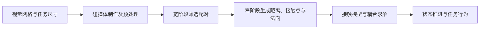

# 机器人仿真的碰撞几何

碰撞几何是仿真器用于判定接近／相交、生成接触点与法向的几何表示，未必等同于视觉网格。它决定接触求解器的输入；表示中的把手孔若已经被填满，再精确的力求解也无法恢复该空隙。这个因果关系由 [[coacd-approximate-convex-decomposition|CoACD 的几何与任务实验]] 和 [[contact-models-in-robotics-a-comparative-analysis|接触模型比较]] 共同支持。

## 从几何到运动的机制

令碰撞表示为 $C=\{g_i(\theta_i)\}_{i=1}^N$，其中 $g_i$ 是基元、凸包或其他表示，$\theta_i$ 是尺寸、位姿、顶点或采样参数。给定物体配置 $q$，几何查询产生一组接触信息：

$$
Q(C,q)\longrightarrow\{(d_k,p_k,n_k)\}_{k=1}^{m}.
$$

$d_k$ 为距离或相交指标，$p_k$ 为接触点，$n_k$ 为法向，$m$ 为生成的接触数量。这是抽象接口，不要求每种算法都返回相同距离或同一套接触点；例如 [[dcol-differentiable-collision-detection-for-a-set-of-convex-primitives|DCOL]] 的尺度指标并非欧氏距离。

令 $x$ 为系统状态，$u$ 为控制，$\eta$ 包含摩擦、柔顺性、求解预算等设置；接触求解和状态推进可概括为：

$$
\lambda=S\bigl(x,u,Q(C,q);\eta\bigr),
\qquad x^+=F(x,u,\lambda).
$$

$\lambda$ 是力或冲量，量纲由具体时间离散定义。几何改变 $p_k$ 和 $n_k$，会改变接触雅可比、力矩臂和约束集合，最终改变运动。上述式子是教学抽象；具体实现见 [[mujoco-computation-collision-detection|MuJoCo 3.8 计算文档]] 与 [[ContactSolvers|Contact Solvers]]。

```mermaid
flowchart LR
  A[视觉网格与任务尺寸] --> B[碰撞体制作及预处理]
  B --> C[宽阶段筛选配对]
  C --> D[窄阶段生成距离、接触点与法向]
  D --> E[接触模型与耦合求解]
  E --> F[状态推进与任务行为]
```

宽阶段粗筛与窄阶段精查属于碰撞检测，接触力和摩擦计算属于后续模型。两层问题应分开诊断。[[mujoco-computation-collision-detection|MuJoCo 文档]]、[[contact-models-in-robotics-a-comparative-analysis|接触模型比较]]

### 一个接触点偏移为何会改变转动

以下是上述接触雅可比机制的教学例。刚体质心为 $c$、接触点为 $p$、接触力为 $f$，该力对质心的力矩是 $\tau=(p-c)\times f$。若几何近似只把接触点移动 $\delta p$，暂时固定力方向和大小，则：

$$
\delta\tau=\delta p\times f.
$$

例如向上的 $10\,\mathrm N$ 支撑力，其作用点沿水平方向偏移 $1\,\mathrm{cm}$，就可产生 $0.1\,\mathrm{N\,m}$ 的额外力矩。这个数值例说明“轮廓看起来接近”仍可能影响平衡和抓握；真实求解还会随点位改变重新分配力，不能把这个固定力例子当成完整仿真预测。接触位置进入动力学的具体结构见 [[contact-models-in-robotics-a-comparative-analysis|接触空间方程]]。

## 表示方式的取舍

| 表示 | 机制与用途 | 必须检查的边界 |
| --- | --- | --- |
| 球体、胶囊体、盒体等参数基元 | 用少量尺寸与位姿参数描述形状，易编辑；部分引擎有专用查询 | 是否包住真实接触区域、是否过度填充孔槽；专用支持依赖引擎 |
| 单一凸包 | 保留包围输入的凸外壳，便于凸碰撞查询 | 必然填充凹陷；把手或壶嘴可能失去功能 |
| 近似凸分解 | 用多个凸包保留非凸结构 | 凹度、组件数、后处理相交与输入修复各自影响结果 |
| 凸基元分解 | 自动拟合一组可编辑参数形状 | 有机曲面可能需要很多基元；部分基元实际仍需转成凸包 |
| 三角网格、SDF 等 | 保留更复杂形状或距离场信息 | 哪些动态物体可用、采样分辨率与成本取决于具体引擎 |

前四项的实证与算法机制见 [[coacd-approximate-convex-decomposition|CoACD]]、[[visacd-visibility-based-gpu-accelerated-approximate-convex-decomposition|VisACD]]、[[convex-primitive-decomposition-for-collision-detection|凸基元分解]]；网格、SDF 和其他模式的具体入口见 [[isaac-sim-core-api-collision-approximation|Isaac Sim 5.1 API 来源]]。**不将“球体最稳定”“SDF 一定最准确”“基元总比凸包快”作为普遍结论。** 几何近似、引擎实现与任务接触方式需要共同确定这些判断。

## 三类误差

将真实可碰撞实体记为 $M$，将碰撞集合的并集记为 $\widehat M$。以下分类是本页依据几何与接触机制作出的综合解释：

| 误差 | 含义 | 可能影响 |
| --- | --- | --- |
| 多占空间 $\widehat M\setminus M$ | 孔槽被填满，轮廓过度膨胀 | 抓手无法进入、路径被误判为不可行 |
| 漏占空间 $M\setminus\widehat M$ | 凸起、薄面或边缘未表示 | 接触过晚、穿透或支撑范围错误 |
| 接触点与法向误差 | 位置、方向或点数偏离所需接触近似 | 力矩、摩擦响应和约束求解发生变化 |

对开放曲面，实体内外未必有唯一意义，不能直接套用上面的体积集合比较；应先明确其碰撞厚度或封闭解释。[[convex-primitive-decomposition-for-collision-detection|凸基元分解]] 的“覆盖输入表面”也不同于精确恢复输入实体内部。

最直接的任务证据来自 [[coacd-approximate-convex-decomposition|CoACD 抽屉实验]]：碰撞体保留把手孔后，更多抽屉能在规定训练尝试内获得成功策略。这个结论限定于该 SAPIEN 协议，不是跨引擎或真实机器人保证。[[visacd-visibility-based-gpu-accelerated-approximate-convex-decomposition|VisACD]] 主要评估离线分解时间与几何；不能把其速度数字称为仿真运行速度。[[convex-primitive-decomposition-for-collision-detection|凸基元分解]] 则提供目标引擎中的落球性能，三个证据层次不可互换。

## 实践：从任务接触反推验收

**以下是综合建议。** 先标出把手、孔、插槽、夹持面、足底或滚动表面等关键区域，再确定近似预算。视觉叠加只检查外形，还应查看实际接触点、法向、间隙、滑动、支撑和任务行为。更多部件可能增加候选与约束，也可能因基元更便宜而降低总耗时；应测目标引擎的完整步骤，不能只数凸包。

碰撞偏移和静止偏移同样会改变接触何时被生成，几何相同不保证接触参数相同。该语义的固定版本依据见 [[isaac-sim-core-api-collision-approximation|Isaac Sim API 来源]]；MuJoCo 网格凸包化与多接触点生成条件见 [[mujoco-computation-collision-detection|MuJoCo 3.8 来源]]。

保留原网格、预处理结果、生成参数和碰撞体产物，并记录引擎版本。[[embodiedgen-v2-an-agentic-simulation-ready-3d-world-engine-for-embodied-ai|EmbodiedGen V2]] 提供完整资产制作流程的实例，其系统成功率不应拆成单个分解算法的效果。资产层的组织另见 [[IsaacSimAssetStructure|Isaac Sim 资产结构]]；优化使用的指标另见 [[DifferentiableCollisionDetection|Differentiable Collision Detection]]；相关机制见 [[ApproximateConvexDecomposition|Approximate Convex Decomposition]]、[[ContactModelsInRobotics|接触模型]] 和 [[SimulationRealityGap|Sim-to-Real Gap]]。

## 研究归属

[[topics/physics-simulation|物理仿真]] · [[topics/collision-geometry|Collision Geometry]]。
