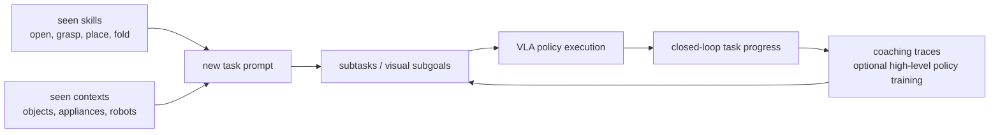

# Compositional Generalization in Robotics

Compositional generalization in robotics（机器人中的组合泛化）指 robot policy 能把训练中见过的 skills、objects、relations、embodiments 或 instructions 重新组合，解决没有专门收集 action demonstrations 的 task。[[pi07-steerable-generalist-robotic-foundation-model|π0.7 paper]] 把它作为 generalist robot foundation model 的核心评估目标，而不是只检验 seen-task imitation。

## 数学结构

这个概念在 source 中主要是 empirical evaluation，而不是一个封闭数学定理。可以把训练数据写成：

$$
D=\{(\tau_i,e_i,o_{1:T}^{(i)},a_{1:T}^{(i)},C_{1:T}^{(i)})\}_{i=1}^{N},
$$

其中 $\tau_i$ 是 task，$e_i$ 是 robot embodiment/environment，$o_{1:T}$ 是 observation trajectory，$a_{1:T}$ 是 action trajectory，$C_{1:T}$ 是 context。组合泛化测试关注一个 target pair $(\tau^\star,e^\star)$，它没有对应的 low-level action demonstrations，或 task 与 embodiment 的组合未在数据中出现。

Evaluation 关注 closed-loop success 或 task progress：

$$
S(\pi_\theta;\tau^\star,e^\star,C^\star),
$$

并和 prior generalist models、task-specific specialists、人类 teleoperators 或 ablated policies 比较。π0.7 的关键变量是 $C^\star$：只给 language、加入 language coaching、加入 generated subgoal images、或加入 high-level policy 生成的 subtasks，会得到不同的 generalization level。

## 直觉

机器人组合泛化比文本组合难，因为“会做 A”和“会做 B”不自动推出“会在真实物理系统里按新顺序做 A+B”。Objects、grasps、contacts、kinematics、latency 和 partial observability 都会让 composition 失败。

π0.7 的 thesis 是：如果训练时用丰富 context 把 skills、strategies、visual outcomes 和 quality modes 绑定起来，那么 test time 可以用 language 或 subgoal images 重新绑定这些 pieces。Language coaching 是一种 human-in-the-loop composition：用户把 unseen long-horizon task 拆成 model 已能跟随的 subtasks，然后 high-level policy 可以从这些 coaching traces 学会自动产生 subtask sequence。

## Failure Modes

- False novelty：在 large diverse datasets 中，很难证明 $\tau^\star$ 完全 unseen；model 可能只是组合了 scattered related episodes。
- Long-horizon compounding errors：short-horizon unseen tasks 可以直接 prompt，但 appliance-style tasks 可能需要 5 minutes、多阶段 interaction 和 recovery；单个 failed subtask 会破坏后续 context。
- Dataset bias override failure：当 scene strongly cues a common behavior，policy 可能忽略 instruction；π0.7 的 reverse-bias experiments 就是在测试这种 failure。
- Embodiment-specific strategy gap：跨机器人泛化不只是 retargeting trajectory；UR5e 和小型 bimanual robot 可能需要不同 reach/grasp strategy。
- Success-rate gap：source 明确承认 unseen tasks 或 unseen task-robot combinations 的 success 通常低于 seen tasks，说明 compositional generalization 仍不是 reliable planning。

## 实践含义

对 benchmark 设计，应该区分四种 generalization：new language for seen behavior、new object/scene for seen task、new embodiment for seen skill、new task composition without low-level demonstrations。把它们混成一个平均分会掩盖真正的困难。

对数据策略，high task diversity 比随机多一些 data 更重要。π0.7 的 ablation 显示移除最 diverse 的 20% robot data 比随机移除 20% 更伤害 unseen short-horizon task performance。

对 robot teaching，language coaching 是一个实际路径：先让 human 给 subtask-level instructions，让 policy执行；再用这些 traces 训练 high-level policy 自动生成 subtasks。它减少 low-level teleoperation demand，但仍依赖 VLA 对每个 subtask 的 grounding 能力。

相关页面：[[RobotContextConditioning]]、[[VisionLanguageActionModels]]、[[Pi07]]。
