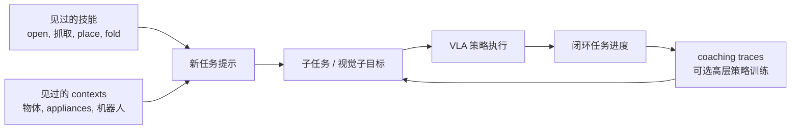

# 机器人学中的组合泛化

组合式泛化 in 机器人学（机器人中的组合泛化）指机器人策略能把训练中见过的技能、物体、关系、本体或指令重新组合，解决没有专门收集动作示范数据的任务。[[pi07-steerable-generalist-robotic-foundation-model|π0.7 论文]] 把它作为通用机器人基础模型的核心评估目标，而不是只检验已见任务模仿。

## 数学结构

这个概念在来源中主要是 empirical 评估，而不是一个封闭数学定理。可以把训练数据写成：

$$
D=\{(\tau_i,e_i,o_{1:T}^{(i)},a_{1:T}^{(i)},C_{1:T}^{(i)})\}_{i=1}^{N},
$$

其中 $\tau_i$ 是任务，$e_i$ 是机器人本体/环境，$o_{1:T}$ 是观测轨迹，$a_{1:T}$ 是动作轨迹，$C_{1:T}$ 是上下文。组合泛化测试关注一个目标配对 $(\tau^\star,e^\star)$，它没有对应的低层动作示范数据，或任务与本体的组合未在数据中出现。

评估关注闭环成功或任务进度：

$$
S(\pi_\theta;\tau^\star,e^\star,C^\star),
$$

并和先验通用模型、任务特定的 specialists、人类遥操作员或经过消融的策略比较。π0.7 的关键变量是 $C^\star$：只给语言、加入语言 coaching、加入生成的子目标图像、或加入高层策略生成的子任务，会得到不同的泛化层级。

## 直觉

机器人组合泛化比文本组合难，因为“会做 A”和“会做 B”不自动推出“会在真实物理系统里按新顺序做 A+B”。物体、grasps、接触、运动学、延迟和 partial observability 都会让组合失败。

π0.7 的 thesis 是：如果训练时用丰富上下文把技能、策略、视觉结果和质量模式绑定起来，那么测试时可以用语言或子目标图像重新绑定这些 pieces。语言 coaching 是一种人在回路组合：用户把未见长时域任务拆成模型已能跟随的子任务，然后高层策略可以从这些 coaching traces 学会自动产生子任务序列。

```mermaid
flowchart LR
  A["见过的技能<br/>open, 抓取, place, fold"] --> C["新任务提示"]
  B["见过的 contexts<br/>物体, appliances, 机器人"] --> C
  C --> D["子任务 / 视觉子目标"]
  D --> E["VLA 策略执行"]
  E --> F["闭环任务进度"]
  F --> G["coaching traces<br/>可选高层策略训练"]
  G --> D
```

## 失效情形

- False novelty：在大规模 diverse 数据集中，很难证明 $\tau^\star$ 完全未见；模型可能只是组合了 scattered 相关的回合。
- 长时域 compounding 错误：短时域未见任务可以直接提示，但 appliance-风格任务可能需要 5 minutes、多阶段交互和恢复；单个失败的子任务会破坏后续上下文。
- 数据集偏差覆盖失败：当场景 strongly cues a 常见的行为，策略可能忽略指令；π0.7 的 reverse-偏差实验就是在测试这种失败。
- 本体特定的策略差距：跨机器人泛化不只是重定向轨迹；UR5e 和小型 bimanual 机器人可能需要不同 reach/抓取策略。
- 成功率差距：来源明确承认未见任务或未见任务机器人 combinations 的成功通常低于已见任务，说明组合式泛化仍不是 reliable 规划。

## 实践含义

对基准设计，应该区分四种泛化：新语言用于已见行为、新物体/场景用于已见任务、新本体用于已见技能、新任务组合不含低层示范数据。把它们混成一个平均分会掩盖真正的困难。

对数据策略，高任务 diversity 比随机多一些数据更重要。π0.7 的消融实验显示移除最 diverse 的 20% 机器人数据比随机移除 20% 更伤害未见短时域任务性能。

对机器人 teaching，语言 coaching 是一个实际路径：先让人类给子任务层级指令，让策略执行；再用这些 traces 训练高层策略自动生成子任务。它减少低层遥操作 demand，但仍依赖 VLA 对每个子任务的语义落地能力。

相关页面：[[RobotContextConditioning]]、[[VisionLanguageActionModels]]、[[Pi07]]。
