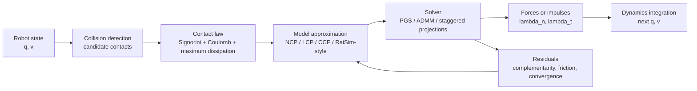

# Contact Models in Robotics

Contact models 定义 robot simulator 如何把 collisions、non-penetration、friction、impacts 与 numerical relaxation 转换成 forces 或 impulses。在 [[contact-models-in-robotics-a-comparative-analysis|Contact Models in Robotics: a Comparative Analysis]] 中，contact modeling 是 contact-rich robotics 的 first-order modeling choice，而不只是 solver implementation detail。

## Physical reference

较物理化的 rigid-contact reference 组合了三条 laws：

- Signorini complementarity：用于 unilateral、non-pulling contact；normal force 只能在 active contact 中推开 bodies。
- Coulomb friction：用于 bounded tangential forces；friction magnitude 受 normal force 与 coefficient \(\mu\) 限制。
- Maximum dissipation principle：用于 friction opposing motion；在 friction cone 内选择最耗散 sliding motion 的 tangential force。

三者合在一起会产生困难的 [[ContactComplementarity|contact complementarity]] problem。Simulators 经常用 exactness 换取 speed、robustness、differentiability 或 easier implementation。论文的主要警告是：这些 tradeoffs 在简单任务中可能被隐藏，但会在 sliding contact、redundant contacts、ill-conditioned systems 和 rough locomotion terrain 中显现出来。

## Contact pipeline

这个 pipeline 的关键点是：contact model 在 contact-resolution layer 进入 simulator。Collision detection 只给出 candidate contacts；真正决定 physical behavior 的，是后续如何把这些 contacts 解释成 unilateral constraints、friction bounds、dissipation objective，以及可求解的 mathematical problem。

## Modeling choices 如何进入 pipeline

在 contact law 阶段，选择 rigid reference 意味着把 non-penetration、non-pulling force、Coulomb friction 和 maximum dissipation 一起保留。这个选择给出最清晰的 physical target，但也把问题变成 [[ContactComplementarity|NCP-style complementarity]]。

在 model approximation 阶段，simulator 会决定牺牲哪部分 exactness。LCP 把 friction cone linearize 成 pyramid，降低求解难度但引入 direction-dependent friction bias。CCP 更好保留 cone 与 maximum dissipation structure，但可能 relax Signorini complementarity。RaiSim-style handling 尝试在 sliding contacts 中恢复 Signorini behavior，但使用 contact-state heuristics，并 relax maximum dissipation。

在 solver 阶段，per-contact methods 如 PGS 或 RaiSim-style bisection 通常每次 iteration 更便宜，但可能错过 contacts 之间的 global coupling，产生 internal forces，并在 ill-conditioned problems 上失败。ADMM 与 staggered projections 这类 global/proximal [[ContactSolvers|contact solvers]] 更关注完整 contact problem 的 coupling，通常更 robust，但每次 iteration 成本更高；warm-starting 可以缩小 runtime gap。

## Robotics implication

对 robotics，contact model 的误差不是只停留在 forces 层。它会进入 MPC、RL policy training、trajectory optimization、system identification 与 [[DifferentiablePhysics|differentiable physics]] 的 downstream objective。source 的 quadruped MPC experiments 显示，flat、high-friction terrain 可能掩盖 solver differences；bumpy 与 slippery terrain 会放大 RaiSim/CCP behavior 与 NCP behavior 的差异。

相关页面：[[ContactSolvers]]、[[SimulationRealityGap]]、[[DifferentiablePhysics]]、[[MuJoCo]]、[[RaiSim]]、[[ContactBench]]。
