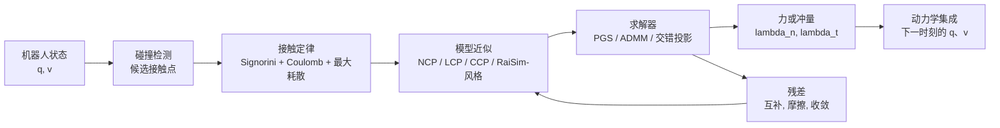

# 机器人学中的接触模型

接触模型定义机器人仿真器如何把碰撞、不穿透、摩擦、冲击与数值松弛转换成力或冲量。在 [[contact-models-in-robotics-a-comparative-analysis|Contact Models in Robotics: a Comparative Analysis]] 中，接触建模是接触丰富机器人学的首要建模选择，而不只是求解器实现细节。

## 数学结构

较物理化的刚性接触参考基准组合了三条定律：

- Signorini 互补条件：用于单边、不产生拉力接触；法向力只能在有效接触中推开刚体。
- Coulomb 摩擦：用于受限切向力；摩擦幅值受法向力与系数 $\mu$ 限制。
- 最大耗散原理：用于摩擦抵抗运动；在摩擦锥内选择最耗散滑动运动的切向力。

三者合在一起会产生困难的 [[ContactComplementarity|接触互补]] 问题。仿真器经常用精确性换取速度、鲁棒性、可微性或更易实现。论文的主要警告是：这些取舍在简单任务中可能被隐藏，但会在滑动接触、冗余接触、病态系统和崎岖运动地形中显现出来。

用变量看，接触模型从机器人配置 $q$、速度 $v$、接触差距 $g_n(q)$、接触雅可比矩阵 $J$ 和摩擦系数 $\mu$ 出发，求法向/切向冲量或力 $\lambda=(\lambda_n,\lambda_t)$。理想刚性参考基准希望同时满足单边接触、库仑摩擦锥和耗散方向；不同仿真器的差异在于它把这个参考基准问题近似成 NCP、LCP、CCP 还是启发式接触状态更新。

## 接触处理流程

```mermaid
flowchart LR
  A["机器人状态<br/>q, v"] --> B["碰撞检测<br/>候选接触点"]
  B --> C["接触定律<br/>Signorini + Coulomb + 最大耗散"]
  C --> D["模型近似<br/>NCP / LCP / CCP / RaiSim-风格"]
  D --> E["求解器<br/>PGS / ADMM / 交错投影"]
  E --> F["力或冲量<br/>lambda_n, lambda_t"]
  F --> G["动力学集成<br/>下一时刻的 q、v"]
  E --> H["残差<br/>互补, 摩擦, 收敛"]
  H --> D
```

这个流程的关键点是：接触模型在接触求解层进入仿真器。碰撞检测只给出候选接触点；真正决定物理行为的，是后续如何把这些接触解释成单边约束、摩擦边界、耗散目标，以及可求解的数学问题。

## 直觉

在接触定律阶段，选择刚性参考基准意味着把不穿透、不产生拉力力、Coulomb 摩擦和最大耗散一起保留。这个选择给出最清晰的物理目标，但也把问题变成 [[ContactComplementarity|NCP 风格互补问题]]。

在模型近似阶段，仿真器会决定牺牲哪部分精确性。LCP 把摩擦锥线性化成棱锥，降低求解难度但引入方向相关摩擦偏差。CCP 更好保留锥与最大耗散结构，但可能松弛 Signorini 互补条件。RaiSim-风格处理尝试在滑动接触中恢复 Signorini 行为，但使用接触状态启发式规则，并松弛最大耗散。

在求解器阶段，逐接触点方法如 PGS 或 RaiSim-风格二分法通常每次迭代更便宜，但可能错过接触之间的全局耦合，产生内部力，并在病态问题上失败。ADMM 与交错投影这类全局/近端 [[ContactSolvers|接触求解器]] 更关注完整接触问题的耦合，通常更鲁棒，但每次迭代成本更高；热启动可以缩小运行时差距。

## 失效情形

- 方向相关摩擦偏差：LCP 的多面体摩擦锥会让摩擦行为依赖离散锥方向。
- 松弛的互补：CCP-风格松弛可能允许分离速度与正法向力同时出现，导致非物理支撑力。
- 启发式接触状态错误：RaiSim-风格处理依赖接触状态分类；滑动/黏着判断错误会改变力分布。
- 内部力：逐接触点/局部求解器在冗余接触中可能产生互相抵消但物理上不干净的内部力。
- 隐藏的简单情形等价性：平坦、高摩擦地形可能让不同模型看起来等价；颠簸、湿滑、病态场景才暴露差异。

## 实践含义

对机器人学，接触模型的误差不是只停留在力层。它会进入 MPC、RL 策略训练、轨迹优化、系统辨识与 [[DifferentiablePhysics|可微物理]] 的下游目标。来源的四足机器人 MPC 实验显示，平坦、高摩擦地形可能掩盖求解器差异；颠簸与湿滑地形会放大 RaiSim/CCP 行为与 NCP 行为的差异。

选择仿真器时应先写清楚目标接触工况：高速冲击、长距离滑动、布料/柔性接触、冗余支撑、力感知、还是可微优化。没有这个工况，比较 “快速” 或 “稳定” 求解器很容易把任务特定的容差误当成一般性物理保真度。

相关页面：[[ContactSolvers]]、[[SimulationRealityGap]]、[[DifferentiablePhysics]]、[[MuJoCo]]、[[RaiSim]]、[[ContactBench]]。
