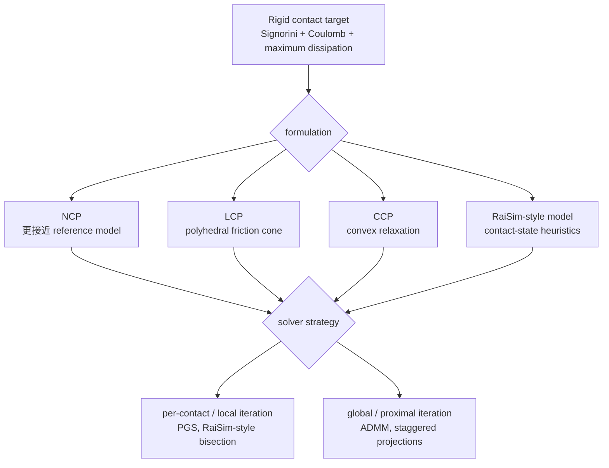

# Contact Solvers（接触求解器）

Contact solvers 是 numerical routines：当 simulator 检测到 contact geometry 并构造出 contact problem 后，它们负责计算 forces 或 impulses。在 [[contact-models-in-robotics-a-comparative-analysis|Contact Models in Robotics: a Comparative Analysis]] 中，solvers 的评估维度包括 physical residuals、robustness to ill-conditioning、internal-force artifacts、self-consistency 和 runtime。

关键点是：solver 不是在孤立地“修正每个接触点”。一个 contact impulse 会通过 rigid-body dynamics 改变整机 velocity，再通过 Jacobian 影响所有其他 contact velocities。因此 contact resolution 本质上是一个 coupled fixed-point problem：找到一组 normal/tangential forces，使 non-penetration、friction bound 和 energy dissipation 的残差同时足够小。

## 数学结构

一个简化的数学图像是：

- normal direction：`lambda_n >= 0`、`v_n >= 0`、`lambda_n * v_n = 0`，表示 contact 不能拉住物体，也不能在分离时仍施加 normal force。
- tangential direction：`||lambda_t|| <= mu * lambda_n`，friction force 被 Coulomb cone 限制。
- sliding 时：maximum dissipation 要求 friction direction 与 tangential motion 相反。

这些条件共同形成 [[ContactComplementarity|contact complementarity]]。论文比较的 solvers 可以按 formulation 和 numerical strategy 两层理解：

Contact coupling 可以通过 Delassus operator 直观理解：$W=J M^{-1}J^\top$，其中 $M$ 是 mass matrix，$J$ 是 contact Jacobian。一个 contact impulse $\lambda_i$ 会通过 $W$ 改变其他 contacts 的 normal/tangential velocities，所以求解不是每个 contact 独立 clip，而是在 coupled system 中找到全局一致的 $\lambda$。

## 直觉

论文区分了两个 practical families：

- Per-contact methods，例如 PGS 与 RaiSim-style bisection：每次 iteration 成本低，在温和的 contact scenarios 中通常足够快；但它们可能遗漏 contacts 之间的 global coupling，产生 internal forces，并在 ill-conditioned problems 上失败。
- Global 或 proximal methods，例如 ADMM 与 staggered projections：使用更多完整 contact problem 的结构。它们通常更 robust，也能产生更干净的 contact forces，但每次 iteration 成本更高。从 previous time step warm-start 可以在 practical simulation loops 中缩小这个差距。

算法直觉上，PGS-style 方法像是在 contact constraints 之间做 sequential projection：更新一个 contact 的 impulse 后，立刻用它修正当前 velocity estimate，再处理下一个 contact。它便宜、incremental，也容易 warm-start；但在 redundant support、sliding 或 bad conditioning 下，局部修正可能互相抵消，留下 self-consistency residuals 或 internal forces。

ADMM 与 staggered projections 这类方法更像是在 whole contact vector 上交替满足 dynamics、cone constraints 和 complementarity-related constraints。它们每步更重，但能更直接处理 contacts 之间的 coupling 与 underdetermination，因此论文把它们描述为更 robust 的方向。

[[omniverse-omni-physics-articulations|Omni Physics Articulations]] 给这个 solver lens 增加了 articulation-internal constraints。Source 说明 closed-loop articulations 更难求解，建议降低 simulation timestep；mimic joint 如果没有 compliance，会用 impulses instantaneously 维持 mimic equation；gripper 场景中 stiff driven joint、light finger inertia、hard mimic constraint 和 hard contact 会互相竞争，导致 instability。它还说明增加 TGS solver position iterations 会降低 compliant mimic joint 看到的 effective timestep，尤其在 behavior 不由 collision response 主导时。

## Failure Modes

- Local coupling miss：PGS/per-contact updates 可能只在局部改善 residual，却没有解决 whole-body contact coupling。
- Ill-conditioned convergence failure：质量分布、redundant contacts 或 near-singular contact geometry 会让 local solvers 难以收敛。
- Internal-force artifacts：underdetermined support 中，solver 可能返回 physical residual 看似可接受但 force distribution 不可信的 solution。
- Competing articulation constraints：hard mimic / tendon / closed-loop constraints 与 hard contact 或 stiff drive 同时存在时，solver 可能出现 instability、chatter 或需要更小 timestep。
- Runtime/fidelity tradeoff inversion：global methods 每步更贵，但如果 local solver 需要大量 iterations 或 failed convergence，实际 control loop 中未必更便宜。
- Warm-start dependence：warm-start 能显著改善 runtime，但也可能让 solver behavior 依赖 previous-step artifacts。

## 实践含义

对 robotics 来说，合适的 solver 取决于 task tolerance。某些 MPC 与 RL workloads 可能能接受快速的 approximate answers；而 contact-rich terrain、redundant support、force sensing、differentiable objectives、closed-loop mechanisms 和 gripper mimic constraints 会对 physical consistency 提出更高要求。

相关页面：[[ContactComplementarity]]、[[ContactModelsInRobotics]]、[[ReducedCoordinateArticulations]]、[[SimulationRealityGap]]、[[DifferentiablePhysics]]。
