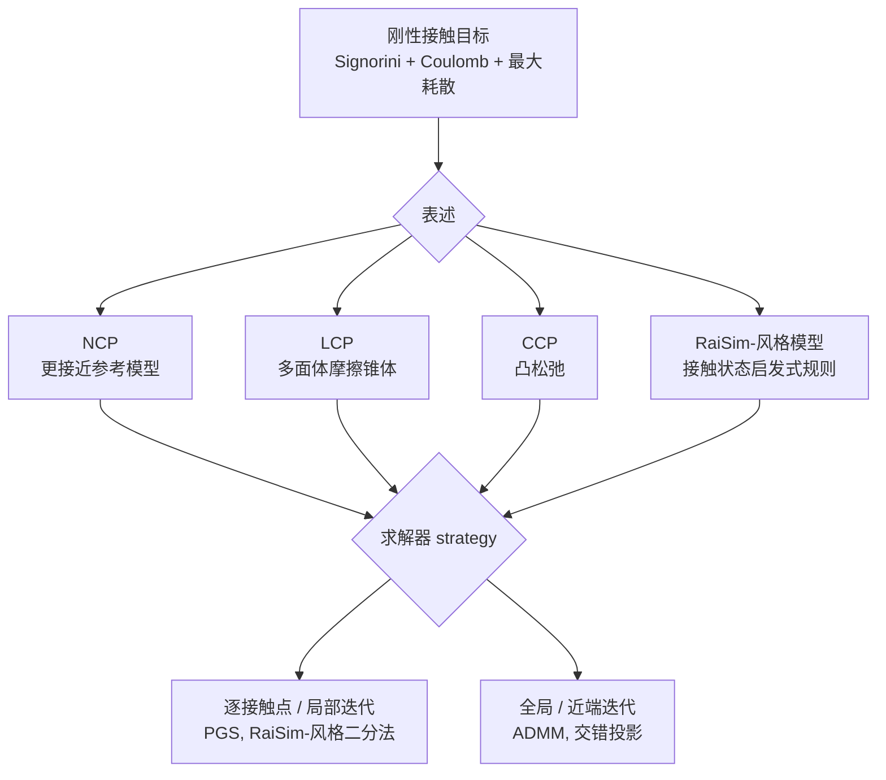

# 接触求解器

接触求解器是数值 routines：当仿真器检测到接触几何并构造出接触问题后，它们负责计算力或冲量。在 [[contact-models-in-robotics-a-comparative-analysis|Contact Models in Robotics: a Comparative Analysis]] 中，求解器的评估维度包括物理残差、鲁棒性到 ill-条件化、内部力产物、self-一致性和运行时。

关键点是：求解器不是在孤立地“修正每个接触点”。一个接触冲量会通过刚体动力学改变整机速度，再通过雅可比矩阵影响所有其他接触速度。因此接触分辨率本质上是一个耦合的不动点问题：找到一组法向/切向力，使不穿透、摩擦边界和能量耗散的残差同时足够小。

## 数学结构

一个简化的数学图像是：

- 法向方向：`lambda_n >= 0`、`v_n >= 0`、`lambda_n * v_n = 0`，表示接触不能拉住物体，也不能在分离时仍施加法向力。
- 切向方向：`||lambda_t|| <= mu * lambda_n`，摩擦力被库仑摩擦锥限制。
- 滑动时：最大耗散要求摩擦方向与切向运动相反。

这些条件共同形成 [[ContactComplementarity|接触互补]]。论文比较的求解器可以按表述和数值策略两层理解：

```mermaid
flowchart TD
  A["刚性接触目标<br/>Signorini + Coulomb + 最大耗散"] --> B{"表述"}
  B --> C["NCP<br/>更接近参考模型"]
  B --> D["LCP<br/>多面体摩擦锥体"]
  B --> E["CCP<br/>凸松弛"]
  B --> F["RaiSim-风格模型<br/>接触状态启发式规则"]
  C --> G{"求解器 strategy"}
  D --> G
  E --> G
  F --> G
  G --> H["逐接触点 / 局部迭代<br/>PGS, RaiSim-风格二分法"]
  G --> I["全局 / 近端迭代<br/>ADMM, 交错投影"]
```

接触耦合可以通过 Delassus 算子直观理解：$W=J M^{-1}J^\top$，其中 $M$ 是质量矩阵，$J$ 是接触雅可比矩阵。一个接触冲量 $\lambda_i$ 会通过 $W$ 改变其他接触的法向/切向速度，所以求解不是每个接触独立截断，而是在耦合的系统中找到全局一致的 $\lambda$。

## 直觉

论文区分了两个实用的族：

- Per-接触方法，例如 PGS 与 RaiSim-风格二分法：每次迭代成本低，在温和的接触场景中通常足够快；但它们可能遗漏接触之间的全局耦合，产生内部力，并在病态问题上失败。
- 全局或近端方法，例如 ADMM 与交错投影：使用更多完整接触问题的结构。它们通常更鲁棒，也能产生更干净的接触力，但每次迭代成本更高。从上一时间步热启动可以在实用的仿真 loops 中缩小这个差距。

算法直觉上，PGS-风格方法像是在接触约束之间做顺序投影：更新一个接触的冲量后，立刻用它修正当前速度估计值，再处理下一个接触。它便宜、incremental，也容易热启动；但在冗余支撑、滑动或不良条件化下，局部修正可能互相抵消，留下 self-一致性残差或内部力。

ADMM 与交错投影这类方法更像是在 whole 接触 vector 上交替满足动力学、锥约束和互补相关的约束。它们每步更重，但能更直接处理接触之间的耦合与 underdetermination，因此论文把它们描述为更鲁棒的方向。

[[omniverse-omni-physics-articulations|Omni 物理关节系统]] 给这个求解器视角增加了关节系统内部约束。来源说明闭环关节系统更难求解，建议降低仿真时间步；mimic 关节如果没有柔顺性，会用冲量瞬时地维持 mimic 方程；夹爪场景中高刚度的驱动的关节、轻量的手指惯量、硬 mimic 约束和硬接触会互相竞争，导致不稳定。它还说明增加 TGS 求解器位置迭代会降低 compliant mimic 关节看到的有效的时间步，尤其在行为不由碰撞响应主导时。

## 失效情形

- 局部耦合 miss：PGS/逐接触点更新可能只在局部改善残差，却没有解决全身接触耦合。
- 病态收敛失败：质量分布、冗余接触或 near-singular 接触几何会让局部求解器难以收敛。
- 内部力产物：underdetermined 支撑中，求解器可能返回物理残差看似可接受但力分布不可信的 solution。
- 相互竞争的关节系统约束：硬 mimic / tendon / 闭环约束与硬接触或高刚度的驱动同时存在时，求解器可能出现不稳定、颤振或需要更小时间步。
- 运行时/保真度取舍 inversion：全局方法每步更贵，但如果局部求解器需要大量迭代或失败的收敛，实际控制循环中未必更便宜。
- 热启动依赖：热启动能显著改善运行时，但也可能让求解器行为依赖先前的步骤产物。

## 实践含义

对机器人学来说，合适的求解器取决于任务容差。某些 MPC 与 RL 工作负载可能能接受快速的近似 answers；而接触丰富地形、冗余支撑、力感知、可微目标、闭环机制和夹爪 mimic 约束会对物理一致性提出更高要求。

相关页面：[[ContactComplementarity]]、[[ContactModelsInRobotics]]、[[ReducedCoordinateArticulations]]、[[SimulationRealityGap]]、[[DifferentiablePhysics]]。
