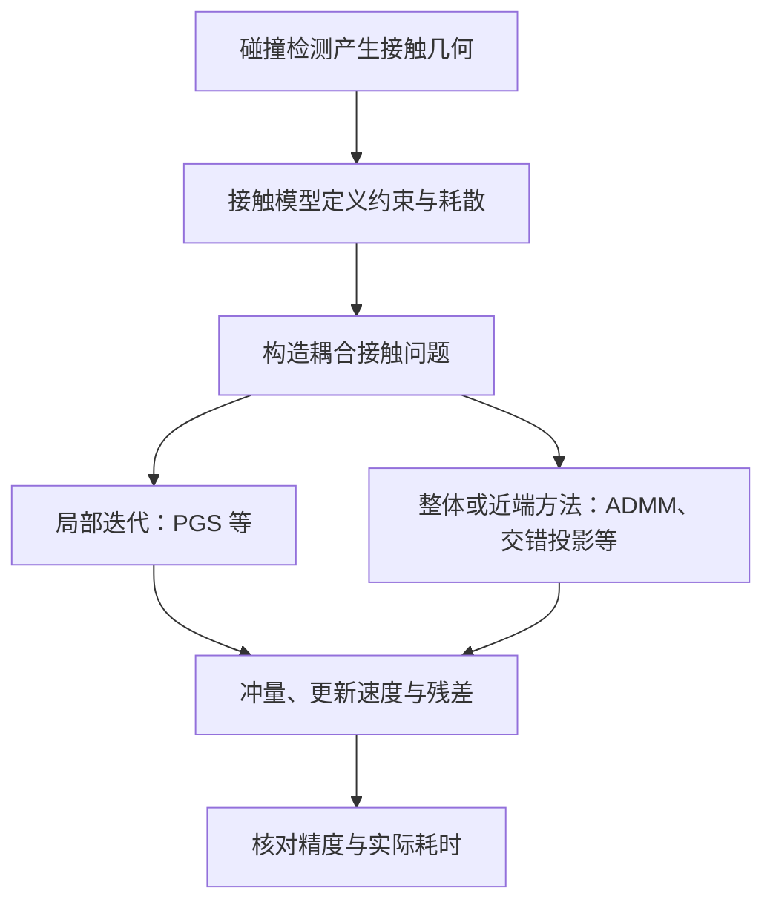

# 接触求解器

接触模型规定“什么力是可接受的”，接触求解器负责“怎样算出这组力或冲量”。同一模型可能有不同算法；同一算法也可能求解不同近似。[[contact-models-in-robotics-a-comparative-analysis|比较论文]] 因而同时检查物理残差、病态问题鲁棒性、内部力和计算时间。

## 数学结构

以下是**无摩擦、已激活接触、忽略恢复和位置稳定化的教学模型**，用来解释耦合与迭代，不替代完整摩擦接触算法。

令 $M$ 为广义质量矩阵，$J$ 为接触法向雅可比矩阵，$v_{\mathrm{free}}$ 为尚未施加接触冲量的广义速度，$p$ 为各接触法向冲量。则：

$$
v^+=v_{\mathrm{free}}+M^{-1}J^\top p,\qquad
v_n^+=b+Wp,\quad b=Jv_{\mathrm{free}},\quad W=JM^{-1}J^\top.
$$

$v^+$ 为冲量后的广义速度，$v_n^+$ 为所有接触的法向相对速度；$W$ 称为 Delassus 算子。其非对角项 $W_{ij}$ 表示第 $j$ 个接触冲量如何改变第 $i$ 个接触速度。动力学与 [[ContactComplementarity|互补条件]] 合起来给出：

$$
0\le p\perp b+Wp\ge0.
$$

在 $W_{ii}>0$ 时，投影高斯—赛德尔法（PGS）的单分量教学更新为：

$$
p_i\leftarrow\max\left(0,\ p_i-\frac{b_i+\sum_j W_{ij}p_j}{W_{ii}}\right).
$$

处理下一个分量时使用刚更新的冲量。**PGS 会通过迭代传播接触耦合**；它的问题在于有限预算、病态或冗余系统下可能难以充分收敛，而不是完全忽略其他接触。完整摩擦模型的局部投影和更新比此式复杂。模型与算法比较见 [[contact-models-in-robotics-a-comparative-analysis|接触模型比较论文]]。

## 直觉：算一次静止支撑

教学例子：质量 $m=1\,\mathrm{kg}$ 的物体恰好接触地面，初始速度为零，步长 $h=0.01\,\mathrm{s}$，重力加速度取 $9.81\,\mathrm{m/s^2}$。自由速度为 $b=-0.0981\,\mathrm{m/s}$，单接触 $W=1/m$。为使 $v_n^+=0$，需要冲量 $p=0.0981\,\mathrm{N\,s}$，对应平均支撑力 $p/h=9.81\,\mathrm{N}$。

这个例子说明求解器如何抵消向地面的运动。多接触时不能逐点套这个答案：一个支撑点的冲量会改变其他支撑点的速度，冗余支撑还可能让力分配不唯一。

## 算法取舍

```mermaid
flowchart TD
  A[碰撞检测产生接触几何] --> B[接触模型定义约束与耗散]
  B --> C[构造耦合接触问题]
  C --> D[局部迭代：PGS 等]
  C --> E[整体或近端方法：ADMM、交错投影等]
  D --> F[冲量、更新速度与残差]
  E --> F
  F --> G[核对精度与实际耗时]
```

局部方法每次更新便宜，容易沿用上一时间步的解进行热启动；但困难系统可能需要很多迭代。比较论文中的 ADMM、交错投影等方法利用更多完整问题结构，在其基准上更鲁棒，但单次迭代通常更贵。算法选择应比较达到相同残差所需的总时间，而不是只比较单次迭代。结论受模型、实现、热启动和任务约束影响。[[contact-models-in-robotics-a-comparative-analysis|接触模型比较论文]]

## 失效情形

- **收敛慢与残差偏大**：病态系统、冗余接触可能让局部更新互相抵消，有限迭代下留下误差。[[contact-models-in-robotics-a-comparative-analysis|接触模型比较论文]]
- **力分配不可信**：冗余支撑可能产生内部力；运动看起来稳定不代表每个接触力都可信。[[contact-models-in-robotics-a-comparative-analysis|接触模型比较论文]]
- **关节与接触约束竞争**：高刚度驱动、轻手指惯量、硬 mimic 约束与硬接触同时作用时可能不稳定。闭环关节系统也更难求解，官方文档建议降低时间步。[[omniverse-omni-physics-articulations|Omni 物理关节文档]]

Omni 文档还指出，增加 TGS 位置迭代会减小柔顺 mimic 关节感受到的有效时间步，尤其在行为不由碰撞响应主导时。这是特定求解器语义，不能直接当作所有引擎的调参规律。[[ReducedCoordinateArticulations|约化坐标关节系统]]

## 实践含义

排查顺序建议：先确认 [[CollisionGeometryForRobotSimulation|碰撞几何]] 和模型语义，再固定步长与初态，比较迭代预算、残差、力分配和总耗时。这是依据上述机制整理的实验方法，不是论文中的统一调参配方。

RL 看任务收益与吞吐量；MPC 和力控制还看力的一致性；可微优化要另查 [[DifferentiablePhysics|梯度质量]]。把设置、热启动和终止条件一起记录，才能复现实验。
