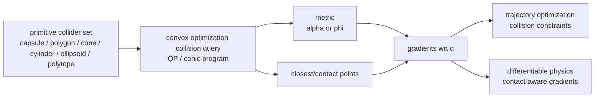

# Differentiable Collision Detection

Differentiable Collision Detection（可微碰撞检测）把 collision query 写成对 geometry / configuration 可微的函数，使 trajectory optimization、state estimation、system identification、differentiable physics 和 learning pipelines 可以使用 collision gradients。它和 [[DifferentiablePhysics|differentiable physics]] 相邻但不等价：前者通常给出 distance / proximity / contact point gradients，后者还要处理 time stepping、contact law、friction 和 solver dynamics。

## 数学结构

传统 collision detection algorithms（例如 GJK、EPA、MPR、FCL-style routines）在工程上成熟高效，但通常包含 branching、support point pivoting、case splits 和 active-set switches。[[dcol-differentiable-collision-detection-for-a-set-of-convex-primitives|DCOL]] 的做法是把 pairwise collision metric 写成 convex optimization problem：寻找让两 primitives 相交所需的最小 uniform scaling factor $\alpha$。

$$
\alpha^\star(q) = \min_{\alpha, z} \alpha
$$

subject to scaled primitive intersection constraints。这里 $q$ 是 object / robot configuration，$z$ 是 convex program 的 internal variables。DCOL 的 interpretation 是：

$$
\alpha^\star(q) > 1 \Rightarrow \text{separated}
$$

$$
\alpha^\star(q) = 1 \Rightarrow \text{touching}
$$

$$
\alpha^\star(q) < 1 \Rightarrow \text{interpenetrating}
$$

因此 trajectory optimization 的 collision avoidance constraint 可以写成：

$$
\alpha^\star_k(q_t) \ge 1
$$

其中 $k$ 是 primitive pair index，$t$ 是 trajectory time index。DCOL 通过 differentiable convex optimization 和 primal-dual interior-point conic solver 获得 $\partial \alpha^\star / \partial q$ 与 contact point derivatives。

[[diffpills-differentiable-collision-detection-for-capsules-and-padded-polygons|DiffPills]] 使用 proximity value $\phi$：$\phi>0$ 表示 separation，$\phi=0$ 表示 touching，$\phi<0$ 表示 collision。Capsule / padded polygon constraints 可写成：

$$
\phi_j(q_t) \ge 0
$$

DiffPills 通过 differentiable convex quadratic programs 计算 proximity 和 closest points，并将它们交给 gradient-based trajectory optimizer。

## 直觉

可微 collision detection 的核心价值不是“碰撞检测更准确”，而是“optimizer 能知道往哪个方向离开 collision 或接近 contact”。对 trajectory optimization，finite differences 或 non-smooth collision branches 会导致 noisy / missing gradients；DCOL 和 DiffPills 用 optimization-defined metrics 给出 smoother, structured gradients。

这也解释了为什么 primitive representation 重要。Capsule、padded polygon、ellipsoid、cone、cylinder 和 polytope 不只是 runtime collider，它们也是 convex programs 的 feasible set。复杂 visual mesh 要进入可微 collision pipeline，通常需要先变成一组 convex primitives；这把 [[ApproximateConvexDecomposition|convex decomposition]] 和 differentiable collision detection 连接起来。

## Failure Modes

- Metric is not full physics：$\alpha$ 或 $\phi$ 是 collision/proximity surrogate，不包含 friction cone、impact law、normal/tangential impulse coupling 或 solver residual。
- Active-set / solver tolerance artifacts：即使 convex program 可微，数值 solver tolerance、constraint activity changes 和 ill-conditioning 仍可能造成 gradient discontinuity 或 noise。
- Primitive decomposition dependency：复杂 object 的 gradient quality 取决于如何分解成 primitives；poor collider approximation 会给出 clean but wrong gradients。
- Scaling metric interpretation：DCOL 的 uniform scaling factor 很适合 differentiable separation measure，但它不等同于某个 engine 的 penetration depth 或 contact offset。
- Contact-rich rollout coupling：单个 pairwise differentiable query 不能自动解决 many-contact time stepping 中的 complementarity、stick-slip、redundant contacts 和 energy dissipation。

## 实践含义

对 trajectory optimization，DCOL / DiffPills-style methods 适合把 collision avoidance 写成 differentiable constraints：$\alpha_k(q_t)\ge 1$ 或 $\phi_j(q_t)\ge 0$。它们特别适合 capsules、robots links、vehicles、convex obstacles 和需要 smooth gradients 的 planning problems。

对 differentiable simulation，不要把 differentiable collision query 直接等同于 differentiable rigid contact simulator。它可以提供 collision metric、closest points 和 gradients，但 time-stepping contact dynamics 仍需要 [[ContactComplementarity|complementarity]]、friction、solver 和 regularization choices；这些 choices 仍可能污染 [[DifferentiablePhysics|physics gradients]]。

未来趋势是把 robot-friendly collider families 与 optimization-friendly collision metrics 结合：offline 用 ACD / primitive decomposition 产生 manageable primitive sets，online 用 differentiable convex programs 提供 constraints and gradients，再把少数 contact-rich interactions 交给更完整的 simulator / solver 验证。

相关页面：[[CollisionGeometryForRobotSimulation]]、[[ApproximateConvexDecomposition]]、[[DifferentiablePhysics]]、[[ContactComplementarity]]、[[ContactSolvers]]、[[DCOL]]、[[DiffPills]]。
