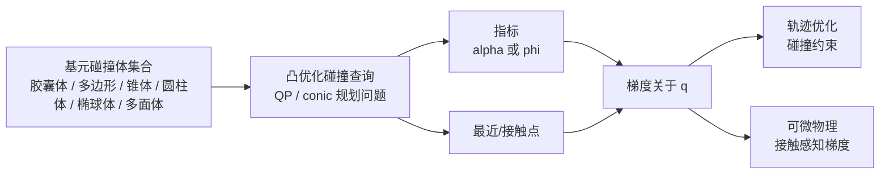

# 可微碰撞检测

可微碰撞检测（可微碰撞检测）把碰撞查询写成对几何 / 配置可微的函数，使轨迹优化、状态估计、系统辨识、可微物理和学习流程可以使用碰撞梯度。它和 [[DifferentiablePhysics|可微物理]] 相邻但不等价：前者通常给出距离 / 邻近度 / 接触点梯度，后者还要处理时间步进、接触定律、摩擦和求解器动力学。

## 数学结构

传统碰撞检测 algorithms（例如 GJK、EPA、MPR、FCL-风格 routines）在工程上成熟高效，但通常包含 branching、支撑点 pivoting、情形 splits 和有效设置 switches。[[dcol-differentiable-collision-detection-for-a-set-of-convex-primitives|DCOL]] 的做法是把两两碰撞指标写成凸优化问题：寻找让两基元相交所需的最小均匀规模扩展因素 $\alpha$。

$$
\alpha^\star(q) = \min_{\alpha, z} \alpha
$$

并满足缩放后基元相交的约束。这里 $q$ 是物体或机器人的配置，$z$ 是凸优化问题的内部变量。DCOL 的解释是：

$$
\alpha^\star(q) > 1 \Rightarrow \text{separated}
$$

$$
\alpha^\star(q) = 1 \Rightarrow \text{touching}
$$

$$
\alpha^\star(q) < 1 \Rightarrow \text{interpenetrating}
$$

因此轨迹优化的碰撞 avoidance 约束可以写成：

$$
\alpha^\star_k(q_t) \ge 1
$$

其中 $k$ 是基元配对索引，$t$ 是轨迹时间索引。DCOL 通过可微凸优化和 primal-dual interior-点 conic 求解器获得 $\partial \alpha^\star / \partial q$ 与接触点 derivatives。

[[diffpills-differentiable-collision-detection-for-capsules-and-padded-polygons|DiffPills]] 使用邻近度价值 $\phi$：$\phi>0$ 表示分离，$\phi=0$ 表示接触，$\phi<0$ 表示碰撞。胶囊体 / 带填充的多边形约束可写成：

$$
\phi_j(q_t) \ge 0
$$

DiffPills 通过可微凸 quadratic programs 计算邻近度和 closest 点，并将它们交给基于梯度的轨迹 optimizer。

## 直觉

可微碰撞检测的核心价值不是“碰撞检测更准确”，而是“optimizer 能知道往哪个方向离开碰撞或接近接触”。对轨迹优化，finite 差异或 non-平滑碰撞 branches 会导致 noisy / missing 梯度；DCOL 和 DiffPills 用优化-定义的指标给出 smoother, 结构化的梯度。

这也解释了为什么基元表示重要。胶囊体、带填充的多边形、ellipsoid、锥、圆柱体和 polytope 不只是运行时碰撞体，它们也是凸 programs 的可行设置。复杂视觉网格要进入可微碰撞流程，通常需要先变成一组凸基元；这把 [[ApproximateConvexDecomposition|凸分解]] 和可微碰撞检测连接起来。

## 失效情形

- 指标 is not 完整物理：$\alpha$ 或 $\phi$ 是碰撞/邻近度替代，不包含摩擦锥、冲击定律、法向/切向冲量耦合或求解器残差。
- 有效设置 / 求解器容差产物：即使凸 program 可微，数值求解器容差、约束 activity 变更和 ill-条件化仍可能造成梯度 discontinuity 或噪声。
- 基元分解依赖：复杂物体的梯度质量取决于如何分解成基元；粗劣的碰撞体近似会给出 clean but wrong 梯度。
- 规模扩展指标 interpretation：DCOL 的均匀规模扩展因素很适合可微分离 measure，但它不等同于某个引擎的穿透深度或接触偏移。
- 接触密集轨迹采样耦合：单个两两可微查询不能自动解决大量-接触时间步进中的互补、stick-滑移、冗余接触和能量耗散。

## 实践含义

对轨迹优化，DCOL / DiffPills-风格方法适合把碰撞 avoidance 写成可微约束：$\alpha_k(q_t)\ge 1$ 或 $\phi_j(q_t)\ge 0$。它们特别适合胶囊体、机器人链接、车辆、凸障碍物和需要平滑梯度的规划问题。

对可微仿真，不要把可微碰撞查询直接等同于可微刚性接触仿真器。它可以提供碰撞指标、closest 点和梯度，但时间-stepping 接触动力学仍需要 [[ContactComplementarity|互补]]、摩擦、求解器和正则化选择；这些选择仍可能污染 [[DifferentiablePhysics|物理梯度]]。

未来趋势是把机器人友好的碰撞体族与优化友好的碰撞指标结合：离线用 ACD / 基元分解产生 manageable 基元集合，在线用可微凸 programs 提供约束与梯度，再把少数接触丰富 interactions 交给更完整的仿真器 / 求解器验证。

相关页面：[[CollisionGeometryForRobotSimulation]]、[[ApproximateConvexDecomposition]]、[[DifferentiablePhysics]]、[[ContactComplementarity]]、[[ContactSolvers]]、[[DCOL]]、[[DiffPills]]。
