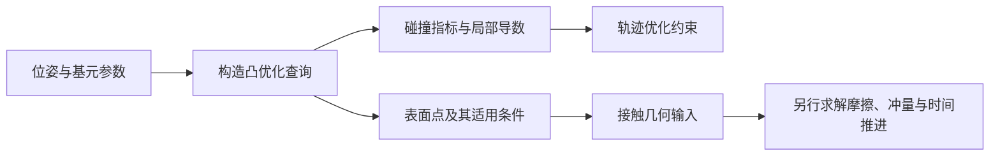

# 可微碰撞检测

可微碰撞检测将物体配置映射为碰撞指标及其导数，让梯度优化器能使用几何约束。需要分清三个对象：**碰撞判定指标、表面点或最近点、完整接触动力学**。一个对象可求导，不代表其他对象都光滑或物理正确。[[dcol-differentiable-collision-detection-for-a-set-of-convex-primitives|DCOL]]、[[diffpills-differentiable-collision-detection-for-capsules-and-padded-polygons|DiffPills]]

## 两种优化定义的碰撞指标

设 $q$ 为两物体配置，$j$ 为基元配对编号，$t$ 为轨迹时间节点。

| 方法 | 指标 | 无穿透约束 | 需要保留的区别 |
| --- | --- | --- | --- |
| DCOL | 使两个凸基元刚好相交的最小共同缩放 $\alpha^\star(q)$ | $\alpha_j^\star(q_t)\ge1$ | 无量纲，依赖尺寸与缩放中心，不等于欧氏距离 |
| DiffPills | 中心线段／多边形最近距离的平方，减去厚度和的平方 $\phi(q)$ | $\phi_j(q_t)\ge0$ | 长度平方量纲，不是有符号距离；中心几何相交时可能缺少脱离方向 |

### 最小缩放

令 $S_i(\alpha;q)$ 为围绕第 $i$ 个物体参考点缩放 $\alpha$ 后的凸集合，$x$ 为公共点：

$$
\alpha^\star(q)=\min_{x,\alpha\ge0}\alpha,
\qquad x\in S_1(\alpha;q)\cap S_2(\alpha;q).
$$

$\alpha^\star>1$ 表示分离，等于 1 表示接触，小于 1 表示原形状相交。多面体可用线性不等式描述，椭球、胶囊体等可用二阶锥约束描述，从而共用凸锥规划。六类基元定义和完整求解结构见 [[dcol-differentiable-collision-detection-for-a-set-of-convex-primitives|DCOL 方法解析]]。

### 中心几何距离

胶囊体是线段加半径，带厚度多边形是二维凸多边形加半径。令 $p_i^\star$ 为两个中心几何的最近点，$R_i$ 为各自半径，则：

$$
\phi(q)=\|p_1^\star-p_2^\star\|_2^2-(R_1+R_2)^2.
$$

中心最近点通过小型凸二次规划求出。$\phi>0$ 表示分离，等于零表示接触，小于零表示相交。中心线段或中心多边形本身已相交时，最优距离可维持为零；此时负指标仍能判相交，梯度却未必提供有用的脱离方向。这是对公式的解释，并非 [[diffpills-differentiable-collision-detection-for-capsules-and-padded-polygons|DiffPills]] 已完成的失效概率实验。

## 为什么能求导，何时不能直接求导

将最优性条件记为 $g(y^\star,q)=0$，其中 $y$ 包含优化变量与约束乘子。在局部解满足条件且 $\partial g/\partial y$ 可逆时，隐函数定理给出：

$$
\frac{\partial y^\star}{\partial q}
=-\left(\frac{\partial g}{\partial y}\right)^{-1}\frac{\partial g}{\partial q}.
$$

内点求解器可复用已有矩阵分解降低求导成本。如果只需要最优目标值的梯度，还可利用最优解处拉格朗日函数对参数的导数。方法依据分别见 [[diffpills-differentiable-collision-detection-for-capsules-and-padded-polygons|DiffPills 第 II 节]] 与 [[dcol-differentiable-collision-detection-for-a-set-of-convex-primitives|DCOL 第 II 节]]。

### 不用记住矩阵求逆，也能理解隐式微分

把参数改变一个小量 $\delta q$，最优解相应改变 $\delta y$。由于改变前后都应满足最优性条件，一阶展开为：

$$
0\approx g(y^\star,q)+G_y\delta y+G_q\delta q
=G_y\delta y+G_q\delta q.
$$

$G_y=\partial_y g$、$G_q=\partial_q g$，所以实际计算是**求解线性系统** $G_y\delta y=-G_q\delta q$，无须显式形成逆矩阵。直觉上，参数移动把原最优解推离约束平衡，导数告诉我们最优解必须如何移动才能恢复平衡。这个展开对应两篇论文的最优性条件微分。

作为一维教学例，$\min_{z\ge0}\frac12(z-a)^2$ 的最优解为 $z^\star=\max(a,0)$。在 $a<0$ 时约束卡住解，导数为 0；在 $a>0$ 时解跟随参数，导数为 1；在 $a=0$ 时两侧导数不同。这个小凸问题说明为什么约束切换处可能出现非光滑。碰撞查询中应分别问“最优距离值是否可微”和“选择的最近点是否可微”；非唯一最近点不必然使最优值不可微。理论入口见 [[diffpills-differentiable-collision-detection-for-capsules-and-padded-polygons|DiffPills 第 II 节]]、[[dcol-differentiable-collision-detection-for-a-set-of-convex-primitives|DCOL 第 II 节]]。

**凸问题不自动意味着最优解处处唯一或经典可微。** 对称、退化或活动约束变化可能影响最近点和最优解的敏感性。碰撞指标与表面点也有不同条件：DiffPills 的表面点恢复需要除以中心最近距离，DCOL 的缩放恢复需要除以 $\alpha^\star$；相应量为零时不能直接代入。DCOL 按尺度恢复的表面对应点，也不能未经证明就当成一般凸体的欧氏最近点。

```mermaid
flowchart LR
  A[位姿与基元参数] --> B[构造凸优化查询]
  B --> C[碰撞指标与局部导数]
  B --> D[表面点及其适用条件]
  C --> E[轨迹优化约束]
  D --> F[接触几何输入]
  F --> G[另行求解摩擦、冲量与时间推进]
```

图中的最后一步属于 [[DifferentiablePhysics|可微物理]]，不会因碰撞查询可微而自动完成。

## 证据与使用边界

[[diffpills-differentiable-collision-detection-for-capsules-and-padded-polygons|DiffPills]] 给出胶囊体车辆的轨迹优化示例；[[dcol-differentiable-collision-detection-for-a-set-of-convex-primitives|DCOL]] 进一步展示搬钢琴、四旋翼、圆锥过孔和凸体接触仿真。它们支持“优化定义的几何约束可以接入机器人问题”，没有证明任意非凸场景都能找到全局最优轨迹，也没有完成所有摩擦接触梯度的验证。

**我们的实践解释。** 同时检查形状近似、指标量纲、局部梯度与所需物理间隙；轨迹节点无碰撞也不自动证明两个节点之间的连续运动无碰撞。复杂形状转为基元集合时，梯度首先描述这个近似集合，几何误差应回到 [[CollisionGeometryForRobotSimulation|碰撞几何]] 和 [[ApproximateConvexDecomposition|凸分解]] 验证。接触动力学则继续检查 [[ContactComplementarity|互补与摩擦]]、[[ContactSolvers|求解残差]]。

## 研究归属

[[topics/physics-simulation|物理仿真]] · [[topics/collision-geometry|碰撞几何如何兼顾精度与计算]]。
