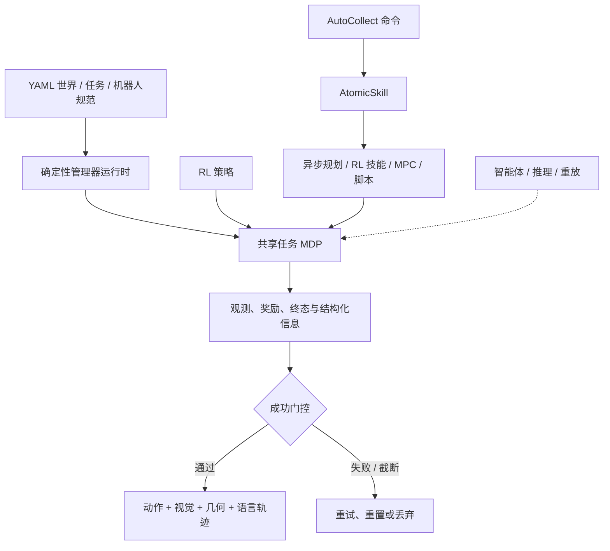

# 可执行具身交互基础设施

可执行具身交互基础设施把世界构建、机器人动作、任务判定、规划、标注、重放和数据提交约束在同一个实际执行回合中。[[magicsim-a-unified-infrastructure-for-executable-embodied-interaction|MagicSim 论文]] 的核心问题不是“能否渲染一个机器人完成任务的视频”，而是同一回合能否被真实控制接口推动、在失败后复现、按任务谓词判定，并把动作、观测、语言与技能语义对齐保存。

## 数学结构

把一个参数化任务写成 MDP：

$$
\mathcal{M}_{\theta}=(\mathcal{S},\mathcal{A},P_{\theta},R_{\theta},\Omega_{\theta},\gamma,H),
$$

其中 $\mathcal{S}$ 是仿真状态，$\mathcal{A}$ 是由机器人形态提供的动作空间，$P_{\theta}$ 是受世界、物理与随机化参数 $\theta$ 控制的转移，$R_{\theta}$ 是奖励，$\Omega_{\theta}$ 是观测生成，$\gamma$ 是折扣因子，$H$ 是回合时域。MagicSim 的共享边界要求不同驱动器执行同一个 `TaskBaseEnv.step` 契约，而不是各自维护任务副本。

执行轨迹还需要语义状态：

$$
\tau = \left(s_0,\xi,\{o_t,a_t,r_t,z_t\}_{t=0}^{T},y\right),
$$

其中 $s_0$ 是可重放初态，$\xi$ 是随机流状态，$z_t$ 表示命令、AtomicSkill、规划器请求、恢复与标注阶段，$y$ 是 `success`、`truncated` 或 `failed`。数据提交规则可以写为：

$$
D \leftarrow D\cup\{\tau\}\quad\text{iff}\quad y=\text{success}.
$$

因此数据集实际采样的是 $p(\tau\mid y=\text{success})$。它提高了示范可用性，却也产生成功选择偏差；要研究恢复或失败，必须另存尝试统计或失败轨迹。

规划器在线执行可以抽象为异步请求：

$$
q_j=(e_j,m_j,g_j,c_j),\qquad F_j=\operatorname{submit}(q_j),
$$

其中 $e_j$ 是环境编号，$m_j$ 是机器人 / 手 / 规划模式，$g_j$ 是目标或目标集，$c_j$ 是约束。物理批次在 future $F_j$ 未完成时继续前进；服务端把兼容请求按形状与求解器类型聚成微批。这里的关键不在某个规划目标函数，而在计算等待不再变成全批次屏障。

确定性随机化用按环境与管理器隔离的流表示：

$$
\xi_{e,m}=h(\xi_0,e,m),
$$

其中 $\xi_0$ 是全局种子，$e$ 是子环境，$m$ 是布局、场景、机器人、相机等管理器。新增相机随机数不应改变物体质量抽样；局部重置环境 $e$ 不应推进其他环境的随机流。

## 系统结构

实线表示论文中的当前执行路径；虚线所代表的完整外部智能体驱动仍有计划中组件。图的重点是三类消费者在 MDP 下方共享世界、控制、传感器与状态，不是三条独立的数据流程。

## 直觉

“回合而非帧”意味着一个漂亮画面不再是系统成功的单位。帧能说明看见了什么，却不能说明机器人通过什么动作到达、规划器选择了哪个目标、失败后能否复现、任务谓词是否满足。可执行回合把这些因果信息与图像绑定起来。

“同步物理时间、异步语义时间”解决的是批处理中的长尾等待。所有环境仍在同一次物理步骤上前进，但有的环境在等 IK，有的在执行轨迹，有的在重试，有的已成功并写数据。若用阶段屏障组织批次，每一阶段都要等待最慢环境；按环境维护状态机后，只在物理步骤处同步。

AtomicSkill 的价值是固定“触碰物理”的层。高层可以由脚本、LLM、VLM 或学习策略选择动作，但抓取目标、接触检查、稳定持有、重试与成功判定不能靠高层输出直接改写仿真状态。这提高了可审查性与数据一致性，代价是行为覆盖受已实现技能词表限制。

逻辑对象身份与 USD 图元路径分离是重置系统的关键。某些后端对象只能隐藏旧图元并创建新图元；若任务、标注和重放直接引用物理路径，重置会破坏语义连续性。稳定的 $(\text{env},\text{category},\text{instance})$ 身份把语义层与后端生命周期解耦。

## 与邻近系统的区别

- 相对 [[SimulationReady3DWorldGeneration|可用于仿真的三维世界生成]]，本概念关注内容进入仿真器以后能否执行、重放、判定与记录，而不主要关注三维内容如何生成和修复。
- 相对 [[TaskGeneralistPolicyEvaluation|通用任务策略评估]]，本概念先建立统一任务与执行边界；策略敏感性、置信区间和跨条件诊断仍需要单独的评测设计。
- 相对 [[HeterogeneousRobotRLTraining|异构机器人 RL 训练]]，这里的异步主要发生在一个批处理模拟器内的环境语义状态与规划 future；UniLab 的异步主要发生在 CPU 采集器、GPU 学习器、重放和参数同步之间。
- 相对纯合成数据渲染流程，本概念要求标签来自实际执行状态与任务结果，而不是只来自可见像素或离线脚本时间轴。

## Failure Modes

- 能力清单被误读成验证结果：支持 15 个模拟族、40 多个任务或约 33 个机器人，不等于每个组合都稳定、物理准确或经过定量评测。
- 接口统一掩盖语义差异：相同 `base` / `arm` / `eef` 通道可能连接车轮模型、学习式步态、IK、运动生成或全身控制器；统一形状不保证等价动力学或相同控制带宽。
- 随机种子被误读成完整确定性：管理器流隔离和快照重放能固定高层初态，但 GPU 求解器、粒子系统、RTX、驱动版本与并行归约仍可能限制逐位复现。
- 异步规划结果过期：规划 future 返回时，目标或障碍物可能已经移动；技能必须根据当前场景重新验证，而不能盲目执行缓存轨迹。
- 成功门控造成数据偏差：失败、超时和难例被移除后，训练数据会高估技能覆盖，也不包含恢复策略所需的负例。
- 固定技能词表形成组合上限：高层规划器只能组合已有技能；需要滚动、滑动、顺应、力控、变形历史或新工具使用时，词表未必闭合。
- 跨求解器物理不可靠：同场共执行不等于统一守恒、准确材料行为或任意模拟族的双向接触耦合。
- 原生二维投影无可见性检查：论文中的 `obj_bbox` / affordance 投影是透视穿透式，可能标出被遮挡目标，不能直接当作可见检测真值。
- 当前与计划能力混合：完整外部 agent command API、高层闭环 RL 和 `InferenceRunner` 尚不能按成熟数据采集路径同等对待。

## 实践含义

- 做机器人数据生成时，应把回合初态、随机流、任务谓词、技能阶段、规划请求、动作、观测和写入门控视为同一数据契约。
- 做并行规划时，应报告规划队列、微批大小、future 延迟分布、等待时安全动作和结果过期率，而不只报告仿真步频。
- 做基准时，应把“接口可用于 RL”与“已经训练并有成绩”分开；至少报告成功、失败、截断、成功回合长度和失败类型。
- 做智能体式控制时，高层生成应停在可验证命令边界；世界变化必须由规划器、控制器和物理步骤实现，不能用瞬时状态编辑伪装成功。
- 做数据质量评估时，应同时保留总尝试数、成功门控比例、候选筛选比例和按失败类型的统计，才能判断保存语料的选择偏差。
- 做仿真到现实研究时，统一接口只解决软件组合问题；碰撞几何、材料参数、传感器标定、控制延迟与硬件动力学仍需独立验证。

相关页面：[[MagicSim]]、[[RoboticsSimulationInfrastructure]]、[[SimulationReady3DWorldGeneration]]、[[AgenticSceneTaskGeneration]]、[[TaskGeneralistPolicyEvaluation]]、[[HeterogeneousRobotRLTraining]]、[[SimulationRealityGap]]、[[ContactModelsInRobotics]]。
