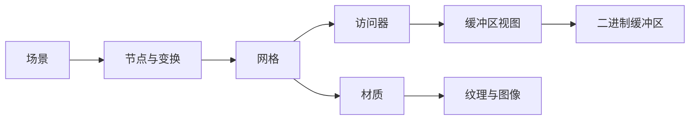

# glTF 场景与数据结构

glTF 把场景关系写在 JSON 中，把几何与图像数据放在可引用的数据块中。读懂它需要沿两条链追踪：**场景 → 节点 → 网格**决定显示哪些对象，**访问器 → 缓冲区视图 → 缓冲区**决定怎样读取实际几何。[[gltf-basic-structure|Khronos glTF 结构教程]]

## 数学结构

本页的结构表达是对官方教程的教学抽象，不是新增文件规范。设节点集合为 $V$、父子关系为 $E$，场景选择其中若干根节点；每个节点可引用网格或相机，并具有变换。一个几何属性的读取可概括为：

$$
\text{几何数组}=\operatorname{Read}(B,\,R,\,A),
$$

$B$ 是原始二进制缓冲区，$R$ 是选择其中一段数据的 `bufferView`，$A$ 是描述数据类型与布局的 `accessor`。具体字节偏移、步长和规范约束需要继续读教程后续章节，本页不替代完整规范。[[gltf-basic-structure|Khronos glTF 结构教程]]

场景图组织实例和变换，数据链提供顶点等数组，材质链决定渲染外观；这三者要同时完整，才能解释一个渲染结果。

## 直觉：文件存在为何还可能缺模型

教学例子：JSON 已经读到一个网格索引，但网格所需的 `.bin` 文件没有加载，此时对象关系存在而几何数据缺失。同样，节点可以有正确几何但纹理 URI 失效。应沿引用检查资源，而不是只检查 JSON 是否有效。外部文件和数据 URI 的区别由 [[gltf-basic-structure|Khronos glTF 结构教程]] 支持。

## 失效情形

以下是由文件引用结构直接推得的工程检查项，不是教程报告的性能实验：外部资源不可用、节点或数据索引错误、把网格外观误认为完整物理描述。最后一项需要对照 [[IsaacSimAssetStructure|仿真资产分层]]：视觉几何、碰撞、惯性、关节与引擎调优各有归属。

## 实践含义

glTF 在本知识库用于理解三维场景的组织与读取。GLB 容器、扩展、验证器和材质细节仍待专门收录。更广的格式选择见 [[3d-model-formats-learning-map|三维模型格式学习地图]]；非破坏式资产组合见 [[OpenUSDSceneComposition|OpenUSD 场景组合]]。
