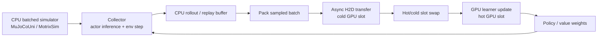

# Heterogeneous Robot RL Training

Heterogeneous robot RL training（异构机器人强化学习训练）把 simulation-based RL 的 rollout collection、policy learning、buffering、data movement 和 parameter synchronization 分配到不同硬件角色上，而不是默认让 physics、collection 和 learning 全部驻留在 GPU execution path。[[unilab-a-heterogeneous-architecture-for-robot-rl-beyond-gpu-dominant-paradigms|UniLab source]] 的中心判断是：efficient robot RL training 取决于 simulation-learning closed loop 的 end-to-end utilization，而不是 GPU-resident physics 本身。

## 数学结构

把一个 robot RL training loop 写成：

$$
\mathcal{L}_{\mathrm{train}}=(\mathcal{C}_{\theta_b},\mathcal{B},\mathcal{U}_{\phi},\mathcal{S}),
$$

其中 $\mathcal{C}_{\theta_b}$ 是 collector / simulator，依赖 backend parameters $\theta_b$；$\mathcal{B}$ 是 rollout 或 replay buffer；$\mathcal{U}_{\phi}$ 是 learner update，对 policy/value parameters $\phi$ 做优化；$\mathcal{S}$ 是 runtime scheduler，负责 data transfer、buffer handoff、weight sync 和 overlap。

对 strictly synchronized PPO，单个 iteration 的 critical path 近似为：

$$
T_{\mathrm{PPO}}\approx T_{\mathrm{collect}}(N,H;\theta_b)+T_{\mathrm{pack}}+T_{\mathrm{H2D}}+T_{\mathrm{update}}+T_{\mathrm{sync}},
$$

其中 $N$ 是 parallel environments 数量，$H$ 是 rollout horizon，$T_{\mathrm{collect}}$ 是 simulation / actor inference / environment stepping cost，$T_{\mathrm{H2D}}$ 是 host-to-device transfer cost，$T_{\mathrm{update}}$ 是 GPU learner update cost，$T_{\mathrm{sync}}$ 是 parameter synchronization cost。PPO 的 data dependency 强，所以 overlap 空间较小。

对 APPO 或 replay-based SAC / FlashSAC，collector 和 learner 可以 overlap，critical path 更接近：

$$
T_{\mathrm{cycle}}\approx \max(T_{\mathrm{collect}}+T_{\mathrm{pack}}+T_{\mathrm{H2D}},\,T_{\mathrm{update}})+T_{\mathrm{sync}}+T_{\mathrm{wait}},
$$

其中 $T_{\mathrm{wait}}$ 是 residual boundary waiting。UniLab 的 runtime 目标就是让 CPU-side collection / packing / async H2D 被 GPU learner update 覆盖，从而降低 $T_{\mathrm{wait}}$ 并提高 learner utilization。

Off-policy replay path 可以抽象成：

$$
\tau_t=(o_t,a_t,r_t,o_{t+1})\rightarrow \mathcal{B}_{CPU},\qquad S_k\sim \mathcal{B}_{CPU},\qquad S_k \xrightarrow{\mathrm{pack+H2D}} S_k^{GPU}.
$$

这里 $\tau_t$ 是 transition，$o_t$ 是 observation，$a_t$ 是 action，$r_t$ 是 reward，$\mathcal{B}_{CPU}$ 是 CPU-resident replay storage，$S_k$ 是 sampled batch。UniLab 的 point 是把 full replay cache 留在 CPU，把 learner hot path 变成 consume ready GPU batches，而不是维护 capacity-scaled GPU replay cache。

## 直觉

GPU-resident robot learning systems 把 physics、rollout collection 和 learning 放在低开销路径上，这对 dense、regular、statically shaped computation 很有效。但 robot control 常见的 dynamic contact sets、sparse interaction、collision handling 和 constraint solving 会改变 backend engineering pressure。UniLab 的直觉是把“低开销闭环”这个 training-system principle 和“physics 必须在 GPU 上”这个 hardware path 分开。

CPU-side simulation 只有在能持续喂饱 learner 时才有意义；GPU-side learning 只有在不被 replay sampling、H2D transfer 或 weight sync 卡住时才发挥密集矩阵计算优势。因此 heterogeneous design 的核心不是 CPU vs GPU 的 ideological choice，而是 critical path placement：哪部分 work 在 learner update 之前阻塞，哪部分 work 可以和 learner update overlap。

Algorithm choice 也不是纯算法问题，它改变 synchronization regime。PPO 强绑定最新 rollout 与更新，适合作为 strict synchronization stress test；APPO 允许 collection 和 learning overlap，但还要用 correction 保持 near-on-policy；FastSAC / FlashSAC 这种 replay-based path 允许 producer-consumer decoupling，因此更容易受益于 CPU sampling、async H2D 和 double-buffering。

这轮 follow-up sources 把这个概念从单篇 paper 扩展成 runtime taxonomy。CPU-batched route 由 [[UniLab]]、[[MuJoCoUni]] 和 [[MotrixSim]] 支撑：它保留或强调 CPU-side physics semantics、stateful batched execution、reset-lifecycle randomization 和 shared-memory / H2D handoff。GPU-oriented route 由 [[MJWarp]]、[[Mjlab|mjlab]]、[[MuJoCoPlayground]]、[[IsaacLab]] 和 [[ManiSkill]] 代表：它把 simulation、rendering 或 training workloads 尽量放在 GPU / accelerator path 上，以提高 massive parallel sampling、visual data collection 或 manager-based training throughput。两条路线都不是 universal winner；它们改变的是 bottleneck placement、feature coverage、platform dependence、debug path 和 memory pressure。

## Failure Modes

- Simulator-throughput fallacy：只比较 env steps/s 可能错过 learner wait、replay boundary、H2D transfer、GPU memory pressure 和 weight sync，无法代表 end-to-end training efficiency。
- GPU-resident necessity overclaim：GPU simulation 很有效，但把它当成 necessary condition 会缩小 software stack、hardware backend 和 deployment platform 的设计空间。
- Decoupling mismatch：如果 task 是 strictly synchronized、vision/rendering dominated，或 learner update 不是瓶颈，CPU/GPU decoupling 可能隐藏不了 dominant cost。
- Replay boundary regression：把 replay storage 放回 GPU cache 可能减少某些 transfer，但也可能把 capacity-scaled replay sampling 和 lazy synchronization 放进 learner hot path。
- Backend semantic mismatch：不同 physics backends 暴露的 randomization fields、solver behavior、reward shaping 或 task defaults 可能不同；training speed comparison 不自动等价于 physics equivalence。
- Feature-parity shortcut：[[MJWarp]] docs 明确列出 unsupported solver/integrator/sensor/plugin/flex/user parameter cases，并说明当前不可 differentiable；把 GPU route 直接等同于 full MuJoCo semantics 或 differentiable physics 会越过 source boundary。
- Cross-platform overgeneralization：macOS、ROCm 和 XPU trainability 说明 portability，但不是 absolute throughput parity，也不是所有 kernels / algorithms 都有同等成熟度。
- Stack-openness overgeneralization：[[IsaacLab]] README 把 framework 描述为 open-source，但同时记录 Isaac Sim / cuRobo proprietary dependency boundary；runtime taxonomy 不能只看 repo license。
- Rigid-body scope limit：当前 source 主要覆盖 rigid-body robot control；deformables、fluids、soft bodies 和 vision-heavy embodied AI 需要重新 profile runtime bottleneck。

## 实践含义

- 对 robot RL system design，应 profile full learner cycle：collector active time、learner update time、overlap ratio、data movement、replay sample time、boundary wait 和 weight sync，而不是只报告 simulator throughput。
- 对 PPO / APPO / SAC comparisons，应把 algorithm 看作 synchronization regime：同一 simulator/backend 在不同 data dependency 下可能出现完全不同的 wall-clock bottleneck。
- 对 [[RoboticsSimulationInfrastructure|simulation infrastructure]]，ML integration 不只是接一个 RL library；replay residency、pinning strategy、device batch slots、async transfer 和 parameter publication 都属于 infrastructure surface。
- 对 [[SimulationRealityGap|sim-to-real]]，heterogeneous runtime 不直接减少 physical mismatch，但它会改变 domain randomization lifecycle、backend portability 和 sim2sim validation workflow；这些都会影响训练分布和 evidence boundary。
- 对 hardware planning，CPU-rich / non-CUDA / Apple / AMD / Intel platforms 不必因缺少 GPU-resident physics path 被排除，但需要用 target task 的 actual critical path 做 benchmark。
- 对 ecosystem selection，应把 backend feature parity、platform dependency、rendering/sensor needs、domain randomization lifecycle、RL framework integration 和 reproducibility pinning 一起记录；这比单独比较 headline steps/s 更接近真实工程决策。

相关页面：[[UniLab]]、[[MuJoCoUni]]、[[MotrixSim]]、[[MJWarp]]、[[Mjlab|mjlab]]、[[MuJoCoPlayground]]、[[IsaacLab]]、[[ManiSkill]]、[[unilab-a-heterogeneous-architecture-for-robot-rl-beyond-gpu-dominant-paradigms]]、[[RoboticsSimulationInfrastructure]]、[[SimulationRealityGap]]、[[HumanoidRLWorkflow]]、[[MuJoCo]]、[[IsaacSim]]、[[TaskGeneralistPolicyEvaluation]]。
