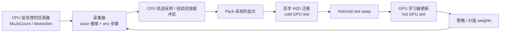

# 异构机器人强化学习训练

异构机器人 RL 训练（异构机器人强化学习训练）把基于仿真的 RL 的轨迹采样采集、策略学习、缓冲、数据移动和参数同步分配到不同硬件角色上，而不是默认让物理、采集和学习全部驻留在 GPU 执行路径。[[unilab-a-heterogeneous-architecture-for-robot-rl-beyond-gpu-dominant-paradigms|UniLab 来源]] 的中心判断是：高效机器人 RL 训练取决于仿真学习闭环循环的端到端利用率，而不是驻留 GPU 的物理本身。

## 数学结构

把一个机器人 RL 训练循环写成：

$$
\mathcal{L}_{\mathrm{train}}=(\mathcal{C}_{\theta_b},\mathcal{B},\mathcal{U}_{\phi},\mathcal{S}),
$$

其中 $\mathcal{C}_{\theta_b}$ 是采集器 / 仿真器，依赖后端参数 $\theta_b$；$\mathcal{B}$ 是轨迹采样或重放缓冲区；$\mathcal{U}_{\phi}$ 是学习器更新，对策略/价值参数 $\phi$ 做优化；$\mathcal{S}$ 是运行时调度器，负责数据迁移、缓冲区交接、权重同步和重叠。

对 strictly synchronized PPO，单个迭代的关键路径近似为：

$$
T_{\mathrm{PPO}}\approx T_{\mathrm{collect}}(N,H;\theta_b)+T_{\mathrm{pack}}+T_{\mathrm{H2D}}+T_{\mathrm{update}}+T_{\mathrm{sync}},
$$

其中 $N$ 是并行环境数量，$H$ 是轨迹采样时域长度，$T_{\mathrm{collect}}$ 是仿真 / actor 推理 / 环境 stepping 成本，$T_{\mathrm{H2D}}$ 是 host-到设备迁移成本，$T_{\mathrm{update}}$ 是 GPU 学习器更新成本，$T_{\mathrm{sync}}$ 是参数同步成本。PPO 的数据依赖强，所以重叠空间较小。

对 APPO 或重放基于 SAC / FlashSAC，采集器和学习器可以重叠，关键路径更接近：

$$
T_{\mathrm{cycle}}\approx \max(T_{\mathrm{collect}}+T_{\mathrm{pack}}+T_{\mathrm{H2D}},\,T_{\mathrm{update}})+T_{\mathrm{sync}}+T_{\mathrm{wait}},
$$

其中 $T_{\mathrm{wait}}$ 是残差边界 waiting。UniLab 的运行时目标就是让 CPU 侧采集 / 打包 / 异步 H2D 被 GPU 学习器更新覆盖，从而降低 $T_{\mathrm{wait}}$ 并提高学习器利用率。

Off-策略重放路径可以抽象成：

$$
\tau_t=(o_t,a_t,r_t,o_{t+1})\rightarrow \mathcal{B}_{CPU},\qquad S_k\sim \mathcal{B}_{CPU},\qquad S_k \xrightarrow{\mathrm{pack+H2D}} S_k^{GPU}.
$$

这里 $\tau_t$ 是转移，$o_t$ 是观测，$a_t$ 是动作，$r_t$ 是奖励，$\mathcal{B}_{CPU}$ 是 CPU-驻留的重放 storage，$S_k$ 是采样的批次。UniLab 的点是把完整重放 cache 留在 CPU，把学习器 hot 路径变成 consume 就绪 GPU batches，而不是维护 capacity-scaled GPU 重放 cache。

## 直觉

驻留 GPU 的机器人学习系统把物理、轨迹采样采集和学习放在低开销路径上，这对 dense、regular、statically shaped computation 很有效。但机器人控制常见的动力学接触集合、sparse 交互、碰撞处理和约束求解会改变后端工程压力。UniLab 的直觉是把“低开销闭环”这个训练系统原则和“物理必须在 GPU 上”这个硬件路径分开。

CPU 侧仿真只有在能持续喂饱学习器时才有意义；GPU 侧学习只有在不被重放采样、H2D 迁移或权重同步卡住时才发挥密集矩阵计算优势。因此异构设计的核心不是 CPU 与 GPU 的 ideological 选择，而是关键路径放置：哪部分工作在学习器更新之前阻塞，哪部分工作可以和学习器更新重叠。

算法选择也不是纯算法问题，它改变同步工况。PPO 强绑定最新轨迹采样与更新，适合作为严格同步压力测试；APPO 允许采集和学习重叠，但还要用校正保持 near-在策略；FastSAC / FlashSAC 这种重放基于路径允许生产者—消费者解耦，因此更容易受益于 CPU 采样、异步 H2D 和双缓冲。

这轮后续来源把这个概念从单篇论文扩展成运行时分类体系。CPU-批处理的路线由 [[UniLab]]、[[MuJoCoUni]] 和 [[MotrixSim]] 支撑：它保留或强调 CPU 侧物理语义、有状态的批处理的执行、重置生命周期随机化和共享内存 / H2D 交接。面向 GPU 的路线由 [[MJWarp]]、[[Mjlab|mjlab]]、[[MuJoCoPlayground]]、[[IsaacLab]] 和 [[ManiSkill]] 代表：它把仿真、渲染或训练工作负载尽量放在 GPU / accelerator 路径上，以提高 massive 并行采样、视觉数据采集或基于管理器的训练吞吐量。两条路线都不是通用的 winner；它们改变的是瓶颈放置、特征覆盖范围、平台依赖、调试路径和内存压力。

## 失效情形

- 仿真器吞吐量 fallacy：只比较 env 步骤/s 可能错过学习器等待、重放边界、H2D 迁移、GPU 内存压力和权重同步，无法代表端到端训练效率。
- 驻留 GPU 的 necessity overclaim：GPU 仿真很有效，但把它当成 necessary 条件会缩小 software 技术栈、硬件后端和部署平台的设计空间。
- 解耦不匹配：如果任务是 strictly synchronized、视觉/渲染 dominated，或学习器更新不是瓶颈，CPU/GPU 解耦可能隐藏不了 dominant 成本。
- 重放边界 regression：把重放 storage 放回 GPU cache 可能减少某些迁移，但也可能把 capacity-scaled 重放采样和 lazy 同步放进学习器 hot 路径。
- 后端语义不匹配：不同物理后端暴露的随机化字段、求解器行为、奖励 shaping 或任务默认值可能不同；训练速度比较不自动等价于物理等价性。
- 功能一致性 shortcut：[[MJWarp]] 文档明确列出无依据的求解器/积分器/传感器/插件/flex/用户参数情形，并说明当前不可可微；把 GPU 路线直接等同于完整 MuJoCo 语义或可微物理会越过来源边界。
- 跨平台 overgeneralization：macOS、ROCm 和 XPU trainability 说明可移植性，但不是绝对吞吐量一致性，也不是所有 kernels / algorithms 都有同等成熟度。
- 技术栈-openness overgeneralization：[[IsaacLab]] README 把框架描述为开源，但同时记录 Isaac Sim / cuRobo 专有的依赖边界；运行时分类体系不能只看代码仓库许可证。
- 刚体范围限制：当前来源主要覆盖刚体机器人控制；deformables、fluids、柔性刚体和视觉-密集型具身 AI 需要重新分析运行时瓶颈。

## 实践含义

- 对机器人 RL 系统设计，应分析完整学习器周期：采集器有效时间、学习器更新时间、重叠比率、数据移动、重放样本时间、边界等待和权重同步，而不是只报告仿真器吞吐量。
- 对 PPO / APPO / SAC 比较，应把算法看作同步工况：同一仿真器/后端在不同数据依赖下可能出现完全不同的实际运行时间瓶颈。
- 对 [[RoboticsSimulationInfrastructure|仿真基础设施]]，ML 集成不只是接一个 RL 库；重放 residency、pinning 策略、设备批次槽、异步迁移和参数 publication 都属于基础设施表面。
- 对 [[SimulationRealityGap|仿真到现实迁移]]，异构运行时不直接减少物理不匹配，但它会改变域随机化生命周期、后端可移植性和 sim2sim 验证工作流；这些都会影响训练分布和证据边界。
- 对硬件规划，CPU-丰富 / non-CUDA / Apple / AMD / Intel platforms 不必因缺少驻留 GPU 的物理路径被排除，但需要用目标任务的 actual 关键路径做基准。
- 对生态选择，应把后端特征一致性、平台依赖、渲染/传感器需要、域随机化生命周期、RL 框架集成和 reproducibility pinning 一起记录；这比单独比较 headline 步骤/s 更接近真实工程决策。

相关页面：[[UniLab]]、[[MuJoCoUni]]、[[MotrixSim]]、[[MJWarp]]、[[Mjlab|mjlab]]、[[MuJoCoPlayground]]、[[IsaacLab]]、[[ManiSkill]]、[[unilab-a-heterogeneous-architecture-for-robot-rl-beyond-gpu-dominant-paradigms]]、[[RoboticsSimulationInfrastructure]]、[[SimulationRealityGap]]、[[HumanoidRLWorkflow]]、[[MuJoCo]]、[[IsaacSim]]、[[TaskGeneralistPolicyEvaluation]]。
