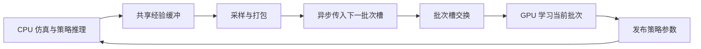

# 异构机器人强化学习训练

异构训练把仿真、策略推理、经验缓冲、学习更新与参数同步分配给不同硬件。设计目标是缩短达到目标策略性能的时间；CPU 或 GPU 上的独立物理吞吐量只解释其中一部分。[[unilab-a-heterogeneous-architecture-for-robot-rl-beyond-gpu-dominant-paradigms|UniLab]] 提供 CPU 仿真与 GPU 学习的具体证据，[[mujocouni-persistent-batched-runtime-primitives-for-mujoco|MuJoCoUni]] 提供可嵌入训练循环的批量物理接口。

## 数据依赖决定能重叠多少

PPO 先收集当前策略轨迹，再更新策略；APPO 允许使用略陈旧的行为策略轨迹，以修正处理策略滞后；SAC 等离策略方法从经验重放中更新，进一步放松新数据与每次更新的绑定。它们改变的不只是优化目标，还有采集器能否与学习器同时工作。[[unilab-a-heterogeneous-architecture-for-robot-rl-beyond-gpu-dominant-paradigms|UniLab §3.2]]

下面是**解释时序的简化模型**，不是论文拟合公式。设采集、准备批次、主机到设备传输、学习、参数同步和剩余等待耗时分别为 $T_c,T_p,T_d,T_l,T_s,T_w$。同步执行近似为

$$
T_{\mathrm{sync}}\approx T_c+T_p+T_d+T_l+T_s.
$$

若准备下一批可以与当前学习重叠，则理想化地有

$$
T_{\mathrm{overlap}}\approx\max(T_c+T_p+T_d,T_l)+T_s+T_w.
$$

重叠不保证成立：采集和学习若竞争同一加速器，分别测量得到的耗时可能在并发时增加；缓冲缺数据、参数同步或任务依赖也会扩大 $T_w$。因此应从真实训练轨迹计算关键路径，不能只把各阶段独立计时取最大值。[[unilab-a-heterogeneous-architecture-for-robot-rl-beyond-gpu-dominant-paradigms|UniLab 图 6、附录 A]]

### 一个能算清收益的时间例子

**教学构造，不是测量值。** 设 $T_c=8$ ms、$T_p=2$ ms、$T_d=1$ ms、$T_l=12$ ms、$T_s=1$ ms，且 $T_w=0$。串行一轮为 24 ms；理想稳定重叠后为 $\max(11,12)+1=13$ ms。即使把传输从 1 ms 降到 0，学习仍是最长路径，轮时仍为 13 ms。反过来，若采集增长到 20 ms，轮时变为 24 ms，优化学习核也暂时无用。

这解释了为什么要看时间线上真正的等待和重叠区间。第一轮还没有可消费的已准备批次，最后一轮可能无需预取；稳定轮时并不自动等于整个短任务总时长。该例只演示上式，实际可重叠关系需要 [[unilab-repository|具体调度实现]]来验证。

## 经验放在哪里，与何时搬运是两个选择

一次环境转移 $\tau_t=(o_t,a_t,r_t,o_{t+1})$ 记录观测、动作、奖励与下一观测。UniLab 的一种安排为

$$
\tau_t\to\mathcal B_{\mathrm{CPU}},\qquad
S_k\sim\mathcal B_{\mathrm{CPU}},\qquad
S_k\xrightarrow{\text{打包与传输}}S_k^{\mathrm{GPU}}.
$$

$\mathcal B_{\mathrm{CPU}}$ 是 CPU 共享重放缓冲，$S_k$ 为采样批次。主缓冲、用于传输的锁页打包槽、GPU 当前批次槽属于不同资源。两个 GPU 批次槽交替使用：一边学习，一边准备下一批。它降低了学习器关键路径上的重放管理，但采样与复制本身仍然存在。[[unilab-a-heterogeneous-architecture-for-robot-rl-beyond-gpu-dominant-paradigms|UniLab 附录 A.1–A.5]]

```mermaid
flowchart LR
  A[CPU 仿真与策略推理] --> B[共享经验缓冲]
  B --> C[采样与打包]
  C --> D[异步传入下一批次槽]
  D --> E[批次槽交换]
  E --> F[GPU 学习当前批次]
  F --> G[发布策略参数]
  G --> A
```

图中是经验重放安排，不应照搬为严格同步 PPO 的执行图。局部搬运路径可能更慢而整体训练更快；关键是能否把它隐藏在已有计算后面。

### 异步计算不等于无同步

一条转移写入共享内存，不表示它立刻可由任意进程安全读取。生产者要先完成写入、发布有效范围；传输完成后，学习器才能消费相应设备槽。同步至少包含三层：**数据是否完整、这一轮该消费哪批、策略参数是哪一版**。UniLab 的固定实现分别使用写入水位与采集令牌、轮次／冷热槽元数据、复制就绪事件和权重版本；它允许部分工作重叠，同时保留这些依赖。[[unilab-repository|双缓冲实现解析]]

另一个经常被吞吐量掩盖的接口是回合结束。UniLab 与 ManiSkill 的同一步自动重置都需要保留重置前的末次观测，否则上一回合末次动作会错误连接到下一回合初态。时间截断还要与真正终止分开记录，供学习器决定是否自举。正确的转移语义是比较训练速度之前的前提。[[unilab-repository|转移写入]]、[[maniskill-repository|自动重置封装]]

## 资源生命周期也是接口的一部分

高频循环应明确谁持有模型和工作数据、步进返回整段轨迹还是最终状态、重置是否只处理终止环境、随机化何时生效。MuJoCoUni 的每环境模型与每线程工作数据、稀疏重置和批量查询，是这类设计的例子；它们不改变 MuJoCo 求解器，也不直接定义奖励或训练算法。[[mujocouni-persistent-batched-runtime-primitives-for-mujoco|MuJoCoUni §3]]

后端接口相同不保证物理与训练分布相同。有效随机化要同时满足任务启用与后端支持，奖励、动作尺度和终止阈值也应逐项对齐。[[unilab-a-heterogeneous-architecture-for-robot-rl-beyond-gpu-dominant-paradigms|UniLab 附录 B–C]]

## 怎样判断收益成立

| 要比较什么 | 应固定或报告什么 |
| --- | --- |
| 物理后端容量 | 模型、接触设置、时间步长、环境数与硬件 |
| 调度和传输收益 | 同一学习目标、更新次数、重放布局与学习器周期 |
| 达到目标性能的时间 | 完整训练曲线、种子、性能阈值与算法配置 |
| 后端可替换性 | 同一策略跨后端执行，而非仅比较各自训练回报 |
| 跨平台可运行性 | 支持设备、实际可训练任务、功能差异与运行时间 |

这是依据上述系统实验提出的整理方法。UniLab 同算法 PPO 接近持平，较大加速含异步或重放配置；跨平台训练也不证明吞吐量相等。视觉渲染占主导、多加速器或非刚体任务需要重新测量，不能继承其单工作站刚体控制结论。[[unilab-a-heterogeneous-architecture-for-robot-rl-beyond-gpu-dominant-paradigms|UniLab §4、§7]]

具体软件能力与版本见 [[unilab-repository|UniLab 仓库]]、[[motrixsim-documentation|MotrixSim 文档]]、[[mujoco-warp-mjwarp-documentation|MJWarp 文档]]、[[mjlab-repository|mjlab]]、[[mujoco-playground-repository|MuJoCo Playground]]、[[isaac-lab-repository|Isaac Lab]]、[[maniskill-repository|ManiSkill]]；本页不复制随版本变化的功能表。上层关系见 [[RoboticsSimulationInfrastructure|仿真基础设施]] 与 [[SimulationRealityGap|仿真—现实差距]]。

## 研究归属

[[topics/robot-policy-learning|机器人策略学习]] · [[topics/physics-simulation|物理仿真]] · [[topics/robot-learning-systems|训练系统怎样提高有效学习效率]]。
