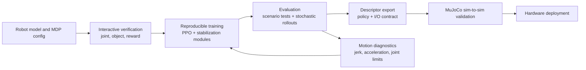

# Humanoid RL Workflow

Humanoid RL workflow（人形机器人强化学习工作流）指从 robot model / MDP verification 到 training、evaluation、sim-to-sim validation 和 hardware deployment 的完整 engineering lifecycle。[[AGILE]] source 的核心贡献是说明：对 humanoid loco-manipulation 来说，很多 failure 不来自单个 RL algorithm 不够强，而来自 workflow boundary 没有被 formalize，例如 reward term 错、joint axis 反、evaluation variance 太高、policy export 后 observation/action contract 对不上。

## 数学结构

设 humanoid RL task configuration 为 $\Theta=(\mathcal{S},\mathcal{O},\mathcal{A},r,d,c,\eta)$，其中 $\mathcal{S}$ 是 simulator state space，$\mathcal{O}$ 是 observation schema，$\mathcal{A}$ 是 action schema，$r(s_t,a_t)$ 是 reward，$d(s_t)$ 是 termination condition，$c$ 是 command/curriculum distribution，$\eta$ 是 robot/simulator parameters，例如 mass、contact、actuator delay 和 sensor noise。Policy $\pi_\phi$ 接收 observation history $o_{t-k:t}$ 与 command $u_t$，输出 action chunk 或 joint target：

$$
a_t \sim \pi_\phi(a \mid o_{t-k:t}, u_t).
$$

AGILE-style workflow 的训练目标不是一个裸 reward maximization，而是带有 smoothness、robustness 和 termination shaping 的 objective：

$$
\max_\phi \mathbb{E}\left[\sum_{t=0}^{T}\gamma^t \hat r_t\right] - \lambda_{\mathrm{act}}\mathcal{L}_{\mathrm{act}} - \lambda_{\mathrm{L2C2}}\mathcal{L}_{\mathrm{L2C2}},
$$

其中 $\hat r_t$ 是 normalized reward，$\mathcal{L}_{\mathrm{act}}$ 包括 action norm、action rate 和 action acceleration penalties，$\mathcal{L}_{\mathrm{L2C2}}$ 约束 observation perturbation 下 policy/value output 的局部变化。

L2C2 使用 consecutive observations $x_t,x_{t+1}$ 构造插值 $\tilde{x}=x_t+\alpha(x_{t+1}-x_t)$，其中 $\alpha\sim\mathcal{U}(0,1)$，并惩罚：

$$
\mathcal{L}_{\mathrm{L2C2}}=\lambda_\pi\lVert \pi(\tilde{x})-\pi(x_t)\rVert^2+\lambda_V\lVert V(\tilde{x}^{p})-V(x_t^{p})\rVert^2.
$$

Online reward normalization 把 raw reward $r_t$ 转成：

$$
\hat{r}_t=\frac{r_t}{\sigma_r\phi_\gamma c+\epsilon},
$$

其中 $\sigma_r$ 是 environment batch 上的 EMA reward standard deviation，$\phi_\gamma=1/\sqrt{1-\gamma^2}$ 近似 discounted return variance factor，$c$ 是 return-scale correction，$\epsilon$ 防止除零。直觉是让 curriculum 或 porting across robots 时的 reward magnitude changes 不直接改变 advantage scale。

Value-bootstrapped termination 把 terminal reward 改成：

$$
\hat r_T \leftarrow \hat r_T+\gamma V(x_T)+b,\qquad b\in\{-\sigma,+\sigma,0\}.
$$

这里 $x_T$ 是 terminal state，$\gamma V(x_T)$ 让 termination value-neutral，$b$ 再把 bad、good、neutral termination 分开。它避免手调一个 fixed termination penalty 时出现“agent prefers dying”的问题。

Virtual harness 在 early training 对 root body 施加辅助 PD wrench：

$$
\tau_h=K_p e_q-K_d\omega,\qquad f_h=K_p(h^\*-h)-K_d\dot h,
$$

其中 $e_q$ 是 body orientation error，$\omega$ 是 angular velocity，$h^\*$ / $h$ 是 desired/current root height。Curriculum scale $s\in[0,1]$ 随训练衰减这些 gains，让 policy 先在有辅助的条件下学到稳定行为，再逐步承担完整控制。

## 直觉

Humanoid RL workflow 的关键是把“训练成功”拆成多个可验证 contract。训练前要验证 robot model 与 MDP；训练中要记录足够信息让 run 可复现；评估时要同时测 task success 与 hardware risk；部署时要保证 policy 看到的 observation order、history buffer 和 action scaling 与训练一致。任何一个 contract 失效，都可能让 reward curve 看起来正常但 hardware execution 失败。

AGILE 的 deterministic scenario tests 与 stochastic rollouts 解决的是不同问题。Stochastic rollouts 估计 command distribution 下的 average robustness，但 variance 大，且可能掩盖短时间内的 joint limit 或 high-frequency actuation。Deterministic sweeps 和 ramps 给出低方差 regression tests，适合比较 teacher/student policies、不同 checkpoints 或不同 simulator backends。

## Failure Modes

- Pre-training misconfiguration：reversed joint axes、collision geometry 错误、reward term 激活错误会让长时间 GPU training 变成无效计算。
- Reward hacking：reward curve 上升但 task metrics 不动，说明 agent 可能利用了 reward composition 的漏洞。
- Stochastic-rollout masking：只看 randomized rollout average 会掩盖 deterministic scenarios 下的 joint limit violations、jerk 和 high-frequency oscillation。
- Transfer contract mismatch：policy export 时 joint order、observation ordering、history buffers 或 action scaling 不一致，会产生 silent bugs。
- Aggressive-policy mismatch：policy 在 simulation 中看起来平滑，可能只是依赖过高 simulated damping；真实 actuators 仍可能无法跟踪 high-frequency actions。
- Actuator/contact reality gap：source 报告开发中的主要 sim-to-real failure 包括 actuator modeling、contact dynamics 和 overly aggressive policies。
- Qualitative hardware validation ceiling：没有 external motion-capture system 时，hardware demo 支持 stable execution，但不能替代 quantitative tracking metrics。
- Framework dependency：AGILE 依赖 Isaac Lab upstream APIs，长期复现和跨 simulator portability 需要额外维护。

## 实践含义

- 对 humanoid RL project，先建立 verification/evaluation/deployment contract，再比较 algorithmic variants；否则 ablation 可能只是测到 bug、scale 或 export mismatch。
- 对 sim-to-real transfer，robustness 和 smoothness 要分开看：domain randomization 处理 dynamics variation，action/L2C2 regularization 处理 actuator-trackable commands。
- 对 evaluation，应该同时保存 deterministic scenario reports、random rollout statistics、per-joint motion-quality metrics 和 exported descriptors，才能定位 failure 是来自 policy、simulator、reward、I/O contract 还是 hardware。
- 对 VLA/loco-manipulation pipeline，decoupled lower-body locomotion policy 可以把 humanoid stability 当作 lower-body API，让 IK 或 VLA upper-body controller 专注 manipulation；但这也要求 upper-body commands 在训练中被 randomization 覆盖，否则组合部署会出现 distribution shift。

相关页面：[[AGILE]]、[[agile-a-comprehensive-workflow-for-humanoid-loco-manipulation-learning]]、[[SimulationRealityGap]]、[[TaskGeneralistPolicyEvaluation]]、[[VisionLanguageActionModels]]、[[MuJoCo]]。
