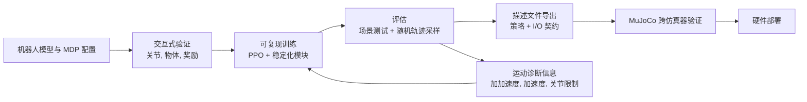

# 人形机器人强化学习工作流

人形机器人 RL 工作流（人形机器人强化学习工作流）指从机器人模型 / MDP 验证到训练、评估、跨仿真器验证和硬件部署的完整工程生命周期。[[AGILE]] 来源的核心贡献是说明：对人形机器人移动操作来说，很多失败不来自单个 RL 算法不够强，而来自工作流边界没有被形式化，例如奖励项错、关节轴反、评估方差太高、策略导出后观测/动作契约对不上。

## 数学结构

设人形机器人 RL 任务配置为 $\Theta=(\mathcal{S},\mathcal{O},\mathcal{A},r,d,c,\eta)$，其中 $\mathcal{S}$ 是仿真器状态空间，$\mathcal{O}$ 是观测模式，$\mathcal{A}$ 是动作模式，$r(s_t,a_t)$ 是奖励，$d(s_t)$ 是终止条件，$c$ 是指令/课程学习分布，$\eta$ 是机器人/仿真器参数，例如质量、接触、执行器延迟和传感器噪声。策略 $\pi_\phi$ 接收观测历史 $o_{t-k:t}$ 与指令 $u_t$，输出动作块或关节目标：

$$
a_t \sim \pi_\phi(a \mid o_{t-k:t}, u_t).
$$

AGILE-风格工作流的训练目标不是一个裸奖励最大化，而是带有平滑性、鲁棒性和终止塑形的目标：

$$
\max_\phi \mathbb{E}\left[\sum_{t=0}^{T}\gamma^t \hat r_t\right] - \lambda_{\mathrm{act}}\mathcal{L}_{\mathrm{act}} - \lambda_{\mathrm{L2C2}}\mathcal{L}_{\mathrm{L2C2}},
$$

其中 $\hat r_t$ 是归一化奖励，$\mathcal{L}_{\mathrm{act}}$ 包括动作范数、动作变化率和动作加速度惩罚项，$\mathcal{L}_{\mathrm{L2C2}}$ 约束观测扰动下策略/价值输出的局部变化。

L2C2 使用连续的观测 $x_t,x_{t+1}$ 构造插值 $\tilde{x}=x_t+\alpha(x_{t+1}-x_t)$，其中 $\alpha\sim\mathcal{U}(0,1)$，并惩罚：

$$
\mathcal{L}_{\mathrm{L2C2}}=\lambda_\pi\lVert \pi(\tilde{x})-\pi(x_t)\rVert^2+\lambda_V\lVert V(\tilde{x}^{p})-V(x_t^{p})\rVert^2.
$$

在线奖励归一化把原始奖励 $r_t$ 转成：

$$
\hat{r}_t=\frac{r_t}{\sigma_r\phi_\gamma c+\epsilon},
$$

其中 $\sigma_r$ 是环境批次上的 EMA 奖励标准差，$\phi_\gamma=1/\sqrt{1-\gamma^2}$ 近似折扣回报方差因素，$c$ 是回报尺度修正，$\epsilon$ 防止除零。直觉是让课程学习或跨机器人迁移时的奖励幅值变更不直接改变优势函数规模。

价值自举终止把终止奖励改成：

$$
\hat r_T \leftarrow \hat r_T+\gamma V(x_T)+b,\qquad b\in\{-\sigma,+\sigma,0\}.
$$

这里 $x_T$ 是终止状态，$\gamma V(x_T)$ 让终止时的价值估计保持中性，$b$ 再把不良、良好、中性终止分开。它避免手调一个固定终止惩罚项时出现“智能体偏好提前终止”的问题。

虚拟悬挂在早期训练对根部刚体施加辅助 PD wrench：

$$
\tau_h=K_p e_q-K_d\omega,\qquad f_h=K_p(h^\*-h)-K_d\dot h,
$$

其中 $e_q$ 是刚体姿态错误，$\omega$ 是角速度，$h^\*$ / $h$ 是期望/当前根节点高度。课程学习规模 $s\in[0,1]$ 随训练衰减这些增益，让策略先在有辅助的条件下学到稳定行为，再逐步承担完整控制。

## 直觉

人形机器人 RL 工作流的关键是把“训练成功”拆成多个可验证契约。训练前要验证机器人模型与 MDP；训练中要记录足够信息让运行可复现；评估时要同时测任务成功与硬件风险；部署时要保证策略看到的观测顺序、历史缓冲区和动作缩放与训练一致。任何一个契约失效，都可能让奖励曲线看起来正常但硬件执行失败。

AGILE 的确定性场景测试与随机轨迹采样解决的是不同问题。随机轨迹采样估计指令分布下的均值鲁棒性，但方差大，且可能掩盖短时间内的关节限制或高频驱动。确定性扫描和渐变测试给出低方差回归测试，适合比较教师策略/学生策略、不同检查点或不同仿真器后端。

## 失效情形

- 训练前配置错误：反向的关节轴、碰撞几何错误、奖励项激活错误会让长时间 GPU 训练变成无效计算。
- 奖励投机：奖励曲线上升但任务指标不动，说明智能体可能利用了奖励组合的漏洞。
- 随机轨迹采样掩盖：只看随机化的轨迹采样均值会掩盖确定性场景下的关节限制违反、加加速度和高频振荡。
- 迁移契约不匹配：策略导出时关节顺序、观测顺序、历史缓冲区或动作缩放不一致，会产生静默错误。
- 激进策略不匹配：策略在仿真中看起来平滑，可能只是依赖仿真中过高的阻尼；真实执行器仍可能无法跟踪高频动作。
- 执行器/接触现实差距：来源报告开发中的主要仿真到现实迁移失败包括执行器建模、接触动力学和过度激进策略。
- 定性硬件验证上限：没有外部动作捕捉系统时，硬件演示支持稳定执行，但不能替代定量跟踪指标。
- 框架依赖：AGILE 依赖 Isaac Lab 上游 APIs，长期复现和跨仿真器可移植性需要额外维护。

## 实践含义

- 对人形机器人 RL 项目，先建立验证/评估/部署契约，再比较算法层面的变体；否则消融实验可能只是测到错误、规模或导出不匹配。
- 对仿真到现实迁移，鲁棒性和平滑性要分开看：域随机化处理动力学变化，动作/L2C2 正则化处理执行器可跟踪的指令。
- 对评估，应该同时保存确定性场景报告、随机轨迹采样统计、逐关节运动质量指标和已导出的描述文件，才能定位失败是来自策略、仿真器、奖励、I/O 契约还是硬件。
- 对 VLA/移动操作流程，解耦的下半身移动策略可以把人形机器人稳定性当作下半身 API，让 IK 或 VLA 上半身控制器专注操作；但这也要求上半身指令在训练中被随机化覆盖，否则组合部署会出现分布偏移。

相关页面：[[AGILE]]、[[agile-a-comprehensive-workflow-for-humanoid-loco-manipulation-learning]]、[[SimulationRealityGap]]、[[TaskGeneralistPolicyEvaluation]]、[[VisionLanguageActionModels]]、[[MuJoCo]]。
