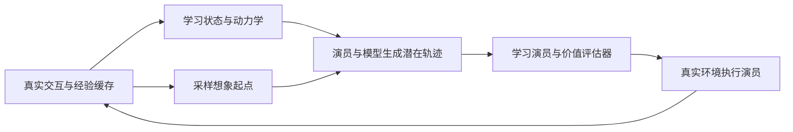

# 想象中的策略学习：世界模型到演员与价值评估器

想象中的策略学习把行为优化放到模型内部：用真实交互学习世界模型，从真实经验中的状态出发生成潜在轨迹，再训练策略选择高回报动作。**模型生成训练经验，演员将行为偏好存入参数。** 执行时仍需从新观测更新状态，但可直接采样策略，省去逐次候选动作搜索。以下以 [[dreamerv3-mastering-diverse-control|DreamerV3 的 Nature 版]]为具体实现，不把其所有设计当作这类方法的共同要求。

## 学习闭环与状态接口

令 $o_t$ 是观测，$a_t$ 是动作，$s_t=(h_t,z_t)$ 是由确定性记忆 $h_t$ 与随机分量 $z_t$ 组成的模型状态。真实轨迹使用观测后验估计 $s_t$；未来想象没有真实图像，只能沿预测先验推进。状态推断与模型目标见 [[LatentStateSpaceModels|潜在状态空间模型]]。

演员为 $\pi_\theta(a_t\mid s_t)$，价值评估器为 $v_\psi(s_t)$，模型预测奖励 $r_t$ 和继续概率 $c_t$。模型负责「采取动作后会怎样」，价值评估器负责「从这里继续按当前策略行动有多好」，演员负责「更可能选择哪些动作」。价值不是纯粹的环境性质，它同时依赖奖励定义和当前行为。[[dreamerv3-mastering-diverse-control|模型、演员与价值学习]]

图中真实数据既训练模型，又提供想象起点。想象没有额外环境交互成本，但仍消耗计算，也依赖训练数据覆盖；它不意味着可以完全不接触环境。

## 数学结构：有限想象怎样学习长期行为

### 自举回报与价值目标

规定 $r_t,c_t$ 对应 $s_t\to s_{t+1}$ 的转移，$\gamma\in[0,1)$ 为折扣，$\lambda\in[0,1]$ 调节一步自举与较长回报的折中，$H$ 为想象终点：

$$
G_t^\lambda=r_t+\gamma c_t\big[(1-\lambda)v_\psi(s_{t+1})+\lambda G_{t+1}^\lambda\big],\qquad
G_H^\lambda=v_\psi(s_H).
$$

继续概率在回合终止处关闭未来贡献；终点价值补上时域之外的回报。较长想象依赖模型预测，较早自举则依赖价值估计；两者都可能有偏差。价值网络拟合停止梯度后的 $G_t^\lambda$，将短轨迹的训练信号传播到更远行为。这是对来源的统一索引教学写法；具体损失、真实重放辅助学习与 EMA 正则见 [[dreamerv3-mastering-diverse-control|DreamerV3 的价值学习]]。

### 把两步回报实际算一遍

**教学例子。**取 $H=2$、$\gamma=0.9$、$\lambda=0.5$，继续概率均为1，奖励 $r_0=1,r_1=2$，价值预测 $v(s_1)=4,v(s_2)=10$。先从末尾算：$G_2=10$，$G_1=2+0.9\times10=11$，再得到 $G_0=1+0.9(0.5\times4+0.5\times11)=7.75$。

展开同一式子，$G_0$ 是一步目标 $1+0.9\times4=4.6$ 与两步目标 $1+0.9\times2+0.9^2\times10=10.9$ 的等权混合。$\lambda$ 因而决定多信任较早的价值预测，还是沿想象多走几步；它不是“真实奖励与虚构奖励各占多少”的比例。若某步 $c_t=0$，该步之后的自举被关闭。

### 策略梯度不等于穿过动力学链反传

令 $A_t=G_t^\lambda-v_\psi(s_t)$ 为优势，$\operatorname{sg}$ 为停止梯度，$\eta\ge0$ 为熵权重，$S$ 为平滑后的回报分位数间距。按「提高优势动作概率并鼓励探索」的方向，可用下面的最大化目标解释 Nature 版演员更新：

$$
J_\pi=\mathbb E\sum_t\left[
\operatorname{sg}\!\left(\frac{A_t}{\max(1,S)}\right)\log\pi_\theta(a_t\mid s_t)
+\eta\mathcal H(\pi_\theta(\cdot\mid s_t))\right].
$$

优势为正时提高已采样动作的概率，为负时降低；熵项避免策略过早集中。停止梯度把优势视为当前策略更新的权重。**本版对连续与离散动作均使用 REINFORCE 估计器**，不能因世界模型可微就说演员主要靠对整条动力学链求导学习。不同梯度估计器是算法选择，不是「想象学习」一词本身决定的。[[dreamerv3-mastering-diverse-control|演员更新与版本边界]]

## 为什么尺度会改变学习行为

若回报任意放大，未归一化的优势项会压过相同权重的探索熵；若稀疏回报几乎不变，强行归一化到单位方差又会放大估计噪声。用回报分位数间距处理异常值，并让分母至少为 1，可以缩小大信号、保留小信号，而不把微弱噪声抬升成重要优势。具体分位数与平滑系数属于论文配置，见 [[dreamerv3-mastering-diverse-control|回报归一化]]。

另一处尺度问题在标量预测。DreamerV3 的 Nature 版用指数间隔桶 $b_i=\operatorname{symexp}(u_i)$ 表示奖励和价值，其中 $u_i$ 均匀间隔，$\operatorname{symexp}(u)=\operatorname{sign}(u)(e^{|u|}-1)$。真实目标落在相邻两桶时，以距离插值构造双桶软标签；模型却可对**全部桶**分配概率 $p_i$，读出为

$$
\hat y=\sum_i p_i b_i.
$$

这使分类交叉熵处理宽范围标量，输出仍连续；它不等于先求对数空间均值再取逆变换，即一般不等于 $\operatorname{symexp}(\sum_i p_i u_i)$。向量观测的 symlog 压缩又是另一用途，不能把所有重建和回归统一成一种公式。[[dreamerv3-mastering-diverse-control|正式版稳健预测与分布实现]]

## 适用范围与实践判断

**来源支持的边界。** 世界模型、表示、价值与探索的稳定性设计相互影响；消融收益因任务而异。固定配置支持在多个任务中分别训练，不能推出一个同权重模型已经跨全部领域泛化。[[dreamerv3-mastering-diverse-control|消融与证据范围]]

**我们的解释。** 想象策略适合把反复行为优化的成本放到训练阶段，但模型误差也会进入策略训练。换奖励、换目标或换动力学后，原策略是否仍合适应分别验证；执行省掉搜索，不代表免除重新学习的需要。[[ModelPredictiveControl|在线规划]]则把更多计算保留到当前决策，[[td-mpc2-scalable-robust-world-models|TD-MPC2]]还组合策略先验与搜索，两种计算位置并非不能共存。

比较方法时分别核算真实交互、模型训练、行为训练和执行延迟；同时核对版本、输入与预算，不能将不同论文的聚合排名拼接。目标通过图像给出时可进一步读 [[VisualGoalPlanning|视觉目标规划]]，比较条件见 [[WorldModelEvaluation|世界模型评估]]。

## 研究归属

[[topics/world-models-and-representations|世界模型与表征]] · [[topics/planning-and-control|规划与控制]] · [[topics/world-model-decision|世界模型如何用于决策]]。
