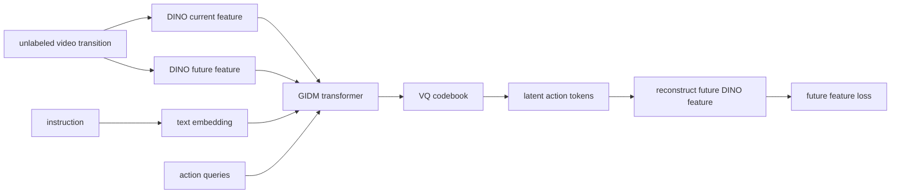
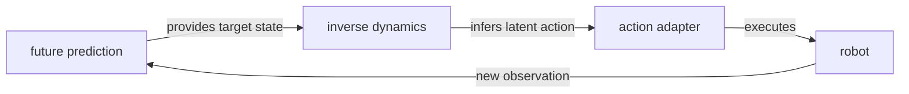

# Inverse Dynamics Models

Inverse Dynamics Model（逆动力学模型，IDM）回答的问题是：给定当前状态和目标/未来状态，什么 action 造成了这个 transition？在 classical robotics 里，它常写成从 $q,\dot q,\ddot q$ 到 torque $\tau$ 的 mapping；在当前 wiki 的 VLA / robot foundation model sources 中，它更常写成从 visual transition $(o_t,o_{t+n})$ 推断 action 或 latent action。[[Seer]] 把 IDM 和 conditional visual foresight 做 end-to-end joint training；[[DeFI]] 则把 visual IDM 提升为可以从 action-free videos 里 self-supervised pretrain 的核心模块。

## 数学结构

有 action labels 时，[[predictive-inverse-dynamics-models-are-scalable-learners-for-robotic-manipulation|Seer/PIDM]] 把 IDM 写成 forecast-conditioned action prediction。设 $h_t$ 是 observation/state history，$g$ 是 language 或 robot-state goal，conditional visual foresight 先预测 future image：

$$
\hat{o}_{t+n}=f_{\mathrm{fore}}(g,h_t).
$$

然后 inverse dynamics 使用 predicted future latent $\hat{o}^{l}_{t+n}$ 预测 action sequence：

$$
\hat{a}_{t:t+n-1}=f_{\mathrm{inv}}(g,h_t,\hat{o}^{l}_{t+n}).
$$

Training loss 是 future image reconstruction 和 action prediction 的组合：

$$
\mathcal{L}_{\mathrm{PIDM}}=\alpha\left\|f_{\mathrm{fore}}(g,h_t)-o_{t+n}\right\|_2^2+\mathcal{L}_{\mathrm{arm}}+\lambda\mathcal{L}_{\mathrm{gripper}},
$$

其中 $\mathcal{L}_{\mathrm{arm}}$ 是 6D arm action 的 Smooth-L1 loss，$\mathcal{L}_{\mathrm{gripper}}$ 是 gripper open/close 的 BCE loss，Seer 中 $\alpha=0.5,\lambda=0.01$。这个 formulation 仍需要 robot action labels，但把 action prediction conditioned on predicted future state，而不是只做 current-state BC。

没有 action labels 时，[[disentangled-robot-learning-via-separate-forward-and-inverse-dynamics-pretraining|DeFI]] 的 GIDM 把 IDM 写成 latent-action representation learning。设 $o_t$ 是 current observation frame，$o_{t+n}$ 是约 $1$ 秒后的 future frame，$\ell$ 是 language instruction。GIDM 先用 DINOv2 encoder 得到 visual features：

$$
e_t = \mathrm{DINO}(o_t), \qquad e_{t+n} = \mathrm{DINO}(o_{t+n}).
$$

GIDM 把 $e_t$、$e_{t+n}$、instruction embedding $f_{\text{text}}(\ell)$ 和 learnable action queries $q_a \in \mathbb{R}^{N \times d}$ 拼成 token sequence，送入 causal spatial-temporal Transformer：

$$
\tilde{a}^{L}_{t \rightarrow t+n} = I_{\theta}(e_t, e_{t+n}, f_{\text{text}}(\ell), q_a).
$$

其中 $\tilde{a}^{L}_{t \rightarrow t+n}$ 是 continuous latent action feature。然后用 VQ-VAE codebook 做 vector quantization：

$$
\hat{a}^{L}_{t \rightarrow t+n} = \mathrm{VQ}_{\theta}(\tilde{a}^{L}_{t \rightarrow t+n}).
$$

Decoder 使用 current feature 和 quantized latent action 重建 future DINO feature：

$$
\hat{e}_{t+n} = D_{\theta}(e_t, \hat{a}^{L}_{t \rightarrow t+n}),
$$

训练目标可以抽象成：

$$
\mathcal{L}_{\mathrm{GIDM}} = \left\|\hat{e}_{t+n} - e_{t+n}\right\|_2^2 + \mathcal{L}_{\mathrm{VQ}}.
$$

$\mathcal{L}_{\mathrm{VQ}}$ 是 VQ-VAE 的 codebook / commitment loss。注意这个 pretraining objective 不需要 ground-truth robot action：transition 必须通过 latent action bottleneck 才能 reconstruct future feature，因此模型被迫把 visual change 压缩成 action-like code。

[[LatentDynamicsActionModels|LDA-1B]] 的 inverse dynamics objective 也接近 action-labeled formulation：给定 current observation 和 future DINO latent，预测 future action chunk $p_\theta(a_{t+1:t+k}\mid o_t,z_{t+1:t+k},\ell)$。三者的共同点是把 inverse dynamics 从 BC-only policy learning 中抽出来；差异是 Seer 用 predicted RGB future 做 supervised PIDM，LDA-1B 在 DINO latent diffusion objective 中预测 action chunk，DeFI 用 unlabeled video transition 先学 latent action representation，再用 action adapter grounding 到 robot command。

## 直觉

Forward dynamics 问“如果要执行某个 motion，scene 未来会长什么样”；inverse dynamics 问“如果 scene 从现在变成那个未来，动作大概是什么”。对 robot policy 来说，两者缺一不可：只有 future prediction，系统可能知道目标画面，却不知道如何产生动作；只有 action imitation，系统可能缺少对 long-horizon visual consequences 的建模。

Seer 的直觉是把“看见未来”直接接到 action token 上：action token [INV] 不只 attend 当前 image/state/language，也 attend foresight token [FRS]，因此 action prediction 可以利用 predicted future。DeFI 的直觉则更偏 representation learning：即使没有 action labels，只要 future reconstruction 必须穿过 latent action bottleneck，模型也会被迫学习 transition 中的 action-like factor。

GIDM 的关键技巧是让 action representation 既不能太自由，也不能太窄。太自由时，decoder 可以绕过 action semantics，直接把 future visual details 泄漏到 latent；太窄时，latent 无法表达抓取、移动、开合、放置等动作差异。VQ-VAE codebook 在这里既是 discretization，也是 information bottleneck：它把 continuous visual transition 压成有限 vocabulary 的 action tokens，减少 low-level visual shortcut。

## Failure Modes

- Future-state leakage：如果 latent action 不经过足够 bottleneck，decoder 可能直接携带 future visual feature，学到 image reconstruction shortcut，而不是 action representation。DeFI 用 VQ-VAE 缓解这个问题。
- Pixel-fidelity distraction：Seer 用 RGB pixel reconstruction 作为 future prediction loss；如果 low-level appearance loss 压过 manipulation-relevant state，future prediction 可能提升视觉指标但不等价于更好的 control signal。
- Action ambiguity：同一个 visual transition 可能由不同 end-effector path、速度或 contact force 造成。Unlabeled video pretraining 学到的是 latent action prior，仍需要 robot action data 把 token grounding 到具体 control space。
- GFDM-to-GIDM error propagation：在 DeFI 中，GIDM finetuning 依赖 GFDM 生成的 future representations；当 GFDM 因 domain shift 预测错误 future，IDM 会把错误 future 翻译成错误 action。
- Contact-rich and cluttered scenes：DeFI 的 failure analysis 中，forward-dynamics failures 占 62%，主要发生在 contact-rich 或 cluttered interactions；这说明 IDM 的上游 future target 本身仍受 world model physical consistency 限制。
- Wrong action despite correct future：同一 failure analysis 中，inverse-dynamics failures 占 38%，表现为 misplacement、failed grasp 或 collision；即使 future image 看起来合理，latent-to-action inference 仍可能失败。
- Representation drift：DeFI 的 ablation 显示 joint fine-tuning GFDM、GIDM 和 adapter 低于只训练 GIDM+Adapter；原因是 GFDM latent output 持续改变会让 GIDM input distribution 漂移。
- Cross-embodiment gap：Seer appendix 中去掉 Franka subsets 的 OXE pretraining 只带来 marginal gains，并在部分 high-precision tasks 上下降；IDM 的 action semantics 仍可能绑定具体 robot/control space。

## 实践含义

对 robot learning from videos，IDM 的最新趋势不是单一路线，而是从“current-state BC head”变成“future-conditioned action bridge”。如果有大规模 action-labeled robot data，Seer-style PIDM 可以 jointly pretrain visual foresight 和 inverse dynamics；如果有大量 human/robot videos 但缺 action label，可以先训练 GIDM-style latent action tokens，再用少量 robot action data 学 adapter。

对 [[VisionLanguageActionModels|VLA]]，这意味着 video prediction 不应只作为 prompt 或 subgoal image；它还需要一个强 inverse dynamics bridge，把 predicted future 转成 executable control。DeFI 的结果支持“forward prediction alone is insufficient”：GFDM+Adapter 的 CALVIN average length 只有 4.35，而 GIDM+Adapter 为 4.51。

对 [[WorldModelsForEmbodiedAI|world models]]，IDM 提供了 decision-coupled evaluation angle：一个 future model 是否有用，不只看 video fidelity，而要看 GIDM 能否从 future representation 中恢复稳定、可执行的 actions。

相关页面：[[Seer]]、[[DeFI]]、[[LatentDynamicsActionModels]]、[[VisionLanguageActionModels]]、[[WorldModelsForEmbodiedAI]]、[[SimulationRealityGap]]。
