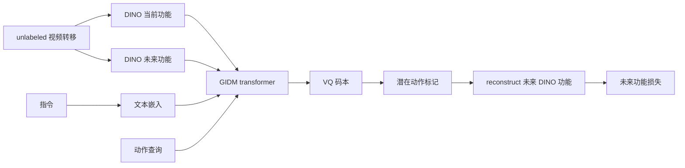
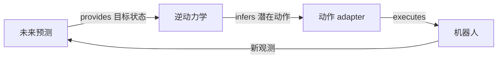

# 逆动力学模型

逆动力学模型（逆动力学模型，IDM）回答的问题是：给定当前状态和目标/未来状态，什么动作造成了这个转移？在 classical 机器人学里，它常写成从 $q,\dot q,\ddot q$ 到力矩 $\tau$ 的映射；在当前知识库的 VLA / 机器人基础模型来源中，它更常写成从视觉转移 $(o_t,o_{t+n})$ 推断动作或潜在动作。[[Seer]] 把 IDM 和条件视觉前瞻预测做端到端关节训练；[[DeFI]] 则把视觉 IDM 提升为可以从动作-free 视频里 self-supervised pretrain 的核心模块。

## 数学结构

有动作标签时，[[predictive-inverse-dynamics-models-are-scalable-learners-for-robotic-manipulation|Seer/PIDM]] 把 IDM 写成 forecast-条件化的动作预测。设 $h_t$ 是观测/状态历史，$g$ 是语言或机器人状态目标，条件视觉前瞻预测先预测未来图像：

$$
\hat{o}_{t+n}=f_{\mathrm{fore}}(g,h_t).
$$

然后逆动力学使用预测的未来潜在 $\hat{o}^{l}_{t+n}$ 预测动作序列：

$$
\hat{a}_{t:t+n-1}=f_{\mathrm{inv}}(g,h_t,\hat{o}^{l}_{t+n}).
$$

训练损失是未来图像重建和动作预测的组合：

$$
\mathcal{L}_{\mathrm{PIDM}}=\alpha\left\|f_{\mathrm{fore}}(g,h_t)-o_{t+n}\right\|_2^2+\mathcal{L}_{\mathrm{arm}}+\lambda\mathcal{L}_{\mathrm{gripper}},
$$

其中 $\mathcal{L}_{\mathrm{arm}}$ 是 6D 机械臂动作的平滑-L1 损失，$\mathcal{L}_{\mathrm{gripper}}$ 是夹爪 open/close 的 BCE 损失，Seer 中 $\alpha=0.5,\lambda=0.01$。这个表述仍需要机器人动作标签，但把动作预测条件化的在预测的未来状态，而不是只做当前状态 BC。

没有动作标签时，[[disentangled-robot-learning-via-separate-forward-and-inverse-dynamics-pretraining|DeFI]] 的 GIDM 把 IDM 写成潜在动作表示学习。设 $o_t$ 是当前观测帧，$o_{t+n}$ 是约 $1$ 秒后的未来帧，$\ell$ 是语言指令。GIDM 先用 DINOv2 编码器得到视觉特征：

$$
e_t = \mathrm{DINO}(o_t), \qquad e_{t+n} = \mathrm{DINO}(o_{t+n}).
$$

GIDM 把 $e_t$、$e_{t+n}$、指令嵌入 $f_{\text{text}}(\ell)$ 和可学习的动作查询 $q_a \in \mathbb{R}^{N \times d}$ 拼成标记序列，送入因果空间时间 Transformer：

$$
\tilde{a}^{L}_{t \rightarrow t+n} = I_{\theta}(e_t, e_{t+n}, f_{\text{text}}(\ell), q_a).
$$

其中 $\tilde{a}^{L}_{t \rightarrow t+n}$ 是连续潜在动作特征。然后用 VQ-VAE 码本做向量量化：

$$
\hat{a}^{L}_{t \rightarrow t+n} = \mathrm{VQ}_{\theta}(\tilde{a}^{L}_{t \rightarrow t+n}).
$$

解码器使用当前特征和 quantized 潜在动作重建未来 DINO 特征：

$$
\hat{e}_{t+n} = D_{\theta}(e_t, \hat{a}^{L}_{t \rightarrow t+n}),
$$

训练目标可以抽象成：

$$
\mathcal{L}_{\mathrm{GIDM}} = \left\|\hat{e}_{t+n} - e_{t+n}\right\|_2^2 + \mathcal{L}_{\mathrm{VQ}}.
$$

$\mathcal{L}_{\mathrm{VQ}}$ 是 VQ-VAE 的码本 / commitment 损失。注意这个预训练目标不需要地面真值机器人动作：转移必须通过潜在动作瓶颈才能 reconstruct 未来特征，因此模型被迫把视觉变更压缩成动作-like 代码。

[[LatentDynamicsActionModels|LDA-1B]] 的逆动力学目标也接近动作标注的表述：给定当前观测和未来 DINO 潜在，预测未来动作块 $p_\theta(a_{t+1:t+k}\mid o_t,z_{t+1:t+k},\ell)$。三者的共同点是把逆动力学从 BC-仅策略学习中抽出来；差异是 Seer 用预测的 RGB 未来做 supervised PIDM，LDA-1B 在 DINO 潜在扩散目标中预测动作块，DeFI 用 unlabeled 视频转移先学潜在动作表示，再用动作 adapter 语义落地到机器人指令。

```mermaid
flowchart LR
  V["unlabeled 视频转移"] --> E1["DINO 当前功能"]
  V --> E2["DINO 未来功能"]
  L["指令"] --> T["文本嵌入"]
  E1 --> I["GIDM transformer"]
  E2 --> I
  T --> I
  Q["动作查询"] --> I
  I --> C["VQ 码本"]
  C --> A["潜在动作标记"]
  A --> R["reconstruct 未来 DINO 功能"]
  R --> Loss["未来功能损失"]
```

## 直觉

正向动力学问“如果要执行某个运动，场景未来会长什么样”；逆动力学问“如果场景从现在变成那个未来，动作大概是什么”。对机器人策略来说，两者缺一不可：只有未来预测，系统可能知道目标画面，却不知道如何产生动作；只有动作模仿，系统可能缺少对长时域视觉 consequences 的建模。

Seer 的直觉是把“看见未来”直接接到动作标记上：动作标记 [INV] 不只关注当前图像/状态/语言，也关注前瞻预测标记 [FRS]，因此动作预测可以利用预测的未来。DeFI 的直觉则更偏表示学习：即使没有动作标签，只要未来重建必须穿过潜在动作瓶颈，模型也会被迫学习转移中的动作-like 因素。

GIDM 的关键技巧是让动作表示既不能太自由，也不能太窄。太自由时，解码器可以绕过动作语义，直接把未来视觉细节泄漏到潜在；太窄时，潜在无法表达抓取、移动、开合、放置等动作差异。VQ-VAE 码本在这里既是离散化，也是信息瓶颈：它把连续视觉转移压成有限 vocabulary 的动作标记，减少低层视觉 shortcut。

```mermaid
flowchart LR
  F["未来预测"] -->|provides 目标状态| I["逆动力学"]
  I -->|infers 潜在动作| A["动作 adapter"]
  A -->|executes| R["机器人"]
  R -->|新观测| F
```

## 失效情形

- 未来状态 leakage：如果潜在动作不经过足够瓶颈，解码器可能直接携带未来视觉特征，学到图像重建 shortcut，而不是动作表示。DeFI 用 VQ-VAE 缓解这个问题。
- 像素保真度 distraction：Seer 用 RGB 像素重建作为未来预测损失；如果低层外观损失压过操作相关的状态，未来预测可能提升视觉指标但不等价于更好的控制 signal。
- 动作歧义：同一个视觉转移可能由不同末端执行器路径、速度或接触力造成。Unlabeled 视频预训练学到的是潜在动作先验，仍需要机器人动作数据把标记语义落地到具体控制空间。
- GFDM-到-GIDM 错误 propagation：在 DeFI 中，GIDM finetuning 依赖 GFDM 生成的未来表征；当 GFDM 因域 shift 预测错误未来，IDM 会把错误未来翻译成错误动作。
- 接触密集与 cluttered 场景：DeFI 的失败分析中，正向动力学失败占 62%，主要发生在接触丰富或 cluttered interactions；这说明 IDM 的上游未来目标本身仍受世界模型物理一致性限制。
- Wrong 动作 despite correct 未来：同一失败分析中，逆动力学失败占 38%，表现为 misplacement、失败的抓取或碰撞；即使未来图像看起来合理，潜在到-动作推理仍可能失败。
- 表征漂移：DeFI 的消融实验显示关节微调 GFDM、GIDM 和 adapter 低于只训练 GIDM+Adapter；原因是 GFDM 潜在输出持续改变会让 GIDM 输入分布漂移。
- 跨本体差距：Seer 附录中去掉 Franka subsets 的 OXE 预训练只带来 marginal 增益，并在部分高精确感任务上下降；IDM 的动作语义仍可能绑定具体机器人/控制空间。

## 实践含义

对机器人学习从视频，IDM 的最新趋势不是单一路线，而是从“当前状态 BC 输出头”变成“未来条件化的动作 bridge”。如果有大规模动作标注的机器人数据，Seer-风格 PIDM 可以 jointly pretrain 视觉前瞻预测和逆动力学；如果有大量人类/机器人视频但缺动作标签，可以先训练 GIDM-风格潜在动作标记，再用少量机器人动作数据学 adapter。

对 [[VisionLanguageActionModels|VLA]]，这意味着视频预测不应只作为提示或子目标图像；它还需要一个强逆动力学 bridge，把预测的未来转成可执行的控制。DeFI 的结果支持“正向预测 alone is insufficient”：GFDM+Adapter 的 CALVIN 均值长度只有 4.35，而 GIDM+Adapter 为 4.51。

对 [[WorldModelsForEmbodiedAI|世界模型]]，IDM 提供了决策-耦合的评估角度：一个未来模型是否有用，不只看视频保真度，而要看 GIDM 能否从未来表示中恢复稳定、可执行的动作。

相关页面：[[Seer]]、[[DeFI]]、[[LatentDynamicsActionModels]]、[[VisionLanguageActionModels]]、[[WorldModelsForEmbodiedAI]]、[[SimulationRealityGap]]。
