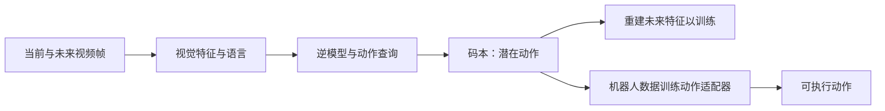

# 逆动力学模型

本页中的逆动力学模型（IDM）从当前与未来视觉状态推断动作或潜在动作。它应与经典机器人学中从位置、速度、加速度求力矩的逆动力学区分：这里讨论的是机器人学习论文中的视觉转移建模。当前来源覆盖 Seer、DeFI 和 LDA-1B 的不同路线。

## 数学结构

### 有动作标签：Seer 的预测逆动力学

$h_t$ 为观测／状态历史，$g$ 为目标条件，$n$ 为预测步数。先预测未来图像，再利用其潜在表示生成动作序列：

$$
\hat o_{t+n}=f_{\mathrm{fore}}(g,h_t),\qquad
\hat a_{t:t+n-1}=f_{\mathrm{inv}}(g,h_t,\hat o^l_{t+n}).
$$

$f_{\mathrm{fore}}$ 与 $f_{\mathrm{inv}}$ 分别为前瞻预测和逆动力学映射，$\hat o^l$ 是未来的潜在表示，帽号表示预测量。Seer 在同一 Transformer 中使用 `[FRS]` 未来标记与 `[INV]` 动作标记，联合训练：

$$
\mathcal L_{\mathrm{PIDM}}=
\alpha\|f_{\mathrm{fore}}(g,h_t)-o_{t+n}\|_2^2+
\mathcal L_{\mathrm{arm}}+\lambda\mathcal L_{\mathrm{gripper}}.
$$

机械臂 6D 动作用平滑 L1 损失，夹爪开／合用二元交叉熵；来源设置 $\alpha=0.5,\lambda=0.01$。这些数值不是其他数据或控制空间的默认配方。[[predictive-inverse-dynamics-models-are-scalable-learners-for-robotic-manipulation|Seer 论文]]

### 无动作标签：DeFI 的潜在动作瓶颈

$o_t,o_{t+n}$ 为当前与约一秒后的帧，$\ell$ 为语言。DINOv2 编码出视觉特征 $e_t,e_{t+n}$；动作查询 $q_a\in\mathbb R^{N\times d}$ 有 $N$ 个、每个维度 $d$。逆模型 $I_\theta$ 处理视觉、文本嵌入 $f_{\mathrm{text}}(\ell)$ 和查询：

$$
\tilde a^L=I_\theta(e_t,e_{t+n},f_{\mathrm{text}}(\ell),q_a),\qquad
\hat a^L=\operatorname{VQ}_\theta(\tilde a^L).
$$

$\tilde a^L$ 为连续潜在动作，$\hat a^L$ 为码本量化后的表示；$\theta$ 汇总学习参数。解码器 $D_\theta$ 用当前特征与潜在动作重建未来：

$$
\hat e_{t+n}=D_\theta(e_t,\hat a^L),\qquad
\mathcal L_{\mathrm{GIDM}}=\|\hat e_{t+n}-e_{t+n}\|_2^2+\mathcal L_{\mathrm{VQ}}.
$$

$\mathcal L_{\mathrm{VQ}}$ 包含码本与承诺损失。这里不需要真实机器人动作标签，但得到的是潜在动作，仍需机器人数据训练适配器才能输出可执行控制。[[disentangled-robot-learning-via-separate-forward-and-inverse-dynamics-pretraining|DeFI 论文]]

### LDA-1B 的条件动作目标

LDA-1B 在共享潜在模型中用当前观测、未来 DINO 特征和语言条件预测动作块；它与 Seer 都使用动作监督，但未来表示和训练组织不同。具体目标路由见 [[LatentDynamicsActionModels|潜在动力学动作模型]]。

## 直觉

正向模型问“执行动作后会怎样”；逆模型问“要得到这个变化，需要怎样的动作”。Seer 将预测未来接到动作标记上；DeFI 用有限码本把视觉转移压成潜在动作，减少直接携带未来细节的捷径。潜在表示的作用不等于物理动作已被唯一辨识：同样视觉变化可能对应不同路径和接触力。

```mermaid
flowchart LR
  A[当前与未来视频帧] --> B[视觉特征与语言]
  B --> C[逆模型与动作查询]
  C --> D[码本：潜在动作]
  D --> E[重建未来特征以训练]
  D --> F[机器人数据训练动作适配器]
  F --> G[可执行动作]
```

图对应 DeFI 的表示学习路线；推理时未来输入来自正向模型，不能偷用测试时真实未来帧。

## 失效情形

DeFI 的失败分析把其检查样本分为 62% 正向动力学失败、38% 逆动力学失败：前者常涉及富接触或杂乱交互，后者包括放置错误、抓取失败或碰撞。这个比例只描述来源样本，不是机器人失败的一般分布。[[disentangled-robot-learning-via-separate-forward-and-inverse-dynamics-pretraining|DeFI 论文]]

其联合微调正向、逆向和适配器的消融低于仅微调逆向与适配器，支持未来表示漂移会影响下游。潜在瓶颈不足可能泄漏未来视觉细节；动作空间落地仍依赖机器人标签。Seer 中移除 Franka 子集后的预训练收益有限，部分精细任务下降，提示跨形态迁移不能仅由预训练规模保证。[[disentangled-robot-learning-via-separate-forward-and-inverse-dynamics-pretraining|DeFI 论文]]、[[predictive-inverse-dynamics-models-are-scalable-learners-for-robotic-manipulation|Seer 论文]]

## 实践含义

**从未来到动作还有搜索路线。** DINO-WM 与 V-JEPA 2-AC 给动作条件的正向模型输入候选动作，用目标图像的特征距离搜索动作，再闭环重规划；它们不需要提前训练未来图到动作的逆模型。这与“先生成未来、再由 IDM 落地”是不同接口。前者需要动作预测和搜索预算，后者需要逆映射或动作适配数据，不能由一个接口的成功推断另一个必然优劣。[[VisualGoalPlanning|视觉目标规划]]、[[ModelPredictiveControl|模型预测控制]]

有大量动作标注轨迹时，可研究联合未来／动作学习；有视频但缺动作标签时，可研究潜在动作再落地。两者应在相同数据与预算下比较，而不是从架构名字推断优劣。

DeFI 报告 CALVIN 平均链长：正向模型加适配器为 4.35，逆模型加适配器为 4.51。这支持其设置下逆表示的价值，不证明任何视频预测都必须搭配同一种 IDM。评估还需分开检查未来预测、潜在动作与最终控制。[[disentangled-robot-learning-via-separate-forward-and-inverse-dynamics-pretraining|DeFI 论文]]、[[WorldModelEvaluation|世界模型评估]]
