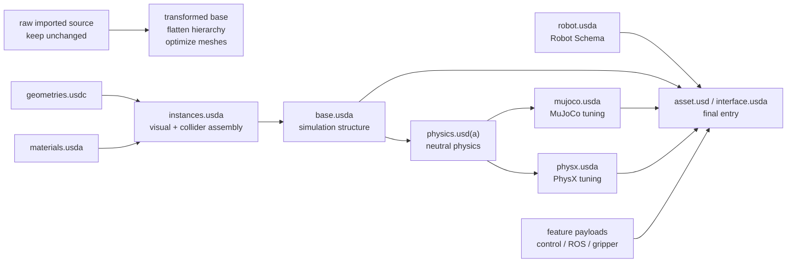
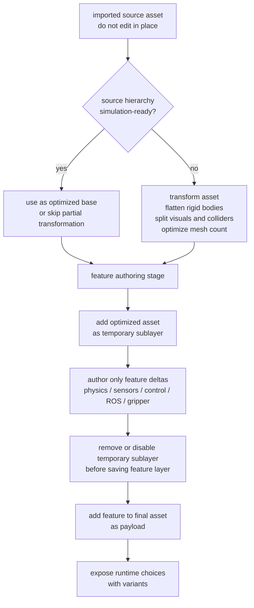
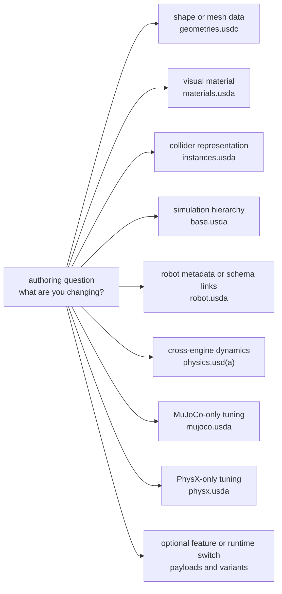

# Isaac Sim Asset Structure 3.0

Isaac Sim Asset Structure 3.0 是 [[isaac-sim-asset-structure|Asset Structure - Isaac Sim Documentation]] 中描述的 robot asset organization pattern：不要把 mesh、materials、colliders、robot metadata、neutral physics、engine-specific tuning、control graphs 和 optional features 混在一个 monolithic USD 里，而是拆成职责明确的 layers，再通过 USD composition 组合成最终 entry asset。

Source 的 evidence boundary 很重要：这是 Isaac Sim 6.0 Early Developer Release 文档中的 guidance，页面最后更新时间是 2026-03-18；它说明的是当前 EDR docs 对 imported assets 的 structure 约定，而不是所有旧版 Isaac Sim assets 都已经符合这个 layout。

## 数学结构

可以把一个 Isaac Sim robot asset 近似看成 USD composition graph：

$$
A = (L, E, V, P)
$$

其中 $L$ 是一组 USD layers，$E$ 是 layer 之间的 composition edges，$V$ 是 variant sets，$P$ 是最终暴露给 consumer 的 prim hierarchy。这个 formalization 是为了复习 source 中的 layers / payloads / variants / references 关系：source 明确要求用 multiple files、sublayers、references、payloads 和 variants 组织 asset。

核心 layers 可以按职责分成五类：

| Role | Typical file | 应该放什么 | 不应该放什么 |
| --- | --- | --- | --- |
| Geometry data | `geometries.usdc` | mesh topology、vertex data | physics tuning、robot metadata、runtime-specific attrs |
| Look / assembly | `materials.usda`, `instances.usda` | materials、shader bindings、visual/collision mesh composition、collision approximation | robot dynamics 和 engine-specific solver tuning |
| Structure / schema | `base.usda`, `robot.usda` | simulation-ready hierarchy、transforms、Isaac robot schema metadata 和 joint relationships | mesh vertex edits、runtime-specific tuning |
| Physics runtime | `physics.usd(a)`, `mujoco.usda`, `physx.usda` | common rigid bodies / masses / joints / articulation，以及 MuJoCo 或 PhysX specific attributes | unrelated visual/material edits |
| Interface / features | `asset.usd` or `interface.usda`, feature payloads | final entry prim、payloads、variants、control/ROS/gripper stacks | destructive edits to source imported hierarchy |

`physics.usd(a)` 扮演 neutral layer：它保存跨 runtime 的 core physical behavior。`mujoco.usda` 和 `physx.usda` 在它之上加入 engine-specific behavior，这样 [[MuJoCo]] damping/frictionloss 或 PhysX mimic/solver attributes 不会写进同一个 layer 互相覆盖。

### 图 1：Asset Composition Graph

这张图强调 Asset Structure 3.0 的核心对象不是单个 file，而是一个 USD composition graph。Geometry、material、instance、schema、neutral physics 和 runtime-specific tuning 分别 author，再由 final entry asset 选择要加载的 payloads 和 variants。

## 直觉

这个 layout 的直觉是把“会一起变化的东西”放在一起，把“会因为 runtime 或 use case 不同而变化的东西”隔离开。CAD mesh 变化会触发 `geometries.usdc`；collision approximation 会触发 `instances.usda`；robot identity 和 schema relationships 会触发 `robot.usda`；跨 runtime 都成立的 mass/joint/articulation 会触发 `physics.usd(a)`；只属于 MuJoCo 或 PhysX 的 solver/runtime tuning 则进入各自 layer。

Transformation 阶段解决的是 source asset 与 simulation asset 的结构差异。Imported source 可能有 nested rigid bodies 或 CAD-oriented hierarchy；simulation 更需要 flattened rigid-body list、清晰的 visual/collider split、较少 mesh count，以及 instantiable references。这样做会牺牲 source hierarchy 的直观原貌，但换来更可控的 simulation composition 和 performance。

Feature authoring 的关键习惯是 temporary sublayer：编辑 feature 时临时把 optimized asset 加进 stage，保存 feature 前移除或 disable 这个 sublayer，然后把 feature 作为 payload 加到 final asset。这样 feature layer 只保存自己的 delta，不把整个 optimized asset 复制进去。

### 图 2：Authoring Workflow

这张图解释为什么 source 要保持 immutable：downstream work 应该挂在 transformed base 和 feature payloads 上，而不是直接污染 imported source。这样 CAD/source re-import 后，feature layer 仍可以重新组合。

## Failure Modes

- Monolithic asset drift：mesh、materials、colliders、schema、PhysX tuning 和 MuJoCo tuning 混在同一个 file，后续 re-import 或 runtime switching 会变得不可审计。
- Source overwrite：直接编辑 imported source asset，CAD/source re-import 时 downstream modifications 丢失。
- Runtime attribute clash：把 PhysX-only API、MuJoCo-specific attrs 和 neutral physics 混写在一起，导致一个 runtime 的 tuning 污染另一个 runtime。
- Hierarchy mismatch：没有 flatten nested rigid bodies 或整理 simulation hierarchy，asset 在 editor 中可见但不满足 articulation/controller/simulation expectations。
- Payload contamination：feature authoring 后忘记移除 optimized asset temporary sublayer，feature file 可能意外保存过多 composition state。
- Naming ambiguity：source 同时出现 `physics.usd` / `physics.usda`、`asset.usd` / `interface.usda`，实际项目应以 importer output 和团队约定固定 naming。

## 实践含义

学习 Asset Structure 3.0 时，不要先背文件名，而要先背 authoring question：

### 图 3：Layer Responsibility Map

这张图适合做实际编辑前的 checklist：先判断 change 的 semantic owner，再进入对应 layer。它的目的不是替代 importer output，而是减少把 unrelated responsibilities 写进同一个 USD file 的风险。

| 你要改什么？ | 先看哪个 layer？ | 原因 |
| --- | --- | --- |
| Shape / mesh data | `geometries.usdc` | 这是 mesh topology 和 vertex data 的 source-of-truth。 |
| Visual material | `materials.usda` | Look-development 应和 geometry / physics 解耦。 |
| Collider representation | `instances.usda` | 这里组合 mesh、material 和 collision approximation。 |
| Simulation hierarchy | `base.usda` | 这里保存 transformed, simulation-ready kinematic structure。 |
| Robot metadata / schema links | `robot.usda` | Robot identity、namespace 和 joint relationships 属于 schema layer。 |
| Cross-engine dynamics | `physics.usd(a)` | Masses、joints、articulation structure 等 common physics 放在 neutral layer。 |
| MuJoCo tuning | `mujoco.usda` | Runtime-specific attrs 只影响 MuJoCo composition。 |
| PhysX tuning | `physx.usda` | PhysX APIs、mimic setup 和 solver-related attrs 与 PhysX runtime 绑定。 |
| Optional feature / runtime switch | final `asset.usd` / `interface.usda` | Payloads 和 variants 控制 feature loading 与 physics setup switching。 |

对 RL、MPC、sim-to-real 或 multi-engine benchmarking，这个 structure 的实际价值是让 asset assumptions 可定位。你可以明确说“这是 shared geometry/collider change”“这是 neutral dynamics change”“这是 PhysX-only tuning change”或“这是 MuJoCo-only tuning change”。这不能消除 [[SimulationRealityGap|simulation reality gap]]，但能减少 asset authoring 层面的不可解释差异。

相关页面：[[IsaacSim]]、[[NVIDIA]]、[[MuJoCo]]、[[SimulationRealityGap]]、[[ContactModelsInRobotics]]。
