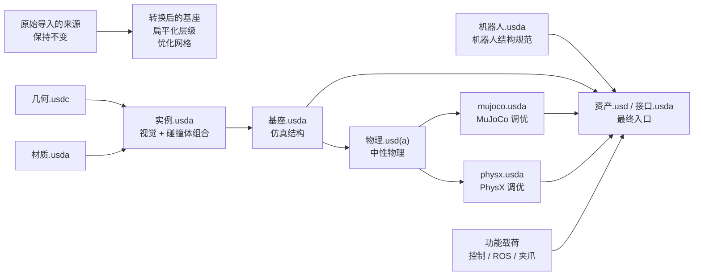
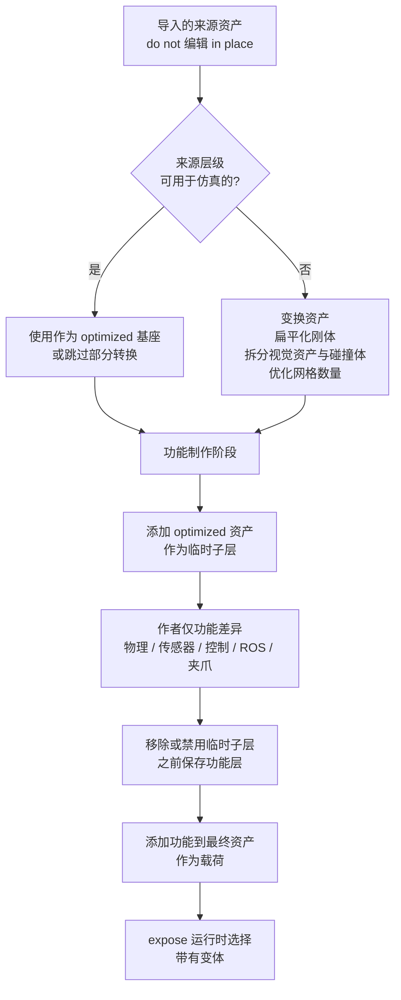
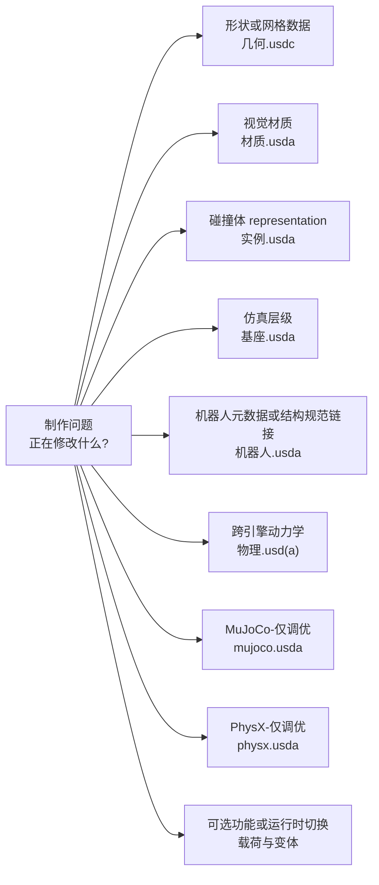

# Isaac Sim 资产结构 3.0

Isaac Sim 资产结构 3.0 是 [[isaac-sim-asset-structure|Asset Structure - Isaac Sim Documentation]] 中描述的机器人资产组织模式：不要把网格、材质、碰撞体、机器人元数据、中性物理、引擎专用调优、控制图和可选特征混在一个单体化 USD 文件里，而应拆成职责明确的层，再通过 USD 组合成最终入口资产。

来源的证据边界很重要：这是 Isaac Sim 6.0 早期开发者发布文档中的指引，页面最后更新时间是 2026-03-18；它说明的是当前 EDR 文档对导入的资产的结构约定，而不是所有旧版 Isaac Sim 资产都已经符合这个布局。

命名上也要保持精确：[[isaac-sim-45-asset-structure|Isaac Sim 4.5 Asset Structure]] 描述的是旧版 / 3.0 之前布局，来源本身没有把旧布局称为 `Asset Structure 2.0`。本页中的 3.0 对照应理解为“旧版与. 3.0”，不是“2.0 与. 3.0”。旧布局的机制页见 [[IsaacSimLegacyAssetStructure]]。

## 数学结构

可以把一个 Isaac Sim 机器人资产近似看成 USD 组合图结构：

$$
A = (L, E, V, P)
$$

其中 $L$ 是一组 USD 层，$E$ 是层之间的组合边，$V$ 是变体集，$P$ 是最终暴露给使用方的图元层级。这个 formalization 是为了复习来源中的层 / 载荷 / 变体 / 引用关系：来源明确要求用 multiple 文件、子层、引用、载荷和变体组织资产。

核心层可以按职责分成五类：

| 角色 | Typical 文件 | 应该放什么 | 不应该放什么 |
| --- | --- | --- | --- |
| Geometry 数据 | `geometries.usdc` | 网格拓扑、顶点数据 | 物理调优、机器人元数据、运行时特定的属性 |
| Look / assembly | `materials.usda`, `instances.usda` | 材质、着色器 bindings、视觉/碰撞网格组合、碰撞近似 | 机器人动力学和引擎特定的求解器调优 |
| 结构 / 结构规范 | `base.usda`, `robot.usda` | 可用于仿真的层级、transforms、Isaac 机器人模式元数据和关节关系 | 网格顶点编辑、运行时特定的调优 |
| 物理运行时 | `physics.usd(a)`, `mujoco.usda`, `physx.usda` | 常见的刚性刚体 / masses / 关节 / 关节系统，以及 MuJoCo 或 PhysX 特定的属性 | unrelated 视觉/材质编辑 |
| 接口 / 功能 | `asset.usd` 或 `interface.usda`, 功能载荷 | 最终入口图元、载荷、变体、控制/ROS/gripper 技术栈 | 破坏性的编辑到来源导入的层级 |

`physics.usd(a)` 扮演中性层：它保存跨运行时的 core 物理行为。`mujoco.usda` 和 `physx.usda` 在它之上加入引擎特定的行为，这样 [[MuJoCo]] 阻尼/frictionloss 或 PhysX mimic/求解器属性不会写进同一个层互相覆盖。

### 图 1：资产组合图

```mermaid
flowchart LR
  S["原始导入的来源<br/>保持不变"] --> T["转换后的基座<br/>扁平化层级<br/>优化网格"]
  G["几何.usdc"] --> I["实例.usda<br/>视觉 + 碰撞体组合"]
  M["材质.usda"] --> I
  I --> B["基座.usda<br/>仿真结构"]
  B --> P["物理.usd(a)<br/>中性物理"]
  P --> MJ["mujoco.usda<br/>MuJoCo 调优"]
  P --> PX["physx.usda<br/>PhysX 调优"]
  R["机器人.usda<br/>机器人结构规范"] --> F["资产.usd / 接口.usda<br/>最终入口"]
  B --> F
  MJ --> F
  PX --> F
  C["功能载荷<br/>控制 / ROS / 夹爪"] --> F
```

这张图强调资产结构 3.0 的核心对象不是单个文件，而是一个 USD 组合图结构。Geometry、材质、实例、模式、中性物理和运行时特定的调优分别作者，再由最终入口资产选择要加载的载荷和变体。

## 直觉

这个布局的直觉是把“会一起变化的东西”放在一起，把“会因为运行时或 use 情形不同而变化的东西”隔离开。CAD 网格变化会触发 `geometries.usdc`；碰撞近似会触发 `instances.usda`；机器人身份和模式关系会触发 `robot.usda`；跨运行时都成立的质量/关节/关节系统会触发 `physics.usd(a)`；只属于 MuJoCo 或 PhysX 的求解器/运行时调优则进入各自层。

[[isaac-sim-core-api-collision-approximation|Isaac Sim Core API collision approximation docs]] 让碰撞体层的含义更具体：同一个可见网格可以选择三角形网格、凸分解、凸包、包围球体、包围 cube、网格 simplification、SDF 或球体 fill 作为碰撞近似。这个选择属于共享碰撞体表示；只有当某个接触调优或后端属性只服务 MuJoCo / PhysX 运行时时，才应进入 `mujoco.usda` / `physx.usda` 这类运行时特定的层。

转换阶段解决的是来源资产与仿真资产的结构差异。导入的来源可能有 nested 刚性刚体或 CAD-定向的层级；仿真更需要 flattened 刚体列表、清晰的视觉/碰撞体 split、较少网格数量，以及 instantiable 引用。这样做会牺牲来源层级的直观原貌，但换来更可控的仿真组合和性能。

功能制作的关键习惯是临时子层：编辑特征时临时把优化后的资产加进阶段，保存特征前移除或 disable 这个子层，然后把特征作为载荷加到最终资产。这样特征层只保存自己的增量，不把整个优化后的资产复制进去。

### 图 2：创作流程

```mermaid
flowchart TD
  A["导入的来源资产<br/>do not 编辑 in place"] --> B{"来源层级<br/>可用于仿真的?"}
  B -- "是" --> C["使用作为 optimized 基座<br/>或跳过部分转换"]
  B -- "否" --> D["变换资产<br/>扁平化刚体<br/>拆分视觉资产与碰撞体<br/>优化网格数量"]
  C --> E["功能制作阶段"]
  D --> E
  E --> F["添加 optimized 资产<br/>作为临时子层"]
  F --> G["作者仅功能差异<br/>物理 / 传感器 / 控制 / ROS / 夹爪"]
  G --> H["移除或禁用临时子层<br/>之前保存功能层"]
  H --> I["添加功能到最终资产<br/>作为载荷"]
  I --> J["expose 运行时选择<br/>带有变体"]
```

这张图解释为什么来源要保持 immutable：下游工作应该挂在转换后的基座和特征载荷上，而不是直接污染导入的来源。这样 CAD/来源重新导入后，特征层仍可以重新组合。

## 失效情形

- 单体化的资产漂移：网格、材质、碰撞体、模式、PhysX 调优和 MuJoCo 调优混在同一个文件，后续重新导入或运行时切换会变得不可审计。
- 覆盖原始来源：直接编辑导入的来源资产，CAD/来源重新导入时下游 modifications 丢失。
- 运行时属性冲突：把 PhysX 专用 API、MuJoCo 专用属性和中性物理混写在一起，导致一个运行时的调优污染另一个运行时。
- 层级不匹配：没有 flatten nested 刚性刚体或整理仿真层级，资产在编辑器中可见但不满足关节系统/控制器/仿真 expectations。
- 载荷污染：特征制作后忘记移除优化后的资产临时子层，特征文件可能意外保存过多组合状态。
- 命名歧义：来源同时出现 `physics.usd` / `physics.usda`、`asset.usd` / `interface.usda`，实际项目应以导入器输出和团队约定固定 naming。

## 实践含义

学习资产结构 3.0 时，不要先背文件名，而要先背制作 question：

### 图 3：分层职责图

```mermaid
flowchart LR
  Q["制作问题<br/>正在修改什么?"] --> A["形状或网格数据<br/>几何.usdc"]
  Q --> B["视觉材质<br/>材质.usda"]
  Q --> C["碰撞体 representation<br/>实例.usda"]
  Q --> D["仿真层级<br/>基座.usda"]
  Q --> E["机器人元数据或结构规范链接<br/>机器人.usda"]
  Q --> F["跨引擎动力学<br/>物理.usd(a)"]
  Q --> G["MuJoCo-仅调优<br/>mujoco.usda"]
  Q --> H["PhysX-仅调优<br/>physx.usda"]
  Q --> I["可选功能或运行时切换<br/>载荷与变体"]
```

这张图适合做实际编辑前的 checklist：先判断变更的语义 owner，再进入对应层。它的目的不是替代导入器输出，而是减少把 unrelated 职责写进同一个 USD 文件的风险。

| 你要改什么？ | 先看哪个层？ | 原因 |
| --- | --- | --- |
| 形状 / 网格数据 | `geometries.usdc` | 这是网格拓扑和顶点数据的唯一事实来源。 |
| 视觉材质 | `materials.usda` | 外观开发应和几何 / 物理解耦。 |
| Collider 表征 | `instances.usda` | 这里组合网格、材质和碰撞近似。 |
| 仿真层级 | `base.usda` | 这里保存转换后的, 可用于仿真的运动学结构。 |
| 机器人元数据 / 结构规范链接 | `robot.usda` | 机器人身份、命名空间和关节关系属于模式层。 |
| 跨引擎动力学 | `physics.usd(a)` | Masses、关节、关节系统结构等常见的物理放在中性层。 |
| MuJoCo 调优 | `mujoco.usda` | 运行时专用属性只影响 MuJoCo 组合。 |
| PhysX 调优 | `physx.usda` | PhysX APIs、mimic 设置和求解器相关的属性与 PhysX 运行时绑定。 |
| 可选功能 / 运行时 switch | 最终 `asset.usd` / `interface.usda` | 载荷和变体控制特征 loading 与物理设置切换。 |

### 与 3.0 之前旧版布局的区别

[[IsaacSimLegacyAssetStructure|旧版资产结构]] 已经使用 USD 子层、载荷、引用和变体，但职责切分较粗：`parts.usd` 承担网格部件，`asset_sim_optimized.usd` 承担转换后的仿真资产，`asset_physics.usd` 承担物理特征。资产结构 3.0 的主要变化是把网格数据、网格/材质/碰撞体 assembly、仿真层级、机器人模式、中性物理和运行时特定的物理拆成更明确的层。

| Responsibility | 旧版 / pre-3.0 | 资产结构 3.0 |
| --- | --- | --- |
| 网格数据 / 部件 | `parts.usd` | `geometries.usdc` |
| Assembly 与 colliders | 混合为来源 / optimized 资产 responsibilities | `instances.usda` |
| 仿真就绪层级 | `asset_sim_optimized.usd` | `base.usda` |
| 机器人元数据 | not 分离 in 4.5 来源 | `robot.usda` |
| 物理设置 | `asset_physics.usd` 参考 | `physics.usd(a)` + `physx.usda` / `mujoco.usda` |
| 最终入口 | `asset.usd` | `asset.usd` 或 `interface.usda` |

### `mujoco.usda` 的归属边界

`mujoco.usda` 不应理解成“MuJoCo 版视觉或碰撞资产”，也不等价于原生 MJCF。有来源支持的部分是：[[isaac-sim-asset-structure]] 把 `mujoco.usda` 放在 MuJoCo 物理设置与引擎专用调优的位置，并把视觉网格、材质、实例、碰撞体和中性物理拆到其他层。由此可以得到一个来自讨论的制作启发式：`mujoco.usda` 保存 [[MuJoCo]] 对已有 USD 机器人资产的运行时解释和调优叠加，而不是机器人资产网格、材质或共享碰撞体的唯一事实来源。更完整的提炼见 [[isaac-sim-mujoco-usda-runtime-semantics]]。

| 语义类型 | 先看哪个层？ | 判断 |
| --- | --- | --- |
| 视觉网格、纹理、材质、网格拓扑 | `geometries.usdc`、`materials.usda`、`instances.usda` | 不属于 `mujoco.usda`。 |
| 碰撞形状、碰撞网格、视觉/collider assembly | `instances.usda`、`base.usda`、`physics.usd(a)` | 如果是跨引擎共享碰撞体语义，不属于 `mujoco.usda`。 |
| 机体/关节层级、关节轴、共享限制、质量/惯量 | `base.usda`、`physics.usd(a)` | 优先作为中性物理 / 结构作者。 |
| MuJoCo 执行器/transmission behavior | `mujoco.usda` | 属于 MuJoCo 专用运行时语义的典型例子。 |
| MuJoCo 关节被动动力学或接触求解器调优 | `mujoco.usda` | 例如阻尼、frictionloss、armature、MuJoCo 专用接触 / 求解器参数；实际可用属性需以 Isaac 后端支撑为准。 |
| MuJoCo 专用碰撞过滤或约束调优 | `mujoco.usda` 或运行时配置 | 如果中性 USD 物理不能表达且只影响 MuJoCo 后端，才进入 MuJoCo 专用层。 |

对 RL、MPC、仿真到现实迁移或多引擎 benchmarking，这个结构的实际价值是让资产假设可定位。你可以明确说“这是共享几何/碰撞体变更”“这是中性动力学变更”“这是 PhysX 专用调优变更”或“这是 MuJoCo 专用调优变更”。这不能消除 [[SimulationRealityGap|仿真—现实差距]]，但能减少资产制作层面的不可解释差异。

相关页面：[[CollisionGeometryForRobotSimulation]]、[[IsaacSimLegacyAssetStructure]]、[[IsaacSim]]、[[NVIDIA]]、[[MuJoCo]]、[[SimulationRealityGap]]、[[ContactModelsInRobotics]]。
