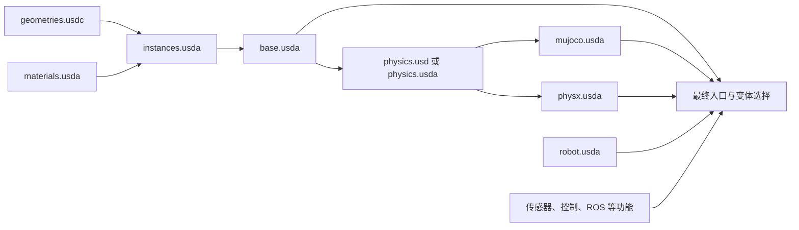
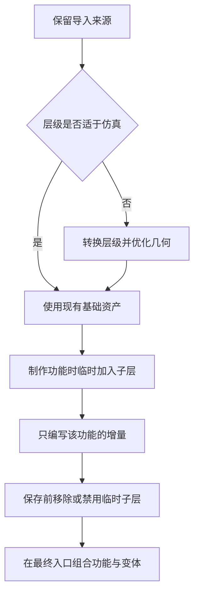

# Isaac Sim 资产结构 3.0

[[isaac-sim-asset-structure|Isaac Sim 6.0 资产结构文档]] 将机器人资产拆成职责明确的 USD 层，再组合为最终入口。这样可以分别维护网格、材质、碰撞体、机器人结构、中性物理、引擎专用调优和可选功能，避免所有编辑集中在一个文件。

**版本边界：**本页依据 Isaac Sim 6.0 早期开发者发布文档，页面日期为2026-03-18；它说明该版设计约定，不保证所有旧资产或正式发布版本已经采用该布局。[[isaac-sim-45-asset-structure|4.5 文档]] 没有把旧布局命名为“2.0”，本库称其为 [[IsaacSimLegacyAssetStructure|旧版资产结构]]。此次为编辑整理，没有重新核验导入器实现。

## 按职责定位文件

| 层或入口 | 主要职责 |
| --- | --- |
| `geometries.usdc` | 网格拓扑与顶点数据 |
| `materials.usda` | 材质图元与着色器绑定 |
| `instances.usda` | 组合几何、材质及视觉／碰撞网格，组织碰撞近似 |
| `base.usda` | 适于仿真的层级与变换 |
| `robot.usda` | 机器人结构描述、元数据与关节关系 |
| `physics.usd`／`physics.usda` | 共享的刚体、质量、关节与关节系统等中性物理描述 |
| `mujoco.usda`、`physx.usda` | 隔离不同物理引擎的专用属性与调优 |
| 功能层 | 传感器、控制图、ROS、夹爪等增量功能 |
| `asset.usd`／`interface.usda` | 通过子层、引用、载荷和变体组成最终入口 |

来源在不同段落使用两种物理层扩展名和两种入口名称。实际项目应检查导入器输出，不把表中的角色说明当作固定文件命名校验器。[[isaac-sim-asset-structure|资产结构来源页]]

```mermaid
flowchart LR
  G[geometries.usdc] --> I[instances.usda]
  M[materials.usda] --> I
  I --> B[base.usda]
  B --> P[physics.usd 或 physics.usda]
  P --> MJ[mujoco.usda]
  P --> PX[physx.usda]
  B --> F[最终入口与变体选择]
  MJ --> F
  PX --> F
  R[robot.usda] --> F
  C[传感器、控制、ROS 等功能] --> F
```

图是职责关系示意，不是要求 PhysX 与 MuJoCo 专用属性同时生效的加载脚本。重点是让后端选择和参数归属可追踪。

## 从导入到功能制作

来源资产保持不变，方便重新导入。若其层级不适于仿真，转换阶段会整理嵌套刚体、分离视觉与碰撞表示、合并或优化网格，并准备适于实例化的引用。随后把物理、传感器和控制等功能叠加到转换结果上。[[isaac-sim-asset-structure|资产结构来源页]]

```mermaid
flowchart TD
  S[保留导入来源] --> Q{层级是否适于仿真}
  Q -->|是| B[使用现有基础资产]
  Q -->|否| T[转换层级并优化几何]
  T --> B
  B --> L[制作功能时临时加入子层]
  L --> E[只编写该功能的增量]
  E --> U[保存前移除或禁用临时子层]
  U --> A[在最终入口组合功能与变体]
```

临时子层提供编辑上下文；保存前断开它，避免功能文件携带不属于自己的组合依赖。重新导入后仍需检查新路径与既有覆写是否匹配，分层本身不保证迁移自动成功。

## 碰撞表示与后端调优

[[isaac-sim-core-api-collision-approximation|Isaac Sim 5.1 碰撞近似文档]] 列出三角形网格、凸分解、凸包、包围球、包围立方体、网格简化、SDF 与球体填充等选项。同一个视觉网格可以对应不同碰撞表示；这些几何选择应与接触求解器调优分开记录。该 API 清单不意味着所有后端支持完全相同的表示。

`mujoco.usda` 是 MuJoCo 专用物理设置层，不等于原生 MJCF，也不承担所有视觉或碰撞资产。共享网格、质量和关节结构先按上表定位；只有后端专用语义才考虑放进对应引擎层。执行器、被动动力学或接触参数是讨论中的分类例子，**不是本页核验过的 Isaac 后端支持清单**；`frictionloss`、`armature` 等字段是否可用，仍需对应版本的模式与导入器资料。[[isaac-sim-mujoco-usda-runtime-semantics|mujoco.usda 语义笔记]]

## 与旧版布局比较

| 职责 | 4.5 旧版 | 6.0 EDR 的3.0布局 |
| --- | --- | --- |
| 网格 | `parts.usd` | `geometries.usdc` 与 `instances.usda` 分工 |
| 仿真结构 | `asset_sim_optimized.usd` | `base.usda`，装配与碰撞职责另行分层 |
| 机器人元数据 | 来源未单独列出对应层 | `robot.usda` |
| 物理 | `asset_physics.usd` | 中性物理与引擎专用调优分层 |
| 最终入口 | `asset.usd` | `asset.usd` 或 `interface.usda` |

这是一张职责对照表，不是自动迁移规则。具体旧版制作机制见 [[IsaacSimLegacyAssetStructure|旧版资产结构]]。

## 编辑前的检查

先问修改的是共享几何、中性动力学、后端参数还是可选功能，再进入对应层。常见问题是直接覆盖导入来源、混写不同后端属性、保留不必要的临时子层，以及只重命名文件却没有重新划分职责。分层让差异可以定位，但不能替代 [[SimulationRealityGap|仿真—现实差距]] 验证。

相关页面：[[OpenUSDSceneComposition|OpenUSD 场景组合]]、[[CollisionGeometryForRobotSimulation|碰撞几何]]、[[ReducedCoordinateArticulations|约化坐标关节系统]]、[[IsaacSim|Isaac Sim]]、[[MuJoCo|MuJoCo]]。

## 研究归属

[[topics/assets-and-world-generation|三维资产与场景生成]] · [[topics/asset-representation|资产格式怎样保留仿真语义]]。
