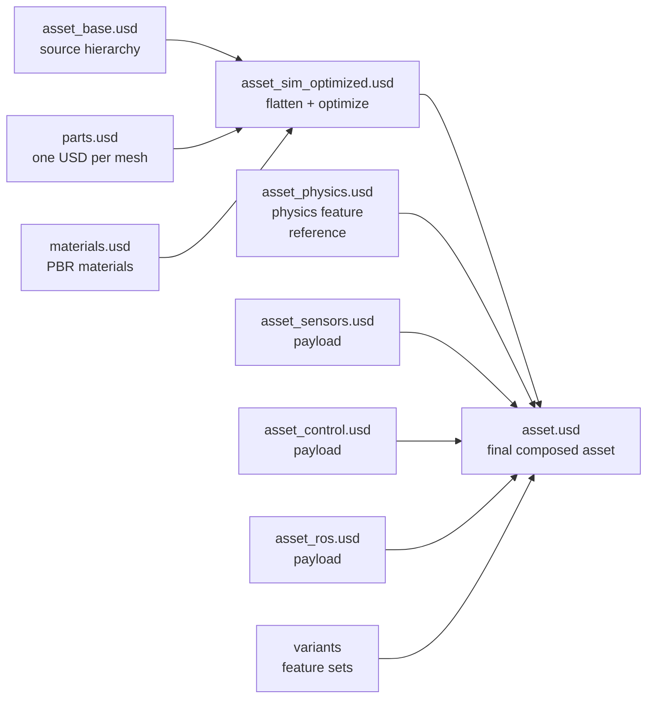
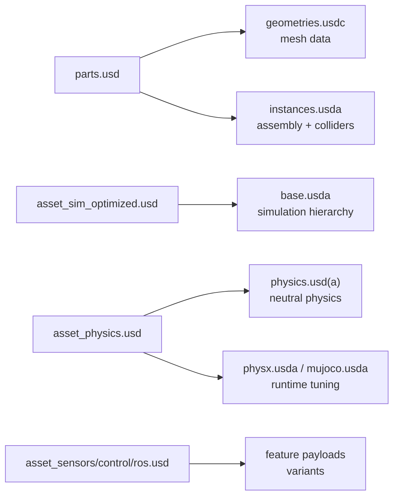

# Isaac Sim Legacy Asset Structure

Isaac Sim Legacy Asset Structure 指 [[isaac-sim-45-asset-structure|Isaac Sim 4.5 Asset Structure]] 中描述的 pre-3.0 robot asset organization pattern。它把 imported asset 分成 source asset、simulation-optimized asset、feature layers 和 final `asset.usd`，并用 USD sublayers、payloads、references 和 variants 组合。Evidence boundary：这个 source 没有把 layout 命名为 `Asset Structure 2.0`，所以本 wiki 不使用 2.0 这个称呼。

## 数学结构

可以把 legacy asset 近似写成：

$$
A_{\text{legacy}} = C(T(S), F)
$$

其中 $S$ 是 source asset set（`asset_base.usd`、`parts.usd`、`materials.usd`），$T$ 是 transformation，把 source hierarchy 变成 simulation-ready 的 `asset_sim_optimized.usd`，$F$ 是 feature layer set（physics、sensors、control、ROS），$C$ 是 final composition，输出 root-level `asset.usd`。

| Role | Typical file | 主要职责 | 3.0 中的近似去向 |
| --- | --- | --- | --- |
| Source hierarchy | `asset_base.usd` | 保留 imported asset 的 full structural hierarchy | `base.usda` 承担 simulation-ready structure，但 3.0 不等价保留 old source layer |
| Mesh parts | `parts.usd` | individual components，source 称 one USD file per mesh | `geometries.usdc` + `instances.usda` |
| Materials | `materials.usd` | PBR materials | `materials.usda` |
| Optimized simulation asset | `asset_sim_optimized.usd` | flatten rigid bodies、整理 visuals/colliders、mesh optimization | `base.usda` + `instances.usda` 的组合职责 |
| Physics feature | `asset_physics.usd` | rigid bodies、colliders、joints、articulations；作为 reference 加到 default prim | `physics.usd(a)` + `physx.usda` / `mujoco.usda` |
| Optional features | `asset_sensors.usd`、`asset_control.usd`、`asset_ros.usd` | sensors、control graphs、ROS Omnigraph functionality；通常作为 payloads | feature payloads / interface asset variants |
| Final entry | `asset.usd` | sublayers、payloads、references、variants 的组合入口 | `asset.usd` or `interface.usda` |

### 图 1：Legacy Composition Pipeline

这张图强调 legacy layout 的核心 abstraction 是 source-to-optimized transformation 加 feature overlays。它已经使用 USD composition，但 feature ownership 还没有像 3.0 那样拆成 geometry、instance、robot schema、neutral physics 和 runtime-specific physics。

## 直觉

Legacy layout 的工程直觉是保护 source import result，同时把 simulation-specific edits 放到 transformed asset 和 feature layers 上。Source asset 可以重新导入；`asset_sim_optimized.usd` 承担“让 asset 适合 simulation”的结构调整；physics、sensor、control 和 ROS 则以 lightweight layer 的方式叠加，避免把每个 optional capability 都烘焙进 final file。

Feature authoring 的关键动作是 temporary sublayer：编辑 `asset_physics.usd`、`asset_sensors.usd` 或 `asset_control.usd` 时临时加载 `asset_sim_optimized.usd` 做上下文，保存 feature 前断开这个 sublayer。这个习惯和 [[IsaacSimAssetStructure|Asset Structure 3.0]] 中的 feature authoring principle 一致：feature file 应只保存自己的 delta，不复制整个 optimized asset。

## 与 Asset Structure 3.0 的区别

| 问题 | Legacy / pre-3.0 | Asset Structure 3.0 |
| --- | --- | --- |
| 官方命名 | Source 只叫 `Asset Structure`；没有 2.0 命名 | 6.0 docs 明确称为 USD Asset Structure 3.0 guidance |
| Mesh organization | `parts.usd`，source 称 one USD file per mesh | `geometries.usdc` 保存 mesh data，`instances.usda` 负责 assembly / collider representation |
| Simulation hierarchy | `asset_sim_optimized.usd` 集中保存 transformed structure | `base.usda` 保存 simulation-ready structure，visual/collider assembly 拆到 `instances.usda` |
| Physics ownership | `asset_physics.usd` 一个 physics feature，作为 reference 加到 default prim | `physics.usd(a)` 保存 neutral physics，`mujoco.usda` / `physx.usda` 隔离 runtime-specific tuning |
| Robot metadata | 4.5 source 没有单独列出 `robot.usda` / Robot Schema layer | 6.0 source 把 `robot.usda` / Robot Schema 作为独立 layer |
| Runtime switching | Variants 可切换 feature sets，但 source 没有 multi-physics runtime separation | Variants 和 runtime-specific layers 明确服务 PhysX、MuJoCo 等 backend 隔离 |

### 图 2：Migration-Oriented Responsibility Map

这个图不是自动迁移规则，而是 authoring responsibility map：看到 old file name 时，先判断它实际承载的 semantic owner，再决定在 3.0 layout 中应该拆到哪个 layer。

## Failure Modes

- Unsupported 2.0 naming：把 4.5 legacy layout 称为 `Asset Structure 2.0` 会制造 false precision；当前 source-backed 名称只能是 legacy / pre-3.0。
- Runtime collapse：把所有 physics 都留在 `asset_physics.usd`，会让 PhysX-only、MuJoCo-only 和 neutral USD physics assumptions 难以分离。
- Payload contamination：feature authoring 后忘记断开 temporary `asset_sim_optimized.usd` sublayer，feature file 可能保存过多 context。
- Source overwrite：直接编辑 `asset_base.usd`、`parts.usd` 或 `materials.usd`，source re-import 时容易丢 downstream modifications。
- Hierarchy mismatch：没有执行 flatten / visual-collider separation / mesh optimization，asset 可加载但不满足 simulation articulation 或 controller expectations。

## 实践含义

识别旧 asset 时，不要问“它是不是 2.0”，而要看 file responsibility。如果目录中出现 `asset_base.usd`、`parts.usd`、`asset_sim_optimized.usd`、`asset_physics.usd` 这组名字，应先按 Isaac Sim 4.5 legacy / pre-3.0 layout 理解。

维护旧 asset 的实用原则是：source files 保持可 re-import；simulation hierarchy change 去 `asset_sim_optimized.usd`；physics / sensor / control / ROS change 去 feature layer；final `asset.usd` 负责 composition，而不是承载所有 edit。迁移到 3.0 时，优先把 mesh data、assembly/colliders、neutral physics 和 engine-specific tuning 拆开，而不是只做 filename rename。

相关页面：[[IsaacSimAssetStructure]]、[[IsaacSim]]、[[OpenUSD]]、[[NVIDIA]]、[[SimulationRealityGap]]。
