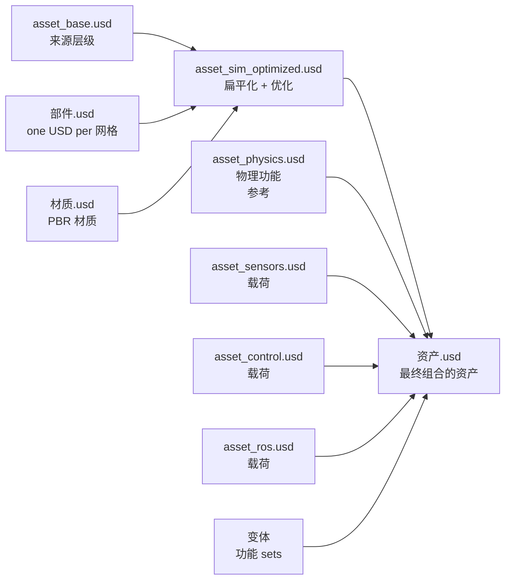
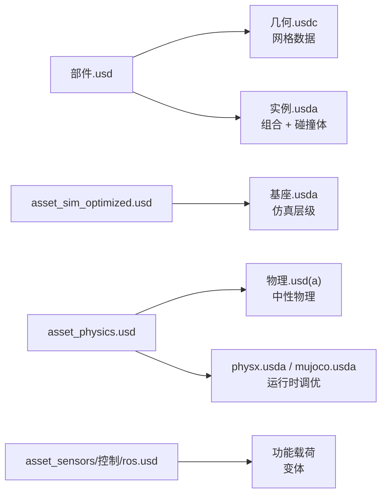

# Isaac Sim 旧版资产结构

Isaac Sim 旧版资产结构指 [[isaac-sim-45-asset-structure|Isaac Sim 4.5 Asset Structure]] 中描述的 3.0 之前机器人资产组织模式。它把导入的资产分成来源资产、仿真优化后的资产、特征层和最终 `asset.usd`，并用 USD 子层、载荷、引用和变体组合。证据边界：这个来源没有把布局命名为 `Asset Structure 2.0`，所以本知识库不使用 2.0 这个称呼。

## 数学结构

可以把旧版资产近似写成：

$$
A_{\text{legacy}} = C(T(S), F)
$$

其中 $S$ 是来源资产设置（`asset_base.usd`、`parts.usd`、`materials.usd`），$T$ 是转换，把来源层级变成可用于仿真的 `asset_sim_optimized.usd`，$F$ 是特征层设置（物理、传感器、控制、ROS），$C$ 是最终组合，输出根部层级 `asset.usd`。

| 角色 | Typical 文件 | 主要职责 | 3.0 中的近似去向 |
| --- | --- | --- | --- |
| 来源层级 | `asset_base.usd` | 保留导入的资产的完整结构性的层级 | `base.usda` 承担可用于仿真的结构，但 3.0 不等价保留 old 来源层 |
| 网格部件 | `parts.usd` | 单独组件，来源称 one USD 文件 per 网格 | `geometries.usdc` + `instances.usda` |
| 材质 | `materials.usd` | PBR 材质 | `materials.usda` |
| Optimized 仿真资产 | `asset_sim_optimized.usd` | flatten 刚性刚体、整理视觉几何/碰撞体、网格优化 | `base.usda` + `instances.usda` 的组合职责 |
| 物理功能 | `asset_physics.usd` | 刚性刚体、碰撞体、关节、关节系统；作为参考基准加到默认图元 | `physics.usd(a)` + `physx.usda` / `mujoco.usda` |
| 可选功能 | `asset_sensors.usd`、`asset_control.usd`、`asset_ros.usd` | 传感器、控制 graphs、ROS Omnigraph 功能；通常作为载荷 | 特征载荷 / 接口资产变体 |
| 最终入口 | `asset.usd` | 子层、载荷、引用、变体的组合入口 | `asset.usd` 或 `interface.usda` |

### 图 1：旧版组合流程

```mermaid
flowchart LR
  AB["asset_base.usd<br/>来源层级"] --> T["asset_sim_optimized.usd<br/>扁平化 + 优化"]
  P["部件.usd<br/>one USD per 网格"] --> T
  M["材质.usd<br/>PBR 材质"] --> T
  T --> A["资产.usd<br/>最终组合的资产"]
  PH["asset_physics.usd<br/>物理功能<br/>参考"] --> A
  S["asset_sensors.usd<br/>载荷"] --> A
  C["asset_control.usd<br/>载荷"] --> A
  R["asset_ros.usd<br/>载荷"] --> A
  V["变体<br/>功能 sets"] --> A
```

这张图强调旧版布局的核心抽象是来源到-优化后的转换加特征叠加层。它已经使用 USD 组合，但特征归属还没有像 3.0 那样拆成几何、实例、机器人模式、中性物理和运行时特定的物理。

## 直觉

旧版布局的工程直觉是保护来源导入结果，同时把仿真特定的编辑放到转换后的资产和特征层上。来源资产可以重新导入；`asset_sim_optimized.usd` 承担“让资产适合仿真”的结构调整；物理、传感器、控制和 ROS 则以轻量层的方式叠加，避免把每个可选能力都烘焙进最终文件。

功能制作的关键动作是临时子层：编辑 `asset_physics.usd`、`asset_sensors.usd` 或 `asset_control.usd` 时临时加载 `asset_sim_optimized.usd` 做上下文，保存特征前断开这个子层。这个习惯和 [[IsaacSimAssetStructure|资产结构 3.0]] 中的特征制作原则一致：特征文件应只保存自己的增量，不复制整个优化后的资产。

## 与资产结构 3.0 的区别

| 问题 | 旧版 / 3.0 之前 | 资产结构 3.0 |
| --- | --- | --- |
| 官方命名 | 来源只叫 `Asset Structure`；没有 2.0 命名 | 6.0 文档明确称为 USD 资产结构 3.0 指引 |
| 网格组织 | `parts.usd`，来源称 one USD 文件 per 网格 | `geometries.usdc` 保存网格数据，`instances.usda` 负责 assembly / 碰撞体表示 |
| 仿真层级 | `asset_sim_optimized.usd` 集中保存转换后的结构 | `base.usda` 保存可用于仿真的结构，视觉/碰撞体 assembly 拆到 `instances.usda` |
| 物理 ownership | `asset_physics.usd` 一个物理特征，作为参考基准加到默认图元 | `physics.usd(a)` 保存中性物理，`mujoco.usda` / `physx.usda` 隔离运行时特定的调优 |
| 机器人元数据 | 4.5 来源没有单独列出 `robot.usda` / 机器人模式层 | 6.0 来源把 `robot.usda` / 机器人模式作为独立层 |
| 运行时切换 | 变体可切换特征集合，但来源没有多物理运行时分离 | 变体和运行时特定的层明确服务 PhysX、MuJoCo 等后端隔离 |

### 图 2：面向迁移的职责图

```mermaid
flowchart LR
  L1["部件.usd"] --> N1["几何.usdc<br/>网格数据"]
  L1 --> N2["实例.usda<br/>组合 + 碰撞体"]
  L2["asset_sim_optimized.usd"] --> N3["基座.usda<br/>仿真层级"]
  L3["asset_physics.usd"] --> N4["物理.usd(a)<br/>中性物理"]
  L3 --> N5["physx.usda / mujoco.usda<br/>运行时调优"]
  L4["asset_sensors/控制/ros.usd"] --> N6["功能载荷<br/>变体"]
```

这个图不是自动迁移规则，而是制作职责映射图：看到 old 文件名称时，先判断它实际承载的语义 owner，再决定在 3.0 布局中应该拆到哪个层。

## 失效情形

- 无依据的 2.0 naming：把 4.5 旧版布局称为 `Asset Structure 2.0` 会制造 false 精确感；当前有来源支持的名称只能是旧版 / 3.0 之前。
- 运行时 collapse：把所有物理都留在 `asset_physics.usd`，会让 PhysX 专用、MuJoCo 专用和中性 USD 物理假设难以分离。
- 载荷污染：特征制作后忘记断开 temporary `asset_sim_optimized.usd` 子层，特征文件可能保存过多上下文。
- 覆盖原始来源：直接编辑 `asset_base.usd`、`parts.usd` 或 `materials.usd`，来源重新导入时容易丢下游 modifications。
- 层级不匹配：没有执行 flatten / 视觉碰撞体分离 / 网格优化，资产可加载但不满足仿真关节系统或控制器 expectations。

## 实践含义

识别旧资产时，不要问“它是不是 2.0”，而要看文件职责。如果目录中出现 `asset_base.usd`、`parts.usd`、`asset_sim_optimized.usd`、`asset_physics.usd` 这组名字，应先按 Isaac Sim 4.5 旧版 / 3.0 之前布局理解。

维护旧资产的实用原则是：来源文件保持可重新导入；仿真层级变更去 `asset_sim_optimized.usd`；物理 / 传感器 / 控制 / ROS 变更去特征层；最终 `asset.usd` 负责组合，而不是承载所有编辑。迁移到 3.0 时，优先把网格数据、assembly/碰撞体、中性物理和引擎特定的调优拆开，而不是只做文件名重命名。

相关页面：[[IsaacSimAssetStructure]]、[[IsaacSim]]、[[OpenUSD]]、[[NVIDIA]]、[[SimulationRealityGap]]。
