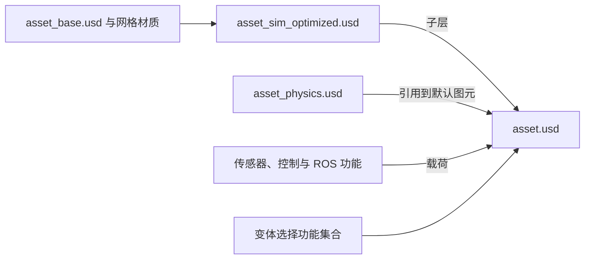

# Isaac Sim 旧版资产结构

本页解释 [[isaac-sim-45-asset-structure|Isaac Sim 4.5 资产结构文档]] 中的组织方式：保留导入来源，生成适于仿真的基础资产，再添加功能层，最后组合为 `asset.usd`。来源未称其为“Asset Structure 2.0”；“旧版”只表示它早于 [[IsaacSimAssetStructure|资产结构3.0]] 的分层约定。

## 文件职责与组合

| 文件 | 职责 |
| --- | --- |
| `asset_base.usd` | 保留导入资产的完整结构层级 |
| `parts.usd` | 组织网格部件；来源描述每个网格对应一个 USD 文件 |
| `materials.usd` | PBR 材质 |
| `asset_sim_optimized.usd` | 转换为仿真需要的结构：整理刚体层级、分离视觉与碰撞表示、优化网格 |
| `asset_physics.usd` | 刚体、碰撞体、关节和关节系统等物理功能 |
| `asset_sensors.usd`、`asset_control.usd`、`asset_ros.usd` | 传感器、控制图和 ROS 功能 |
| `asset.usd` | 组合基础资产与可选功能，提供最终入口 |

```mermaid
flowchart LR
  S[asset_base.usd 与网格材质] --> T[asset_sim_optimized.usd]
  T -->|子层| A[asset.usd]
  P[asset_physics.usd] -->|引用到默认图元| A
  F[传感器、控制与 ROS 功能] -->|载荷| A
  V[变体选择功能集合] --> A
```

物理功能是来源特别说明的例外：它作为引用加入默认图元，其他功能通常作为载荷。不要把全部功能都按同一种组合方式处理。[[isaac-sim-45-asset-structure|4.5 来源页]]

## 制作流程

来源文件应保持可重新导入。需要转换时，先将嵌套刚体整理为适于仿真的层级，拆分视觉与碰撞表示，并优化网格与材质。制作功能层时，临时把 `asset_sim_optimized.usd` 加为子层以获得上下文，只编写功能增量，保存前移除或禁用临时子层，再把功能加入最终资产。

这个流程保护来源与下游编辑的分工；若直接修改导入文件，重新导入可能覆盖下游变化；若保留临时子层，功能文件可能携带多余依赖。它与3.0的增量编辑原则一致。[[isaac-sim-45-asset-structure|4.5 来源页]]、[[isaac-sim-asset-structure|6.0 来源页]]

## 怎样理解向3.0的迁移

旧版把较多仿真结构集中在 `asset_sim_optimized.usd`，把物理功能集中在 `asset_physics.usd`。3.0进一步区分网格数据、实例与碰撞装配、仿真层级、机器人描述、中性物理和引擎专用参数；详细对照集中在 [[IsaacSimAssetStructure|资产结构3.0]]，不在这里重复。

看到旧文件名时，应先检查它实际承载的职责，再决定拆分位置。不能把旧 `asset_base.usd` 与新 `base.usda` 视为严格等价，也不能仅重命名文件就认定完成迁移。4.5来源没有给出多物理引擎分层方案或完整自动迁移规则。

相关页面：[[OpenUSDSceneComposition|OpenUSD Composition]]、[[sources/isaac-sim-asset-structure|Isaac Sim]]、[[SimulationRealityGap|Sim-to-Real Gap]]。本次为现页与来源页的编辑整理，没有重新检查官方导入器。

## 研究归属

[[topics/assets-and-world-generation|3D 资产与场景]] · [[topics/asset-representation|3D 资产格式]]。
