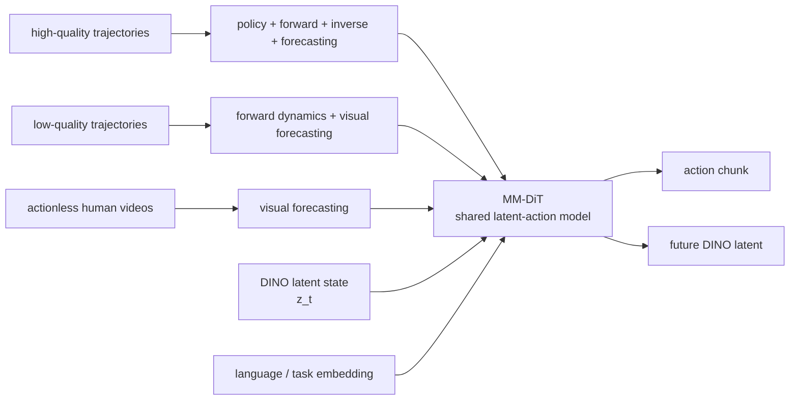

# Latent Dynamics Action Models

Latent Dynamics Action Model（LDA，潜在动力学动作模型）是 [[lda-1b-scaling-latent-dynamics-action-model|LDA-1B]] source 中提出的 robot foundation model training paradigm：它把 action policy、forward dynamics、inverse dynamics 和 visual forecasting 统一到一个 diffusion model 中，但把 future visual state 表示为 DINO latent，而不是 pixel/VAE reconstruction。核心目标是从 heterogeneous embodied data 中学习 action-induced state transitions，并让 mixed-quality data 不再只能作为 noisy imitation data。

## 数学结构

设 $o_t$ 是当前 observation，$\ell$ 是 language instruction，$a_{t+1:t+k}$ 是 future action chunk，$z_{t+1:t+k}$ 是由 DINO encoder 提取的 future visual latent。LDA 继承 UWM（Unified World Model）的四个 objective：

$$
\begin{array}{ll}
\text{Policy:} & p_\theta(a_{t+1:t+k}\mid o_t,\ell) \\
\text{Forward dynamics:} & p_\theta(z_{t+1:t+k}\mid o_t,a_{t+1:t+k},\ell) \\
\text{Inverse dynamics:} & p_\theta(a_{t+1:t+k}\mid o_t,z_{t+1:t+k},\ell) \\
\text{Visual forecasting/planning:} & p_\theta(z_{t+1:t+k}\mid o_t,\ell)
\end{array}
$$

Source 中的 UWM 写法使用 future observations $o_{t+1:t+k}$；LDA 的关键替换是令 visual target 进入 structured DINO latent $z_{t+1:t+k}=f_{\mathrm{DINO}}(o_{t+1:t+k})$。模型对 action chunk 与 visual latent 分别加 Gaussian noise，并训练 vector field/denoising heads。抽象地写：

$$
\mathcal{L}_{\theta}=\lambda_a\mathbb{E}\left[\left\|v_\theta^a(\tilde{a}_{\tau_a},\tilde{z}_{\tau_z},o_t,\ell,e_m)-(\epsilon_a-a_{t+1:t+k})\right\|_2^2\right]+\lambda_z\mathbb{E}\left[\left\|v_\theta^z(\tilde{a}_{\tau_a},\tilde{z}_{\tau_z},o_t,\ell,e_m)-(\epsilon_z-z_{t+1:t+k})\right\|_2^2\right],
$$

其中 $\tilde{a}_{\tau_a}$ 是 noisy action chunk，$\tilde{z}_{\tau_z}$ 是 noisy future DINO latent，$\epsilon_a,\epsilon_z$ 是 Gaussian noise，$e_m$ 是 task/objective embedding（policy、forward dynamics、inverse dynamics、visual forecasting），$\lambda_a,\lambda_z$ 表示该 training task 是否激活 action loss 或 visual loss。没有某个 modality 时，LDA 使用 learnable register token 作为 placeholder。

## 直觉

Behavior cloning 只问“这个 observation 下 expert 做了什么 action”。LDA 还问三个额外问题：给定 action 会导致什么 future state，给定 current/future state 需要什么 action，以及没有 action label 时 future visual state 如何变化。这让 low-quality trajectories 和 actionless videos 仍能提供 dynamics supervision，而不是被 BC 当成有害数据丢掉。

DINO latent 的作用是把 prediction target 从 appearance-heavy pixels 移到 semantic/spatial features。Pixel/VAE target 会把 illumination、texture、background 和 camera view 的低层变化也算进 loss；DINO features 更偏 object structure、affordance 和 spatial layout，因此更适合学习 action-induced transitions。代价是模型继承了 DINO representation 的盲点：没有被 DINO 编进 latent 的 force、tactile 或 material state 很难由 downstream dynamics head 补回来。

## Failure Modes

- Frozen visual representation bottleneck：source 明确把 fixed DINO visual features 列为 limitation；如果 DINO latent 不编码 contact force、tactile slip、transparent objects 或 fine tool geometry，latent dynamics 可能预测得 coherent 但控制所需 state 不完整。
- Data-role misrouting：low-quality trajectories 对 dynamics 有用，但如果质量标签、action availability 或 objective selection 错误，bad actions 可能污染 policy loss，或者 useful actions 被排除。
- Actionless video ambiguity：actionless egocentric videos 只能提供 visual forecasting supervision；没有动作条件时，模型可能学到 common motion priors，但无法区分哪些 state changes 是 robot-controllable。
- Egocentric viewpoint bias：source 说训练和 evaluation 主要依赖 egocentric camera viewpoints；换成 third-person、multi-camera、tactile/depth-heavy setup 时，latent/action alignment 可能需要重建。
- Offline proxy gap：scaling analysis 使用 held-out action prediction L1 error；它稳定可复现，但不等于 closed-loop success，尤其在 contact-rich tasks 中误差的 timing 和 direction 比平均 L1 更重要。
- Source-level reproducibility：paper 报告 large-scale dataset 和 model training，但 independent reproduction 依赖 code/data/checkpoint availability 和 evaluation protocol release。

## 实践含义

对 robot foundation model pretraining，LDA 的重要启发是把 data quality 变成 training objective routing，而不是 dataset filtering。收集到的 pauses、retries、suboptimal motion 可能不适合作为 policy target，但仍可能告诉模型物体如何移动、什么 contact 会失败、哪些 visual transitions 常见。

对 [[WorldModelsForEmbodiedAI|world models]]，LDA 是一个 practical middle ground：它不需要生成 high-fidelity RGB video，也不把 world model 单独拿来做 MPC rollout，而是用 latent forward/inverse dynamics 改善 downstream action policy。

对 [[VisionLanguageActionModels|VLA]]，LDA 提供了 BC 之外的 scaling path。Policy head 仍然输出 action chunks，但训练信号不只来自 expert action likelihood，还来自 action-conditioned future-state prediction 和 inverse dynamics。

相关页面：[[LDA1B]]、[[EI30K]]、[[WorldModelsForEmbodiedAI]]、[[VisionLanguageActionModels]]、[[RobotContextConditioning]]、[[SimulationRealityGap]]。
