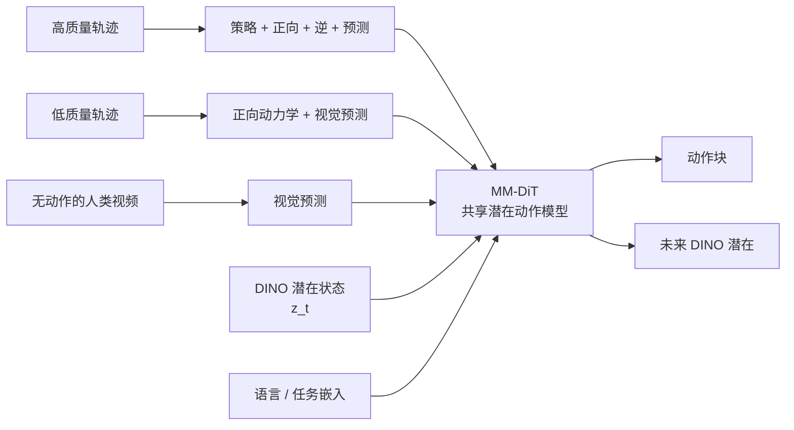

# 潜在动力学动作模型

潜在表征动力学动作模型（LDA，潜在动力学动作模型）是 [[lda-1b-scaling-latent-dynamics-action-model|LDA-1B]] 来源中提出的机器人基础模型训练 paradigm：它把动作策略、正向动力学、逆动力学和视觉预测统一到一个扩散模型中，但把未来视觉状态表示为 DINO 潜在，而不是像素/VAE 重建。核心目标是从异构具身数据中学习动作-induced 状态转移，并让混合质量数据不再只能作为 noisy 模仿数据。

[[Seer]] 和 [[DeFI]] 从两个方向强化了同一判断：动作表示不应只靠行为克隆。Seer 在动作标注的机器人数据上把未来 RGB 预测与逆动力学动作预测端到端结合；DeFI 则让 [[InverseDynamicsModels|逆动力学预训练]] 从 unlabeled 视频转移中学习潜在动作标记。LDA-1B 把逆动力学放进共享扩散目标；DeFI 则把正向动力学和逆动力学分开预训练，先让 GIDM 学潜在动作标记，再在下游机器人数据上用动作 adapter 语义落地到可执行的指令。

## 数学结构

设 $o_t$ 是当前观测，$\ell$ 是语言指令，$a_{t+1:t+k}$ 是未来动作块，$z_{t+1:t+k}$ 是由 DINO 编码器提取的未来视觉潜在。LDA 继承 UWM（统一的世界模型）的四个目标：

$$
\begin{array}{ll}
\text{Policy:} & p_\theta(a_{t+1:t+k}\mid o_t,\ell) \\
\text{Forward dynamics:} & p_\theta(z_{t+1:t+k}\mid o_t,a_{t+1:t+k},\ell) \\
\text{Inverse dynamics:} & p_\theta(a_{t+1:t+k}\mid o_t,z_{t+1:t+k},\ell) \\
\text{Visual forecasting/planning:} & p_\theta(z_{t+1:t+k}\mid o_t,\ell)
\end{array}
$$

来源中的 UWM 写法使用未来观测 $o_{t+1:t+k}$；LDA 的关键替换是令视觉目标进入结构化的 DINO 潜在 $z_{t+1:t+k}=f_{\mathrm{DINO}}(o_{t+1:t+k})$。模型对动作块与视觉潜在分别加高斯噪声，并训练向量场/去噪头。抽象地写：

$$
\mathcal{L}_{\theta}=\lambda_a\mathbb{E}\left[\left\|v_\theta^a(\tilde{a}_{\tau_a},\tilde{z}_{\tau_z},o_t,\ell,e_m)-(\epsilon_a-a_{t+1:t+k})\right\|_2^2\right]+\lambda_z\mathbb{E}\left[\left\|v_\theta^z(\tilde{a}_{\tau_a},\tilde{z}_{\tau_z},o_t,\ell,e_m)-(\epsilon_z-z_{t+1:t+k})\right\|_2^2\right],
$$

其中 $\tilde{a}_{\tau_a}$ 是 noisy 动作块，$\tilde{z}_{\tau_z}$ 是 noisy 未来 DINO 潜在，$\epsilon_a,\epsilon_z$ 是高斯噪声，$e_m$ 是任务/目标嵌入（策略、正向动力学、逆动力学、视觉预测），$\lambda_a,\lambda_z$ 表示该训练任务是否激活动作损失或视觉损失。没有某个 modality 时，LDA 使用可学习的寄存标记作为占位符。

## 直觉

行为克隆只问“这个观测下专家做了什么动作”。LDA 还问三个额外问题：给定动作会导致什么未来状态，给定当前/未来状态需要什么动作，以及没有动作标签时未来视觉状态如何变化。这让低质量轨迹和无动作标注的视频仍能提供动力学监督，而不是被 BC 当成有害数据丢掉。

DINO 潜在的作用是把预测目标从偏重外观的 pixels 移到语义/空间特征。像素/VAE 目标会把光照、纹理、背景和相机视角的低层变化也算进损失；DINO 特征更偏物体结构、可供性和空间布局，因此更适合学习动作-induced 转移。代价是模型继承了 DINO 表示的盲点：没有被 DINO 编进潜在的力、触觉或材质状态很难由下游动力学输出头补回来。

```mermaid
flowchart LR
  D1["高质量轨迹"] --> O1["策略 + 正向 + 逆 + 预测"]
  D2["低质量轨迹"] --> O2["正向动力学 + 视觉预测"]
  D3["无动作的人类视频"] --> O3["视觉预测"]
  O1 --> M["MM-DiT<br/>共享潜在动作模型"]
  O2 --> M
  O3 --> M
  V["DINO 潜在状态<br/>z_t"] --> M
  L["语言 / 任务嵌入"] --> M
  M --> A["动作块"]
  M --> Z["未来 DINO 潜在"]
```

## 失效情形

- 冻结的视觉表示瓶颈：来源明确把固定 DINO 视觉特征列为局限；如果 DINO 潜在不编码接触力、触觉滑移、透明物体或精细工具几何，潜在动力学可能预测得连贯但控制所需状态不完整。
- 数据角色 misrouting：低质量轨迹对动力学有用，但如果质量标签、动作可用性或目标选择错误，不良动作可能污染策略损失，或者有用动作被排除。
- 无动作标注的视频歧义：无动作标注的第一视角视频只能提供视觉预测监督；没有动作条件时，模型可能学到常见的运动先验，但无法区分哪些状态变更是机器人可控的。
- 第一视角视角偏差：来源说训练和评估主要依赖第一视角相机视角；换成第三人称、多相机、触觉/深度-密集型设置时，潜在/动作对齐可能需要重建。
- 离线代理指标差距：规模扩展分析使用 held-out 动作预测 L1 错误；它稳定可复现，但不等于闭环成功，尤其在接触丰富任务中误差的 timing 和方向比平均 L1 更重要。
- 来源层面 reproducibility：论文报告大规模数据集和模型训练，但 independent reproduction 依赖代码/数据/检查点可用性和评估规程发布。

## 实践含义

对机器人基础模型预训练，LDA 的重要启发是把数据质量变成训练目标路由，而不是数据集过滤。收集到的 pauses、retries、suboptimal 运动可能不适合作为策略目标，但仍可能告诉模型物体如何移动、什么接触会失败、哪些视觉转移常见。

对 [[WorldModelsForEmbodiedAI|世界模型]]，LDA 是一个实用的 middle 地面：它不需要生成高保真度 RGB 视频，也不把世界模型单独拿来做 MPC 轨迹采样，而是用潜在正向/逆动力学改善下游动作策略。

对 [[VisionLanguageActionModels|VLA]]，LDA、Seer 和 DeFI 共同提供了 BC 之外的规模扩展路径。策略头仍然输出动作块，但训练信号不只来自专家动作似然，还来自动作条件化的未来状态预测、未来状态到-动作逆动力学，以及动作-free 视频转移重建。

相关页面：[[LDA1B]]、[[EI30K]]、[[Seer]]、[[DeFI]]、[[InverseDynamicsModels]]、[[WorldModelsForEmbodiedAI]]、[[VisionLanguageActionModels]]、[[RobotContextConditioning]]、[[SimulationRealityGap]]。
