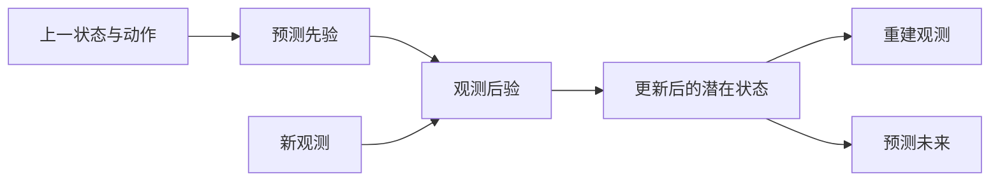

# 潜在状态空间模型：估计与预测

世界模型常把观测历史压成潜在状态 $z_t$，再根据动作预测未来。理解它的关键是分开**看见当前观测后的状态估计**与**尚未看见未来观测时的预测**。前者对应后验，后者对应动力学先验。[[a-comprehensive-survey-on-world-models-for-embodied-ai|具身世界模型综述]]

## 从速度不可见的例子理解

教学例子：两张相同的杯子图像可能来自静止杯子，也可能来自正在运动的杯子。单帧相似不代表下一帧相同。历史帮助判断运动趋势；动作则决定未来还会受到怎样的干预。潜在状态应该保留预测所需的信息，而不是只记录当前图像的外观。状态与观测的区别见 [[MarkovDecisionProcesses|MDP 与强化学习基础]]。

## 数学结构

令 $o_t$ 为观测，$a_t$ 为动作，$z_t$ 为潜在状态，$\theta$ 为生成模型参数，$\phi$ 为推断模型参数。三个核心分布为：

$$
\underbrace{p_\theta(z_t\mid z_{t-1},a_{t-1})}_{\text{预测先验}},\qquad
\underbrace{q_\phi(z_t\mid z_{t-1},a_{t-1},o_t)}_{\text{观测后验}},\qquad
\underbrace{p_\theta(o_t\mid z_t)}_{\text{观测模型}}.
$$

动作先让模型预测，再用新观测修正状态。训练时有后验可以读取观测；想象未来时只能沿先验推进，未来观测不能作为输入。这里的 $q_\phi$ 是近似推断分布，不保证等于真实贝叶斯后验。[[a-comprehensive-survey-on-world-models-for-embodied-ai|具身世界模型综述]]

在初始状态先验为 $p_\theta(z_0)$、转移满足马尔可夫假设、观测在给定当前潜在状态后条件独立的约定下，联合分布是：

$$
p_\theta(o_{1:T},z_{0:T}\mid a_{0:T-1})=p_\theta(z_0)\prod_{t=1}^T p_\theta(z_t\mid z_{t-1},a_{t-1})p_\theta(o_t\mid z_t).
$$

这是上面三部分的序列展开；它说明潜在状态既要能推进，也要能解释观测。[[a-comprehensive-survey-on-world-models-for-embodied-ai|具身世界模型综述]]

### RSSM：记忆与随机状态分开

[[planet-learning-latent-dynamics|PlaNet]] 的循环状态空间模型（RSSM）把上述一般潜在状态进一步分成确定性记忆 $h_t$ 与随机状态 $u_t$。为避免和上文整体状态 $z_t$ 混淆，这里用 $u_t$ 表示论文中随机分量：

$$
\begin{aligned}
h_t&=f_\theta(h_{t-1},u_{t-1},a_{t-1}),\\
u_t&\sim p_\theta(u_t\mid h_t),\qquad
u_t\sim q_\phi(u_t\mid h_t,o_t),\\
o_t,r_t&\sim p_\theta(o_t,r_t\mid h_t,u_t).
\end{aligned}
$$

$f_\theta$ 是循环更新，$r_t$ 为奖励；第二行的两个分布分别用于预测与看到观测后的估计，不能把两次采样当成同一步同时执行的动作。记忆路径有助于跨多步保存信息，随机路径表达观测不足造成的多种可能。PlaNet 的消融支持组合在其六个控制任务上更有效，不表示任何模型都必须采用同样架构。[[planet-learning-latent-dynamics|PlaNet §3]]

[[dreamerv3-mastering-diverse-control|DreamerV3]] 沿用这一分工，但随机状态使用分类分布，另外预测回合继续标记；重建和 KL 的梯度平衡也有所变化。因此“RSSM”描述结构家族，不能用一个 ELBO 配方覆盖所有实现。

## 直觉：ELBO 为什么有两项

证据下界（ELBO）把观测重建与后验—先验对齐连接起来：

$$
\mathcal L=\mathbb E_{q_\phi}[\log p_\theta(o_{1:T}\mid z_{0:T})]-D_{\mathrm{KL}}\!\left(q_\phi(z_{0:T}\mid o_{1:T},a_{0:T-1})\,\Vert\,p_\theta(z_{0:T}\mid a_{0:T-1})\right).
$$

$T$ 为序列长度，$D_{\mathrm{KL}}$ 为 KL 散度。重建项要求潜在状态保留观测信息，KL 项要求使用观测修正后的状态与仅依赖历史和动作的预测具有一致性。它们共同约束“看见后能解释”和“看见前能预测”。[[WorldModelsForEmbodiedAI|具身智能世界模型]]

深入推导：下界与真实后验的关系

令 $o$、$z$、$a$ 分别简记整段观测、潜在状态与动作序列，且省略参数。利用联合分布 $p(o,z\mid a)$，有：

$$
\log p(o\mid a)=\mathbb E_q\!\left[\log\frac{p(o,z\mid a)}{q(z\mid o,a)}\right]+D_{\mathrm{KL}}\!\left(q(z\mid o,a)\,\Vert\,p(z\mid o,a)\right).
$$

第二项非负，所以第一项是下界。它是基于变分目标展开的教学推导，原始序列推导可核对 [[planet-learning-latent-dynamics|PlaNet 附录 F]]：训练优化下界，同时依赖生成模型和近似后验的表达能力，并不意味着学得的潜在状态自动具有真实物理语义。

图中的新观测只进入估计环节；开放式未来预测必须避免读取真实未来信息。

## 失效情形

- 多步预测误差累积，早期错误进入后续输入。
- 外观重建好但接触、力或微小状态信息不足，预测对控制无效。
- 潜在表示与推理成本无法同时满足精细表达和实时控制要求。
- 评测使用额外真值或特权状态，能力不能直接与普通观测条件比较。

上述风险来自 [[a-comprehensive-survey-on-world-models-for-embodied-ai|具身世界模型综述]]；具体冻结视觉特征的限制见 [[LatentDynamicsActionModels|潜在动力学动作模型]]。

## 实践含义

读一个世界模型，分别标注训练时可见信息与预测时可见信息，再检查潜在状态如何影响动作。RSSM 可接到 [[ModelPredictiveControl|在线规划]]，也可接到 [[ImaginedPolicyLearning|想象中的策略学习]]，结构相近不代表执行算法相同。进入具体机制时读 [[WorldModelsForEmbodiedAI|具身智能世界模型]]；需要比较用途时读 [[WorldModelTaxonomy|世界模型分类体系]]；检查预测是否改善决策时读 [[WorldModelEvaluation|世界模型评估]]。
