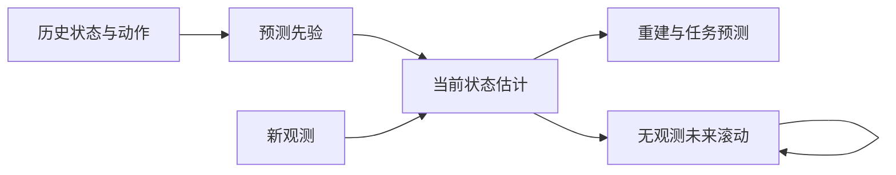

# Latent State-Space Models

潜在状态空间模型用不可直接观测的状态组织序列：一部分模型解释观测怎样产生，另一部分预测状态如何随动作变化。关键分工是**读取新观测后的状态估计**与**没有未来观测时的动力学预测**。潜在变量可帮助压缩历史，但不能仅凭名字就断言它等于真实物理状态。[[planet-learning-latent-dynamics|PlaNet 的潜在建模]]、[[a-comprehensive-survey-on-world-models-for-embodied-ai|具身世界模型综述]]

## 从速度不可见的例子理解

**教学例子。** 两张相同位置的杯子图像，可能分别来自静止杯子与运动杯子。单帧外观相同，下一帧却可能不同；历史帮助推断速度，动作还会改变后果。模型应保留预测所需的信息，而非只描述当前外观。状态与观测的基础区别见 [[MarkovDecisionProcesses|Markov Decision Process (MDP)]]。

## 生成假设与近似推断

令 $o_t$ 为观测，$a_t$ 为动作，$z_t$ 为潜在状态，$\theta$ 为生成参数。假设给定 $z_t$ 后观测条件独立、状态转移满足马尔可夫结构，并取初始先验 $p_\theta(z_0)$：

$$
p_\theta(o_{1:T},z_{0:T}\mid a_{0:T-1})=
 p_\theta(z_0)\prod_{t=1}^T p_\theta(z_t\mid z_{t-1},a_{t-1})p_\theta(o_t\mid z_t).
$$

$T$ 是序列长度。转移模型 $p_\theta(z_t\mid z_{t-1},a_{t-1})$ 给出预测先验，观测模型 $p_\theta(o_t\mid z_t)$ 解释状态怎样产生传感信息；有任务奖励时还可增加奖励预测头。以上是模型选择的假设，不是已经证明学习到的状态足够描述所有真实动力学。[[planet-learning-latent-dynamics|§2–3 的生成结构]]

非线性模型通常难以精确计算状态后验，于是引入参数为 $\phi$ 的近似推断分布，例如

$$
q_\phi(z_t\mid z_{t-1},a_{t-1},o_t).
$$

它结合历史状态、动作与新观测估计当前状态。在线控制只能利用当前及过去观测；训练中若使用看见整段未来的平滑后验，需要另行说明部署时如何处理这个信息差异。这里的近似后验也不保证等于真实贝叶斯后验。[[planet-learning-latent-dynamics|§3 的滤波与平滑区别]]

### “预测—纠正”为什么能分开

**教学推导。**令 $b_{t-1}(z)=p(z_{t-1}=z\mid o_{1:t-1},a_{0:t-2})$ 为上一步信念，先按动作传播：

$$
b_t^-(z_t)=\int p_\theta(z_t\mid z_{t-1},a_{t-1})b_{t-1}(z_{t-1})\,dz_{t-1}.
$$

新图像到来后，再以观测似然重新加权：

$$
b_t(z_t)=\frac{p_\theta(o_t\mid z_t)b_t^-(z_t)}{\int p_\theta(o_t\mid u)b_t^-(u)\,du}.
$$

分母只是将概率归一化。这是上述生成假设下的贝叶斯滤波关系：动作先把“可能在哪”往前推，图像再排除不相符的可能。RSSM 的编码器学习近似纠正步骤，并不实际逐点计算这个积分。规划中的未来图像尚不存在，因此只能反复传播，不能偷偷用未来真值纠正。[[planet-learning-latent-dynamics|§3 的近似滤波]]

停止梯度（$\operatorname{sg}$）又是另一种操作：前向数值保持不变，反向传播时该分支的导数视为零。它不表示冻结整个网络，也不表示下一批数据的目标不会变化；后文用它分别控制“先验追后验”与“后验适应先验”的更新方向。[[dreamerv3-mastering-diverse-control|KL 平衡]]

## 训练：为什么重建与先验对齐需要同时存在

把整段变量简记为 $o,z,a$，证据下界（ELBO）满足

$$
\log p_\theta(o\mid a)=
\underbrace{\mathbb E_{q_\phi}\!\left[\log p_\theta(o\mid z,a)\right]-D_{\rm KL}\!\left(q_\phi(z\mid o,a)\Vert p_\theta(z\mid a)\right)}_{\mathcal J_{\rm ELBO}}
+D_{\rm KL}\!\left(q_\phi(z\mid o,a)\Vert p_\theta(z\mid o,a)\right).
$$

KL 散度非负，因此最大化 $\mathcal J_{\rm ELBO}$ 是优化对数似然的下界。第一项使状态解释观测，第二项使利用观测推断的状态与仅按动作预测的状态相容。这是标准变分分解的教学展开，序列推导见 [[planet-learning-latent-dynamics|附录 F]]；它并不证明潜在各维具有可解释的物理语义。

从推导上看，先写 $\log p(o\mid a)=\log\mathbb E_q[p(o,z\mid a)/q(z\mid o,a)]$，再用 Jensen 不等式把对数移入期望，就得到下界。把 $p(o,z\mid a)$ 分解为观测似然与潜在先验，便出现重建项和 KL 项；它们不是任意拼接的两个正则。上述等式还显示，下界与真实对数似然之间的差距就是近似后验与模型后验的 KL。[[planet-learning-latent-dynamics|附录 F]]

如果只奖励“容易预测”，潜在变量可能丢掉输入信息；如果只强调重建，又可能让表示保留大量难以预测、却不影响控制的视觉细节。KL 的梯度平衡、最低信息阈值等方法用于调节这种压力；采用加权、截断目标后，不能不加说明地把具体实现都称作同一个原始 ELBO。[[dreamerv3-mastering-diverse-control|表示、动力学与预测损失]]

## RSSM：记忆与随机分量分开

循环状态空间模型（RSSM）把上面的整体状态拆成确定性记忆 $h_t$ 和随机分量 $u_t$。为避免与整体状态 $z_t$ 混淆，这里用 $u_t$ 表示随机分量：

$$
\begin{aligned}
h_t&=f_\theta(h_{t-1},u_{t-1},a_{t-1}),\\
 p_t(u_t)&=p_\theta(u_t\mid h_t),\qquad q_t(u_t)=q_\phi(u_t\mid h_t,o_t),\\
 p(o_t,r_t\mid h_t,u_t)&=p(o_t\mid h_t,u_t)p(r_t\mid h_t,u_t).
\end{aligned}
$$

$f_\theta$ 是循环更新，$r_t$ 是奖励。真实观测可用时从 $q_t$ 估计状态，想象未来时从 $p_t$ 预测；二者不是同时对同一状态执行两次独立采样。记忆提供跨步保留信息的路径，随机分量表达多个可能状态。两类路径的实验依据与具体分布见 [[planet-learning-latent-dynamics|RSSM 与消融]]。

DreamerV3 延续这一结构，但改用分类随机变量，并预测回合继续标记。其先验—后验对齐还把梯度分成两个方向，可概括为

$$
\mathcal L_{\rm dyn}=\max\{\kappa,D_{\rm KL}(\operatorname{sg}(q_t)\Vert p_t)\},\qquad
\mathcal L_{\rm rep}=\max\{\kappa,D_{\rm KL}(q_t\Vert\operatorname{sg}(p_t))\}.
$$

$\operatorname{sg}$ 为停止梯度，$\kappa$ 为最低阈值：前者让先验追随后验，后者让后验更可预测；低于阈值时暂停压缩梯度。它们配合观测与任务预测损失、以不同权重优化，不能作为两个相同的损失随意合并。具体阈值、权重和稳定性设计留在 [[dreamerv3-mastering-diverse-control|DreamerV3 来源页]]。

## 多步预测与不确定性的边界

一步预测训练常以真实观测推断出的状态为输入；多步想象却持续使用自己预测的状态。早期误差可能因此进入下一步输入。增加跨多步的先验—后验一致性约束是一种缓解手段，**不属于 RSSM 的定义，也不是默认必需项**：PlaNet 的多步正则对另一模型有益，对最终 RSSM 未带来收益。依据与适用范围见 [[planet-learning-latent-dynamics|潜在多步预测正则消融]]。

**我们的解释。** 随机潜在状态允许表示多个未来，却不自动提供校准好的模型不确定性；同样，重建看起来合理不等于接触后果或任务价值预测可靠。后验纠正也只有在重新观测时发生，不能凭空修复无反馈长滚动。

图中状态估计利用新观测，未来滚动不读取真实未来。需要分别验证表示保留了什么、一步预测是否准、多步误差如何积累，以及动作决策是否受益。

## 与决策的连接

同一类状态模型可以供 [[ModelPredictiveControl|在线动作规划]]使用，也可以供 [[ImaginedPolicyLearning|想象中的策略学习]]使用；状态结构相近不意味着执行算法相同。冻结视觉特征上的确定性动力学是另一类表示选择，见 [[VisualGoalPlanning|视觉目标规划]]，不能全部称作带变分后验的 RSSM。

更广的表示与用途分类见 [[WorldModelTaxonomy|世界模型分类]]、[[WorldModelsForEmbodiedAI|具身世界模型]]；预测与控制表现的区分见 [[WorldModelEvaluation|World Model 评测]]。与机器人动作模型的连接可读 [[sources/lda-1b-scaling-latent-dynamics-action-model|LDA-1B]]。

## 研究归属

[[topics/world-models-and-representations|World Models]] · [[topics/planning-and-control|规划与控制]] · [[topics/world-model-decision|World Models 与决策]]。
