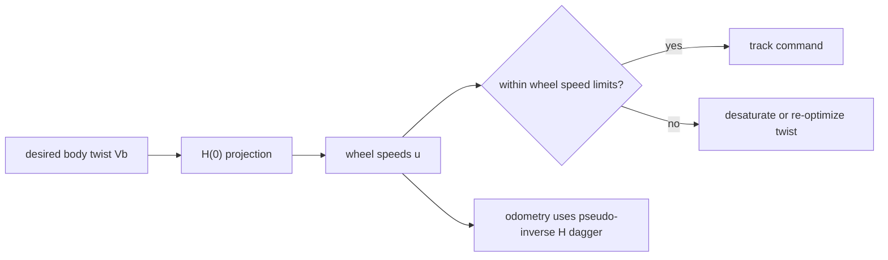

# Omnidirectional Wheels

Omnidirectional wheels（全向轮）让 wheeled base 在平面内直接控制 forward、sideways 和 yaw motion。[[modern-robotics-chapter-13-wheeled-mobile-robots|Modern Robotics Chapter 13]] 主要讨论 omniwheel 与 mecanum wheel 的 kinematic mapping；[[structural-properties-and-classification-of-wheeled-mobile-robots|Campion et al.]] 把 fully mobile omnidirectional robots 归入 WMR type $(3,0)$，即 $\delta_m=3,\delta_s=0$。

## 数学结构

对一个 omni/mecanum wheel，在 wheel frame 中，contact point velocity $v=(v_x,v_y)$ 可以分解为 driving component 和 free-sliding component。Modern Robotics 用 roller/free-sliding angle $\gamma$ 写成：

$$
u_i = \frac{1}{r_i}(v_x+v_y\tan\gamma_i)
$$

其中 $u_i$ 是第 $i$ 个 wheel 的 driving angular speed，$r_i$ 是 wheel radius。将 wheel frame velocity 从 chassis twist $V_b$ 变换过来，就得到每个 wheel 的一行 $h_i(0)$；堆叠所有 wheel rows：

$$
u = H(0)V_b
$$

Proper construction 的核心条件是：

$$
\operatorname{rank}H(0)=3
$$

若 wheel speed 有界：

$$
|u_i| \le u_{i,\max}
$$

则每个 wheel 在 $V_b$ space 中生成两张 parallel planes，所有 wheel constraints 的交集是 feasible body twist polyhedron。

## 直觉

全向轮不是“没有约束”，而是把一部分 relative motion 交给 passive rollers。Omniwheel 通常让 wheel sideways direction 被动滚动；mecanum wheel 用 angled rollers 把每个 wheel speed 投影到 forward、sideways 和 yaw。多个 wheel 的投影组合起来，如果 rank 足够，底盘就可以生成任意 planar twist。

三 omniwheel 和四 mecanum 是两个典型结构。三轮结构刚好提供三行约束；四 mecanum 是 over-actuated mapping，正常 tracking 要求 wheel speeds 落在 $H(0)$ 的 column space 中，否则意味着某些 wheel 必须在 driving direction 上 skid。

## Failure Modes

- Geometry rank failure：wheel driving/free-sliding directions 对齐过多，导致无法控制某个平面方向。
- Over-actuation inconsistency：四轮 mecanum 的 $u$ 若不满足某个 $V_b$，真实系统会通过 slip 或 compliance 解决矛盾。
- Roller contact artifacts：roller 离散接触会产生 ripple、vibration 和 force discontinuity；低保真仿真常把它平均化。
- Weak traction：全向能力依赖 roller contact 与地面摩擦，低摩擦或载荷偏置会导致 sideways tracking error。
- Odometry drift：$H^\dagger$ 反算 $V_b$ 假设 no skidding in driving direction；真实 slip 会积累 pose error。

## 实践含义

控制上，先用 $u=H(0)V_b$ 做 inverse kinematics；若有 wheel limits，就在 body twist space 中约束 $V_b$ 或对 $u$ 做 desaturation。状态估计上，用 $V_b=H^\dagger(0)\Delta\theta$ 做 wheel odometry，但需要 IMU、vision、lidar 或 beacon 等外部观测定期校正。

仿真上，早期可以把 omni/mecanum base 当成 kinematic holonomic base；做 sim-to-real 或接触敏感任务时，再显式检查 roller friction、normal load、ground roughness 和 [[ContactSolvers|solver]] settings。相关页面：[[WheeledRobotKinematics]]、[[MobileRobotOdometry]]、[[SimulationRealityGap]]。
