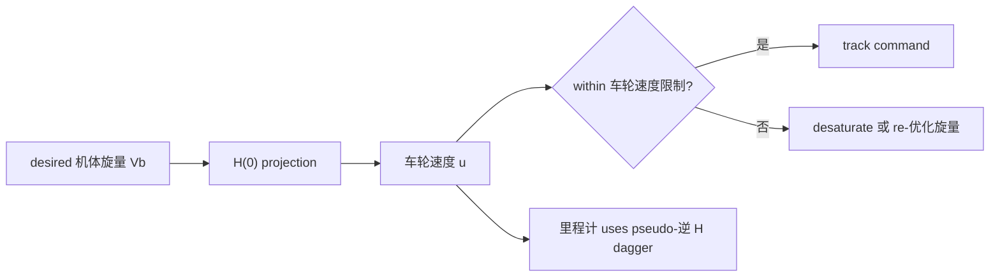

# 全向轮

全向车轮（全向轮）让轮式基座在平面内直接控制正向、横向和偏航角运动。[[modern-robotics-chapter-13-wheeled-mobile-robots|Modern 机器人学章节 13]] 主要讨论全向轮与 mecanum 车轮的运动学映射；[[structural-properties-and-classification-of-wheeled-mobile-robots|Campion et al.]] 把完全移动式全向机器人归入 WMR 类型 $(3,0)$，即 $\delta_m=3,\delta_s=0$。

## 数学结构

对一个 omni/mecanum 车轮，在车轮帧中，接触点速度 $v=(v_x,v_y)$ 可以分解为驱动组件和 free-滑动组件。Modern 机器人学用滚轮/free-滑动角度 $\gamma$ 写成：

$$
u_i = \frac{1}{r_i}(v_x+v_y\tan\gamma_i)
$$

其中 $u_i$ 是第 $i$ 个车轮的驱动角速度，$r_i$ 是车轮半径。将车轮帧速度从底盘旋量 $V_b$ 变换过来，就得到每个车轮的一行 $h_i(0)$；堆叠所有车轮 rows：

$$
u = H(0)V_b
$$

Proper 结构的核心条件是：

$$
\operatorname{rank}H(0)=3
$$

若车轮速度有界：

$$
|u_i| \le u_{i,\max}
$$

则每个车轮在 $V_b$ 空间中生成两张并行平面，所有车轮约束的交集是可行刚体旋量多面体。

```mermaid
flowchart LR
  A["desired 机体旋量 Vb"] --> B["H(0) projection"]
  B --> C["车轮速度 u"]
  C --> D{"within 车轮速度限制?"}
  D -- "是" --> E["track command"]
  D -- "否" --> F["desaturate 或 re-优化旋量"]
  C --> G["里程计 uses pseudo-逆 H dagger"]
```

## 直觉

全向轮不是“没有约束”，而是把一部分 relative 运动交给被动 rollers。全向轮通常让车轮横向方向被动滚动；mecanum 车轮用 angled rollers 把每个车轮速度投影到正向、横向和偏航角。多个车轮的投影组合起来，如果秩足够，底盘就可以生成任意平面旋量。

三全向轮和四 mecanum 是两个典型结构。三轮结构刚好提供三行约束；四 mecanum 是 over-actuated 映射，正常跟踪要求车轮速度落在 $H(0)$ 的 column 空间中，否则意味着某些车轮必须在驱动方向上 skid。

## 失效情形

- Geometry 秩失败：车轮驱动/free-滑动方向对齐过多，导致无法控制某个平面方向。
- Over-驱动 inconsistency：四轮 mecanum 的 $u$ 若不满足某个 $V_b$，真实系统会通过滑移或柔顺性解决矛盾。
- 滚轮接触产物：滚轮离散接触会产生 ripple、vibration 和力 discontinuity；低保真仿真常把它平均化。
- 弱 traction：全向能力依赖滚轮接触与地面摩擦，低摩擦或载荷偏置会导致横向跟踪错误。
- 里程计漂移：$H^\dagger$ 反算 $V_b$ 假设 no skidding in 驱动方向；真实滑移会积累位姿错误。

## 实践含义

控制上，先用 $u=H(0)V_b$ 做逆运动学；若有车轮限制，就在刚体旋量空间中约束 $V_b$ 或对 $u$ 做 desaturation。状态估计上，用 $V_b=H^\dagger(0)\Delta\theta$ 做车轮里程计，但需要 IMU、视觉、lidar 或 beacon 等外部观测定期校正。

仿真上，早期可以把 omni/mecanum 基座当成运动学完整约束基座；做仿真到现实迁移或接触敏感任务时，再显式检查滚轮摩擦、法向负载、地面粗糙度和 [[ContactSolvers|求解器]] 场景。相关页面：[[WheeledRobotKinematics]]、[[MobileRobotOdometry]]、[[SimulationRealityGap]]。
