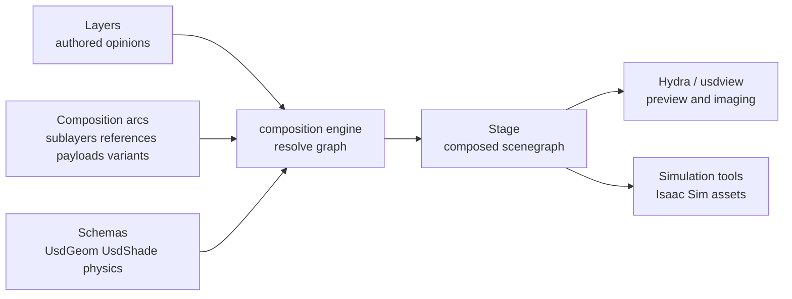

# OpenUSD Scene Composition

[[OpenUSD]] 的核心学习入口不是“USD 是哪种文件后缀”，而是 scene description（场景描述）如何被 schema 化、组合、覆写、查询和 author。[[openusd-introduction|Introduction to USD]] 把 USD 定位为 single scenegraph + composition engine + schemas + toolset 的组合：它让 elemental assets 可以组成 sets、scenes、shots 和 worlds，并且允许在 stronger layers 中 non-destructively edit as overrides。[[isaac-sim-asset-structure|Isaac Sim Asset Structure]] 则展示这个思想在 robotics asset authoring 中如何落到 layers、payloads、references 和 variants。

Evidence boundary：当前 OpenUSD source 是官方 Introduction，不是 glossary 或 API reference。它足够支持 `Stage`、`Prim`、`Layer`、schemas、composition arcs、Hydra、extension points 和 USD boundary 的入门级机制解释；但 `LayerStack`、value resolution、LIVRPS strength ordering、list-editing 和 namespace editing 的精确定义仍需要后续 ingest `glossary.html` / tutorials。

## 数学结构

可以把 OpenUSD 的高层功能抽象成一个 scene-description resolution system：

$$
S = \operatorname{Resolve}(L, C, \Sigma)
$$

其中 $L=\{L_1,\dots,L_n\}$ 是 authored layers（保存 prim specs、property specs、metadata 和 composition arcs 的 layer 集合），$C$ 是 composition arcs / strength ordering（怎样 stack、reference、payload、variant、inherit 或 specialize），$\Sigma$ 是 schema vocabulary（例如 `UsdGeom`、`UsdShade`、lighting、physics 等 domain schemas），$S$ 是最终被 `Stage` 暴露的 composed scene description。变量含义要分清：Layer 保存 authored opinions；composition engine 负责 resolve；Stage 是 resolved result 的 runtime scenegraph view。

USD data model 的局部结构可以写成：

$$
P_i = (N_i, A_i, R_i, M_i)
$$

其中 $P_i$ 是一个 prim（scenegraph node），$N_i$ 是 child prim namespace，$A_i$ 是 Attributes（typed values，可 time-varying），$R_i$ 是 Relationships（指向其他 scene objects 的 targets），$M_i$ 是 metadata。Source 明确说明 USD 用 hierarchical namespace of `Prim` 组织 data；Attributes 和 Relationships 合称 Properties；Prims 与 contents 被组织到 Layer 中。

在 robotics / simulation asset 中，这个抽象会变成更具体的 asset graph：

$$
R = \operatorname{Compose}(L_{\text{geom}}, L_{\text{mat}}, L_{\text{physics}}, L_{\text{runtime}}, L_{\text{feature}}, V)
$$

其中 $L_{\text{geom}}$ 保存 mesh / geometry data，$L_{\text{mat}}$ 保存 materials，$L_{\text{physics}}$ 保存 neutral physics，$L_{\text{runtime}}$ 保存 PhysX / MuJoCo 这类 engine-specific tuning，$L_{\text{feature}}$ 保存 control / ROS / gripper feature payloads，$V$ 是 variant sets。[[IsaacSimAssetStructure]] 的例子说明这些 responsibilities 不应该混成 monolithic USD，而应该放在职责清晰的 layers 中。

这张图表达的是 source-backed mechanism：Layer 保存 authored scene description，composition arcs 描述组合与覆写关系，schemas 给 prim/property 语义，Stage 暴露 resolved scenegraph，Hydra / DCC / simulator 再消费这个 composed result。

### Composition Arcs

当前 source 明确介绍了六类 composition behavior：

| Arc / mechanism | 作用 | 直觉 |
| --- | --- | --- |
| subLayers | stack layers，并按 strength ordering resolve | 多个作者或部门各写自己的 layer，最终组合成一个 asset / scene |
| references | 把另一个 layer 或同一 layer 中 target prim 的 subtree 组合进 referencing prim | 装配 elemental assets 成 aggregates / scenes |
| payloads | deferred reference，可在 Stage 打开后选择 load / unload | 管理 working set，只加载当前任务需要的 scene parts |
| VariantSets | 在一个 package 中暴露多种 asset variations，downstream 可用 stronger layer 切换 selector | 非破坏式选择不同外观、配置或 runtime setup |
| inherits | derived prim 接收 base prim 的 overrides，适合 mass edit | 给一类 prim / asset 做统一修改 |
| specializes | derived prim 是 base 的 specialized refinement | 表达更稳定的 specialized fallback / refinement 关系 |

## 直觉

OpenUSD 解决的是大型 3D pipeline 的两个长期问题。第一，多个 tools 和 teams 都在生产 scene data，如果每个 tool 都只输出自己的封闭格式，interchange、review 和 reuse 会变成 brittle conversion chain。USD 用 low-level data model 加 high-level schemas 给 mesh、transform、material、lighting、physics 等概念建立共享表达。第二，一个 scene 或 robot asset 通常不是单一作者、单一文件、单一用途；composition 让不同 workstreams 可以把自己的 contribution 保存在独立 layer，再组合成一个可检查的 final scene。

Composition 的要点是“强 layer 的 opinion 可以统一地 override 弱 layer”，无论弱内容是 subLayered、referenced 还是 inherited。Source 列出 stronger layer 可以添加/deactivate/reorder prims、修改 variants、override metadata、添加 properties、override attributes、block attribute values、修改 relationship / connection targets 等。学习时不要把 USD 想成 import/export，而要把它想成一个可组合的、可覆写的 authored-opinion graph。

对 robotics 来说，这个直觉尤其重要。一个 robot asset 同时有 mesh、material、collider、joint、mass、sensor、controller、ROS integration、PhysX tuning、MuJoCo tuning 等语义。如果这些都写进一个文件，后续很难判断一个 behavior change 来自 visual geometry、collision approximation、neutral physics 还是 runtime-specific tuning。[[IsaacSimAssetStructure]] 把这些 responsibilities 拆成 layers，本质上就是在 simulation asset 里应用 OpenUSD scene composition 的工程原则。

Hydra 的位置也要放对：它不是 composition engine，而是 USD distribution 中的 imaging framework。它把 scene delegates 和 render delegates 连接起来，让 `usdview` 与第三方插件可以用 composed USD scene 做 preview、rendering 和 animation streaming。对学习者来说，Hydra 是“我如何看见 composed result”的通道，不是“这个 result 如何被 resolve”的规则。

## Failure Modes

- File-format reduction：只把 USD 当成 `.usd` / `.usda` / `.usdc` 文件格式，忽略 schemas 和 composition，最后只能得到更复杂的 interchange file，而不是可组合的 asset system。
- Schema ambiguity：不同 tools 对同一个 prim/property 语义理解不一致，interchange 看似成功，但 downstream renderer、simulator 或 validation tool 读到的含义不同。
- Namespace fragility：USD 使用 textual hierarchical namespace，而不是 GUID；当 referenced asset 的 internal namespace 改变时，higher-level overrides 可能 fall off。Source 明确把这列为 USD 的边界条件。
- Rigging overreach：USD 的 scenegraph 是 lightweight authoring / composed data extraction substrate，不是 high-performance rigging system；把 rigging runtime behavior 直接塞进 USD 会损害 interchange。
- Working-set collapse：payloads 的价值是 deferred loading；如果所有 heavy assets 都无条件 reference/load，Stage 可以表达 scene，但 interactive workflow 和 memory footprint 会恶化。
- Monolithic asset drift：robotics asset 把 mesh、materials、colliders、physics 和 runtime tuning 混写，后续 re-import、engine switching 或 regression debug 难以定位 source of change。这个 failure mode 已在 [[IsaacSimAssetStructure]] 中具体化。
- Composition overconfidence：composition 能组织 asset assumptions，但不能证明 physics runtime 与真实世界一致；sim-to-real 仍需要 [[SimulationRealityGap]] 层面的验证。
- Glossary overreach：当前 Introduction 支持入门机制，但不能替代 glossary / API reference；对 `LayerStack`、value resolution、list-editing、namespace editing 和 LIVRPS strength ordering 的精确定义应等后续 ingest。

## 实践含义

学习 OpenUSD 时，先把问题分成三层：data semantics、composition structure、consumer behavior。Data semantics 问“这个 scene element 是什么”；composition structure 问“它来自哪里、怎么被组合和覆写”；consumer behavior 问“renderer、DCC tool 或 simulator 最终如何解释它”。

| 学习问题 | 当前 wiki 入口 | Evidence 状态 |
| --- | --- | --- |
| OpenUSD 的官方定位是什么？ | [[openusd-introduction]], [[OpenUSD]] | source-backed |
| Stage / Prim / Layer 的基本关系是什么？ | [[OpenUSDSceneComposition]], [[openusd-introduction]] | source-backed 入门层级 |
| 为什么 composition 是核心能力？ | [[OpenUSDSceneComposition]], [[IsaacSimAssetStructure]] | source-backed；精确定义待 glossary |
| Hydra 在 USD 里负责什么？ | [[openusd-introduction]] | source-backed |
| Robotics asset 为什么要拆 layers？ | [[IsaacSimAssetStructure]] | source-backed |
| USD physics schema 和 Isaac Sim runtime tuning 怎么衔接？ | [[IsaacSimAssetStructure]], [[SimulationRealityGap]] | 部分 source-backed；需要补充 OpenUSD physics / Isaac docs |

相关页面：[[OpenUSD]]、[[IsaacSimAssetStructure]]、[[IsaacSim]]、[[SimulationRealityGap]]。
