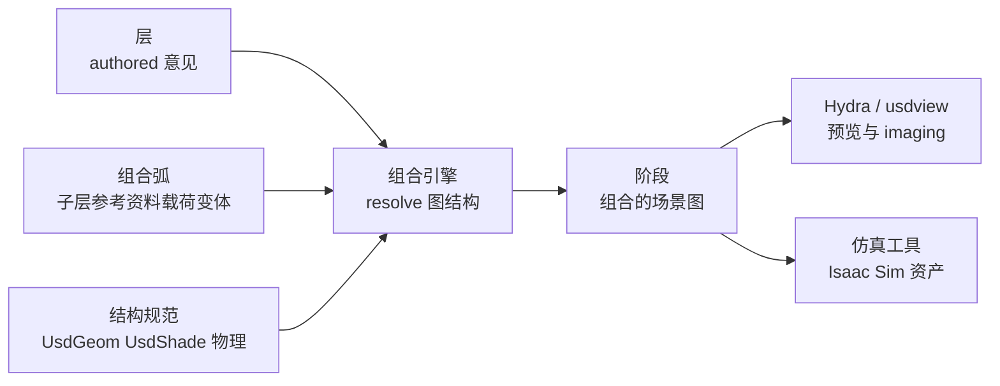

# OpenUSD 场景组合

[[OpenUSD]] 的核心学习入口不是“USD 是哪种文件后缀”，而是场景描述（场景描述）如何被模式化、组合、覆写、查询和作者。[[openusd-introduction|Introduction 到 USD]] 把 USD 定位为单一场景图 + 组合引擎 + 模式 + 工具集的组合：它让基础资产可以组成集合、场景、镜头和世界，并且允许在更强的层中非破坏性地编辑作为覆盖。[[isaac-sim-asset-structure|Isaac Sim Asset Structure]] 则展示这个思想在机器人学资产制作中如何落到层、载荷、引用和变体。[[nvidia-ovrtx|NVIDIA ovrtx]] 补充了传感器仿真侧的官方示例：应用可以用行内根部层子层原始场景，并在不改来源资产的情况下作者相机、`RenderProduct`、`RenderVar`、语义标签或 non-视觉材质标签。

证据边界：当前 OpenUSD 来源是官方 Introduction，不是 glossary 或 API 参考基准。它足够支持 `Stage`、`Prim`、`Layer`、模式、组合弧、Hydra、扩展点和 USD 边界的入门级机制解释；但 `LayerStack`、价值分辨率、LIVRPS strength 顺序、列表编辑和命名空间编辑的精确定义仍需要后续收录 `glossary.html` / tutorials。

## 数学结构

可以把 OpenUSD 的高层功能抽象成一个场景描述分辨率系统：

$$
S = \operatorname{Resolve}(L, C, \Sigma)
$$

其中 $L=\{L_1,\dots,L_n\}$ 是 authored 层（保存图元 specs、属性 specs、元数据和组合弧的层集合），$C$ 是组合弧 / strength 顺序（怎样技术栈、参考基准、载荷、变体、inherit 或 specialize），$\Sigma$ 是模式 vocabulary（例如 `UsdGeom`、`UsdShade`、光照、物理等域模式），$S$ 是最终被 `Stage` 暴露的组合的场景描述。变量含义要分清：层保存 authored 意见；组合引擎负责 resolve；阶段是 resolved 结果的运行时场景图视角。

USD 数据模型的局部结构可以写成：

$$
P_i = (N_i, A_i, R_i, M_i)
$$

其中 $P_i$ 是一个图元（场景图节点），$N_i$ 是 child 图元命名空间，$A_i$ 是属性（带类型的值，可随时间变化的），$R_i$ 是关系（指向其他场景物体的目标），$M_i$ 是元数据。来源明确说明 USD 用分层命名空间的 `Prim` 组织数据；属性和关系合称属性；图元与内容被组织到层中。

在机器人学 / 仿真资产中，这个抽象会变成更具体的资产图结构：

$$
R = \operatorname{Compose}(L_{\text{geom}}, L_{\text{mat}}, L_{\text{physics}}, L_{\text{runtime}}, L_{\text{feature}}, V)
$$

其中 $L_{\text{geom}}$ 保存网格 / 几何数据，$L_{\text{mat}}$ 保存材质，$L_{\text{physics}}$ 保存中性物理，$L_{\text{runtime}}$ 保存 PhysX / MuJoCo 这类引擎特定的调优，$L_{\text{feature}}$ 保存控制 / ROS / 夹爪特征载荷，$V$ 是变体集。[[IsaacSimAssetStructure]] 的例子说明这些职责不应该混成单体化的 USD，而应该放在职责清晰的层中。

```mermaid
flowchart LR
  L["层<br/>authored 意见"] --> CE["组合引擎<br/>resolve 图结构"]
  A["组合弧<br/>子层参考资料载荷变体"] --> CE
  S["结构规范<br/>UsdGeom UsdShade 物理"] --> CE
  CE --> ST["阶段<br/>组合的场景图"]
  ST --> H["Hydra / usdview<br/>预览与 imaging"]
  ST --> SIM["仿真工具<br/>Isaac Sim 资产"]
```

这张图表达的是有来源支持的机制：层保存 authored 场景描述，组合弧描述组合与覆写关系，模式给图元/属性语义，阶段暴露 resolved 场景图，Hydra / DCC / 仿真器再消费这个组合的结果。

### 组合弧

当前来源明确介绍了六类组合行为：

| 弧 / 机制 | 作用 | 直觉 |
| --- | --- | --- |
| 子层 | 技术栈层，并按 strength 顺序 resolve | 多个作者或部门各写自己的层，最终组合成一个资产 / 场景 |
| 引用 | 把另一个层或同一层中目标图元的 subtree 组合进 referencing 图元 | 装配基础资产成 aggregates / 场景 |
| 载荷 | deferred 参考基准，可在阶段打开后选择负载 / unload | 管理 working 设置，只加载当前任务需要的场景部件 |
| VariantSets | 在一个软件包中暴露多种资产 variations，下游可用更强的层切换 selector | 非破坏式选择不同外观、配置或运行时设置 |
| inherits | 派生的图元接收基座图元的覆盖，适合质量编辑 | 给一类图元 / 资产做统一修改 |
| specializes | 派生的图元是基座的专门的细化 | 表达更稳定的专门的回退方案 / 细化关系 |

## 直觉

OpenUSD 解决的是大型 3D 流程的两个长期问题。第一，多个工具和 teams 都在生产场景数据，如果每个工具都只输出自己的封闭格式，交换、审查和 reuse 会变成 brittle 转换 chain。USD 用低层数据模型加高层模式给网格、变换、材质、光照、物理等概念建立共享表达。第二，一个场景或机器人资产通常不是单一作者、单一文件、单一用途；组合让不同 workstreams 可以把自己的 contribution 保存在独立层，再组合成一个可检查的最终场景。

Composition 的要点是“强层的 opinion 可以统一地覆盖弱层”，无论弱内容是 subLayered、引用的还是 inherited。来源列出更强的层可以添加/停用/重排图元、修改变体、覆盖元数据、添加属性、覆盖属性、阻断属性值、修改关系 / connection 目标等。学习时不要把 USD 想成导入/导出，而要把它想成一个可组合的、可覆写的 authored-opinion 图结构。

对机器人学来说，这个直觉尤其重要。一个机器人资产同时有网格、材质、碰撞体、关节、质量、传感器、控制器、ROS 集成、PhysX 调优、MuJoCo 调优等语义。如果这些都写进一个文件，后续很难判断一个行为变更来自视觉几何、碰撞近似、中性物理还是运行时特定的调优。[[IsaacSimAssetStructure]] 把这些职责拆成层，本质上就是在仿真资产里应用 OpenUSD 场景组合的工程原则。[[nvidia-ovrtx|ovrtx]] 的传感器配置进一步说明，渲染/传感器输出本身也应被作者成组合层：`RenderProduct` 用关系连接传感器图元和 `RenderVar`，渲染场景与设备 pinning 作者在 RenderProduct 上，语义/non-视觉标签可以通过覆盖层加到现有场景。

Hydra 的位置也要放对：它不是组合引擎，而是 USD 分布中的 imaging 框架。它把场景 delegates 和渲染 delegates 连接起来，让 `usdview` 与第三方插件可以用组合的 USD 场景做预览、渲染和动画 streaming。对学习者来说，Hydra 是“我如何看见组合的结果”的通道，不是“这个结果如何被 resolve”的规则。

## 失效情形

- 文件格式减少：只把 USD 当成 `.usd` / `.usda` / `.usdc` 文件格式，忽略模式和组合，最后只能得到更复杂的交换文件，而不是可组合的资产系统。
- 模式歧义：不同工具对同一个图元/属性语义理解不一致，交换看似成功，但下游渲染器、仿真器或验证工具读到的含义不同。
- 命名空间脆弱性：USD 使用 textual 分层命名空间，而不是 GUID；当引用的资产的内部命名空间改变时，更高层覆盖可能 fall off。来源明确把这列为 USD 的边界条件。
- 骨骼绑定 overreach：USD 的场景图是轻量制作 / 组合的数据 extraction 基底，不是高性能骨骼绑定系统；把骨骼绑定运行时行为直接塞进 USD 会损害交换。
- Working-设置 collapse：载荷的价值是 deferred loading；如果所有密集型资产都无条件参考基准/负载，阶段可以表达场景，但交互式工作流和内存 footprint 会恶化。
- 单体化的资产漂移：机器人学资产把网格、材质、碰撞体、物理和运行时调优混写，后续重新导入、引擎切换或 regression 调试难以定位来源的变更。这个失效情形已在 [[IsaacSimAssetStructure]] 中具体化。
- Composition overconfidence：组合能组织资产假设，但不能证明物理运行时与真实世界一致；仿真到现实迁移仍需要 [[SimulationRealityGap]] 层面的验证。
- Glossary overreach：当前 Introduction 支持入门机制，但不能替代 glossary / API 参考基准；对 `LayerStack`、价值分辨率、列表编辑、命名空间编辑和 LIVRPS strength 顺序的精确定义应等后续收录。

## 实践含义

学习 OpenUSD 时，先把问题分成三层：数据语义、组合结构、使用方行为。数据语义问“这个场景 element 是什么”；组合结构问“它来自哪里、怎么被组合和覆写”；使用方行为问“渲染器、DCC 工具或仿真器最终如何解释它”。

| 学习问题 | 当前知识库入口 | 证据状态 |
| --- | --- | --- |
| OpenUSD 的官方定位是什么？ | [[openusd-introduction]], [[OpenUSD]] | 有来源支持的 |
| 阶段 / 图元 / 层的基本关系是什么？ | [[OpenUSDSceneComposition]], [[openusd-introduction]] | 有来源支持的入门层级 |
| 为什么组合是核心能力？ | [[OpenUSDSceneComposition]], [[IsaacSimAssetStructure]] | 有来源支持的；精确定义待 glossary |
| Hydra 在 USD 里负责什么？ | [[openusd-introduction]] | 有来源支持的 |
| 机器人学资产为什么要拆层？ | [[IsaacSimAssetStructure]] | 有来源支持的 |
| USD 物理模式和 Isaac Sim 运行时调优怎么衔接？ | [[IsaacSimAssetStructure]], [[SimulationRealityGap]] | 部分有来源支持的；需要补充 OpenUSD 物理 / Isaac 文档 |
| OpenUSD 场景如何变成传感器输出？ | [[nvidia-ovrtx]], [[RTXSensorSimulationPipeline]] | 有来源支持的在 SDK/API 契约层级 |

相关页面：[[OpenUSD]]、[[IsaacSimAssetStructure]]、[[RTXSensorSimulationPipeline]]、[[IsaacSim]]、[[SimulationRealityGap]]。
