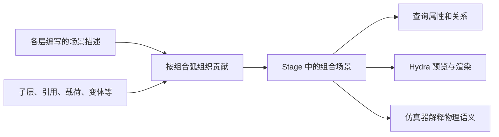

# OpenUSD Composition

[[sources/openusd-introduction|OpenUSD]] 用共享数据模型和组合规则组织场景。不同作者把几何、材质、物理或传感器配置写在独立层中，应用再通过 `Stage` 访问组合结果；较强的编写意见可以覆写较弱意见，不必修改原始资产。它不仅是一组文件后缀。[[openusd-introduction|OpenUSD 官方介绍]]、[[learn-openusd-prim-composition|图元组合教程]]

本页依据已收录的官方介绍、Learn OpenUSD 教程、术语表、Isaac Sim 资产结构与 ovrtx 来源页整理。它解释入门机制，不替代完整组合强度规则、列表编辑、命名空间编辑或载荷加载的操作参考；本次编辑没有重新核验全部官方文档。

## 层中的描述与场景中的结果

| 对象 | 含义 | 阅读时要区分什么 |
| --- | --- | --- |
| `Layer` | 保存图元规范、属性和元数据的场景描述容器 | 可以只写增量，不必包含完整场景 |
| `PrimSpec` | 某个层内对图元的描述 | 尚未组合；同一最终图元可以汇集多个规范 |
| 编写意见（Opinion） | 某层对值或元数据的贡献 | 文件中看到的值未必是最终生效值 |
| `Prim` | 组合场景中的图元，组织子图元与属性 | 命名空间层级不等于仿真器的物理拓扑 |
| `Attribute` 与 `Relationship` | 前者保存有类型的默认值或时间采样值；后者指向命名空间目标 | 两者同属图元属性，但数值与关系的含义不同 |
| `LayerStack` | 根层及递归子层按强度组成的层栈 | 不等同于一个文件 |
| `Stage` | 组合后的场景视图 | 打开一个根文件，可以得到由许多层和资产共同构成的场景 |

组合先建立图元贡献的组织关系，属性求值再按有序贡献确定最终值；两者不是同一步。模式（Schema）为网格、变换、材质、灯光或物理等对象规定语义。[[openusd-glossary|OpenUSD 术语与概念]]、[[learn-openusd-stage|场景教程]]

```mermaid
flowchart LR
  L[各层编写的场景描述] --> C[按组合弧组织贡献]
  A[子层、引用、载荷、变体等] --> C
  C --> S[Stage 中的组合场景]
  S --> V[查询属性和关系]
  S --> H[Hydra 预览与渲染]
  S --> P[仿真器解释物理语义]
```

图表示数据怎样被组织和使用。Hydra 是成像框架，连接场景与渲染委托；它消费组合后的场景，不负责决定组合强度规则。[[openusd-introduction|OpenUSD 官方介绍]]

## 常见组合机制

| 机制 | 作用 |
| --- | --- |
| 子层 | 将多个层组成按强度排序的层栈，便于各自维护不同贡献 |
| 引用 | 把目标图元的子树组合到引用它的图元中，用于资产装配 |
| 载荷 | 支持延迟加载的组合内容，可按工作需求加载或卸载 |
| 变体集 `VariantSets` | 在同一资产中组织可选配置，下游选择外观或功能等变体 |
| 继承 `inherits` | 让多个派生图元接受基础图元的共同描述，便于批量修改 |
| 特化 `specializes` | 表达派生图元对基础描述的专门化与回退关系 |

这张表概括已收录介绍中的作用，不给出所有组合弧之间的完整优先级。具体操作需查相应教程与 API。[[openusd-introduction|官方介绍]]、[[openusd-glossary|术语表]]

## 机器人资产为什么要分层

同一机器人既有网格和材质，也有碰撞体、质量、关节、传感器、控制器及引擎专用参数。将它们分层，能追踪行为变化究竟来自几何、中性物理还是 PhysX／MuJoCo 调优。[[IsaacSimAssetStructure|Isaac Sim 资产结构 3.0]] 展开具体文件职责。

传感器配置也可以作为增量加入既有场景。[[nvidia-ovrtx|ovrtx]] 用行内 USDA 层、引用和关系添加传感器、`RenderProduct`、`RenderVar` 与标签；具体执行和输出契约见 [[RTXSensorSimulationPipeline|ovrtx 的 RTX 传感器流程]]。资产组合能组织这些假设，不能单独保证物理或传感器与现实一致。

## 常见误解与检查方法

- **把场景等同文件。** `.usda`、`.usdc` 和 `.usdz` 解决编码与交付问题；组合场景可能跨多个文件。格式入门见 [[learn-openusd-file-formats|文件格式教程]]，文本语法见 [[USDAFileSyntax|USDA 文件语法]]。
- **只检查某层的值。** 修改后没有生效时，要查最终组合结果及更强意见，不能只看被编辑文件。
- **重命名后认为覆写会自动跟随。** USD 使用文本命名空间而非 GUID；资产内部路径改变可能使上层覆写失去目标。[[openusd-introduction|官方介绍]]
- **把组合规则当作使用方语义。** 同一属性被正确组合，不代表所有渲染器或仿真器都支持它；模式、插件和后端版本仍需匹配。
- **无条件加载全部重资产。** 载荷允许控制工作集；忽略加载策略会失去这项组织能力。
- **把 USD 当作完整骨骼绑定执行系统。** 官方介绍将其定位为场景制作、组合和数据提取基础，并明确其边界。[[openusd-introduction|官方介绍]]

读一个资产时依次问：它描述什么、描述来自哪个层、最终由谁解释。相关入口：[[sources/openusd-introduction|OpenUSD]]、[[IsaacSimLegacyAssetStructure|旧版资产结构]]、[[SimulationRealityGap|Sim-to-Real Gap]]。

## 研究归属

[[topics/assets-and-world-generation|3D 资产与场景]] · [[topics/asset-representation|3D 资产格式]]。
