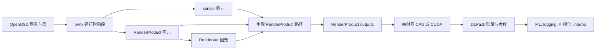

# RTX 传感器仿真流程

RTX 传感器仿真流程是 [[Ovrtx|ovrtx]] 来源中体现出的 application 契约：用 [[OpenUSD]] 阶段表达场景、传感器图元、`RenderProduct` 和 `RenderVar`，由渲染器在步骤中推进传感器仿真，再把输出映射为 CPU/CUDA DLPack 张量。这个流程把“场景怎么被组合”“哪个传感器被渲染”“输出哪些变量”“数据在哪个设备上被消费”拆成可检查的接口，而不是把传感器仿真当成不透明的 screenshot。

## 数学结构

可以把 ovrtx 运行时阶段写成：

$$
S_t = \operatorname{Compose}(L_{\text{root}}, L_{\text{inline}}, R_{\text{refs}}, A_t)
$$

其中 $S_t$ 是当前运行时阶段，$L_{\text{root}}$ 是根部 USD 层，$L_{\text{inline}}$ 是应用为了添加相机、`RenderProduct`、`RenderVar`、语义标签或 non-视觉材质标签而写入的行内 USDA 层，$R_{\text{refs}}$ 是后续添加的 removable 引用，$A_t$ 是通过属性 writes / 映射写入的运行时属性状态。这个式子不是代码仓库中的原始公式，而是对来源 API 的结构化表达。

一个 `RenderProduct` 可以抽象为：

$$
r_j = (c_j, V_j, q_j, d_j)
$$

其中 $c_j$ 是 `rel camera` 指向的传感器图元路径（相机、lidar、radar 等），$V_j = \{v_{j1}, \dots, v_{jm}\}$ 是 `rel orderedVars` 指向的 `RenderVar` 集合，$q_j$ 是分辨率、渲染模式、渲染场景、warm-up 状态等质量/性能 controls，$d_j$ 是可选的 `deviceIds` allow-列表。变量名里 `camera` 是 USD 关系名称；来源明确说这个关系也用于 lidar/radar 等传感器图元。

一次传感器步骤可以写成：

$$
Y_t = \operatorname{Step}_{\theta}(S_t, R, \Delta t), \quad R=\{r_1,\dots,r_n\}
$$

其中 $\theta$ 是渲染器配置和 Omniverse RTX 运行时状态，$R$ 是本次传给 `step` 的 RenderProduct 路径设置，$\Delta t$ 是传感器仿真时间步，$Y_t$ 是每个 RenderProduct 的帧输出。来源的关键约束是：调用 `step` 时传 RenderProduct 路径，不传传感器路径；未包含在本次设置里的 RenderProduct 会丢弃 accumulated 传感器渲染历史。

每个渲染变量输出的数据结构可以抽象为：

$$
y_{j,k} = (\text{name}, \text{type}, \text{version}, \mathcal{T}, \mathcal{P})
$$

其中 $\mathcal{T}$ 是具名的张量集合，$\mathcal{P}$ 是 CPU-驻留的参数集合。每个张量 $T_i=(n_i, s_i, \tau_i, dev_i, ptr_i)$，分别表示通道名称、形状、数据类型、设备和 DLPack 数据指针。相机输出通常是单张量，例如 `LdrColor` 的形状是 $(H,W,4)$；lidar/radar `PointCloud` 是复合的输出，例如 `Coordinates`、`Intensity` 或 `RCS`、`RadialVelocityMs`、`Counts`、`Flags` 等具名的张量。

## 直觉

这个流程的直觉是把传感器仿真分成制作契约和数据契约。制作契约在 USD 里：传感器图元定义传感器，`RenderProduct` 定义这次要从哪个传感器产生输出，`RenderVar` 定义要哪些输出变量。数据契约在 DLPack 输出里：渲染 var 输出不是 ad hoc 缓冲区，而是带 `name`、`type`、`version`、具名的张量、参数和同步提示的容器。

对机器人学来说，这种拆法重要，因为相机、lidar、radar、语义分割和材质-facing 传感器行为不应该混在一个单体化的 callback 里。Scene 作者可以用 USD 关系、行内子层和引用保持原始资产不变；application 可以按任务选择 RenderProducts、渲染模式、通道和 GPU 设备；ML 或可视化使用方再通过 DLPack 选择 CPU readback、CUDA linear 内存或图像风格 CUDA 数组 interop。

渲染模式是保真度/吞吐量的显式调节项。`Real-Time Path-Tracing` 是默认高保真路径，`PathTracing` 适合参考基准质量离线收敛，`Minimal` 适合高 FPS 强化学习、分割掩码或调试可视化。因为模式是每个 RenderProduct 属性，同一个阶段可以让不同传感器产品使用不同质量/性能点。

Scene 组合与随机化的归属要分清。ovrtx 可以把已有 USD 内容子层/参考基准/clone 到运行时阶段，也可以通过属性 write/映射改相机、轻量的、材质、变换、语义标签、RenderProduct 场景等属性；因此上层应用可以实现相机位姿、focal 长度、exposure、轻量的 intensity/旋转、材质绑定、实例变换或渲染场景随机化。当前来源没有显示内置域随机化模块，也没有高层物理物体创建 API；随机化策略与物理丰富资产制作更适合放在 env 封装、Isaac Lab 任务层、ovPhysX/Isaac Sim 或离线 USD 生成层。详见 [[ovrtx-api-boundary]]。

## 失效情形

- Sensor 路径 / RenderProduct 路径混淆：来源明确要求 `step` 接收 RenderProduct 路径；把相机/lidar/radar 图元路径直接传给 `step` 会破坏流程边界。
- 忽略 warm-up：loading 场景、重置或改变路径 tracing 场景后，纹理 streaming 与路径 tracing accumulation 会让前几帧质量不稳定；来源给出 40 warm-up 帧作为 conservative 默认。
- 变量尺寸点点云被当成 dense 数组：lidar/radar 张量的形状是 maximum extent，实际条目数由 `Counts` 给出；使用所有 allocated 条目会读到无效点或旧数据。
- `Flags` 判断过窄：valid 点/检测应检查 `Flags[i] & 0x40`，不能写成 `Flags[i] == 0x40`，因为其他传感器特定的 bits 可以同时置位。
- CUDA 映射生命周期 / 同步错误：GPU 映射带 producer event 和 stream 提示；跨 stream 或取消映射后继续读写需要显式同步或拷贝。
- USD 插件路径注册顺序错误：当 ovrtx 和其他 OpenUSD subsystem 共进程时，模式/插件路径必须在 USD 模式 registry 第一次 populate 前发布；来源中 `ovrtx_register_schema_paths` 的契约是 first-调用 wins。
- Picking 设备假设：来源的 0.3.0 局限是视口 picking 只支持运行在 CUDA-可见 GPU 0 的 RenderProduct，所以 picking 产品需要 `deviceIds = [0]`。
- C API 资源泄漏：C 路径需要显式释放结果、取消映射输出、发布状态/查询/read 结果；Python 有对象生命周期封装，但 DLPack-派生的数组仍会影响映射生命周期。
- 有来源支持的已知问题：文档把相机 `DepthSD` 的 C 端回读标为当前已知问题，因此不能默认所有 AOV 都具有同等成熟度。
- 物理制作边界混淆：ovrtx 的组合/mutation API 可以移动、复制、引用和改写阶段内容，但当前来源表面不提供刚性刚体、关节系统、可变形等高层创建辅助函数；把它当作完整物理场景 builder 会把归属放错层。
- Randomization 归属混淆：ovrtx 能执行属性层级变更，但没有发现内置域随机化调度器；回合/场景随机化应由上层策略/env/数据集生成代码管理。

## 实践含义

- 对 RL / 策略评估，ovrtx 支持把传感器保真度作为实验变量：同一场景可以用 `Minimal` 追求吞吐量，用实时/路径 tracing 追求视觉保真度，用 tiled 渲染把多相机输出合并为一个张量契约。
- 对合成数据生成，`RenderVar` 目录使 RGB、HDR、表面法向、距离、3D 位置、语义分割和 ID 映射图成为可显式请求的输出变量，而不是后处理阶段的隐式侧 effect。
- 对 lidar/radar 流程，`PointCloud` 复合的输出把坐标、signal strength、速度、timestamp/帧元数据、材质/物体 ids 和有效性 flags 放进同一个 schemaed 容器；使用方可以按通道名称而不是硬-coded struct 布局读取。
- 对仿真到现实迁移，流程只能保证传感器仿真被结构化配置和读取；真实传感器分布、材质响应、运动补偿、相机标定和硬件噪声仍需要单独验证，不能由 RTX 渲染 API 自动推出。
- 对 [[RoboticsSimulationInfrastructure]]，ovrtx 是一个官方示例：渲染器生命周期、阶段 mutation、GPU 映射、状态查询、调试 picking、选择 outlines 和智能体技能都属于仿真器可用性与 diagnosability，而不只是渲染后端。
- 对域随机化，ovrtx 更适合作为确定性执行器：上层采样随机变量，写入 USD/运行时属性，重置/warm-up/步骤，再读取传感器输出。这样可以让随机化策略、物理语义和传感器渲染契约分层管理。

相关页面：[[nvidia-ovrtx]]、[[Ovrtx]]、[[ovrtx-api-boundary]]、[[OpenUSDSceneComposition]]、[[RoboticsSimulationInfrastructure]]、[[SimulationRealityGap]]。
