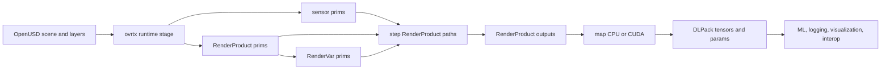

# RTX Sensor Simulation Pipeline

RTX sensor simulation pipeline 是 [[Ovrtx|ovrtx]] source 中体现出的 application contract：用 [[OpenUSD]] stage 表达 scene、sensor prim、`RenderProduct` 和 `RenderVar`，由 renderer 在 step 中推进 sensor simulation，再把 outputs 映射为 CPU/CUDA DLPack tensors。这个 pipeline 把“场景怎么被组合”“哪个 sensor 被渲染”“输出哪些变量”“数据在哪个 device 上被消费”拆成可检查的接口，而不是把 sensor simulation 当成 opaque screenshot。

## 数学结构

可以把 ovrtx runtime stage 写成：

$$
S_t = \operatorname{Compose}(L_{\text{root}}, L_{\text{inline}}, R_{\text{refs}}, A_t)
$$

其中 $S_t$ 是当前 runtime stage，$L_{\text{root}}$ 是 root USD layer，$L_{\text{inline}}$ 是应用为了添加 cameras、`RenderProduct`、`RenderVar`、semantic labels 或 non-visual material labels 而写入的 inline USDA layer，$R_{\text{refs}}$ 是后续添加的 removable references，$A_t$ 是通过 attribute writes / mappings 写入的 runtime attribute state。这个式子不是 repo 中的原始公式，而是对 source API 的结构化表达。

一个 `RenderProduct` 可以抽象为：

$$
r_j = (c_j, V_j, q_j, d_j)
$$

其中 $c_j$ 是 `rel camera` 指向的 sensor prim path（camera、lidar、radar 等），$V_j = \{v_{j1}, \dots, v_{jm}\}$ 是 `rel orderedVars` 指向的 `RenderVar` 集合，$q_j$ 是 resolution、render mode、render settings、warm-up state 等 quality/performance controls，$d_j$ 是可选的 `deviceIds` allow-list。变量名里 `camera` 是 USD relationship 名称；source 明确说这个 relationship 也用于 lidar/radar 等 sensor prim。

一次 sensor step 可以写成：

$$
Y_t = \operatorname{Step}_{\theta}(S_t, R, \Delta t), \quad R=\{r_1,\dots,r_n\}
$$

其中 $\theta$ 是 renderer configuration 和 Omniverse RTX runtime state，$R$ 是本次传给 `step` 的 RenderProduct path set，$\Delta t$ 是 sensor simulation timestep，$Y_t$ 是每个 RenderProduct 的 frame outputs。source 的关键约束是：调用 `step` 时传 RenderProduct paths，不传 sensor paths；未包含在本次 set 里的 RenderProduct 会丢弃 accumulated sensor rendering history。

每个 render variable output 的数据结构可以抽象为：

$$
y_{j,k} = (\text{name}, \text{type}, \text{version}, \mathcal{T}, \mathcal{P})
$$

其中 $\mathcal{T}$ 是 named tensors 集合，$\mathcal{P}$ 是 CPU-resident params 集合。每个 tensor $T_i=(n_i, s_i, \tau_i, dev_i, ptr_i)$，分别表示 channel name、shape、dtype、device 和 DLPack data pointer。Camera outputs 通常是单 tensor，例如 `LdrColor` 的 shape 是 $(H,W,4)$；lidar/radar `PointCloud` 是 composite output，例如 `Coordinates`、`Intensity` 或 `RCS`、`RadialVelocityMs`、`Counts`、`Flags` 等 named tensors。

## 直觉

这个 pipeline 的直觉是把 sensor simulation 分成 authoring contract 和 data contract。Authoring contract 在 USD 里：sensor prim 定义 sensor，`RenderProduct` 定义这次要从哪个 sensor 产生输出，`RenderVar` 定义要哪些 output variables。Data contract 在 DLPack output 里：render var output 不是 ad hoc buffer，而是带 `name`、`type`、`version`、named tensors、params 和 synchronization hints 的 container。

对 robotics 来说，这种拆法重要，因为 camera、lidar、radar、semantic segmentation 和 material-facing sensor behavior 不应该混在一个 monolithic callback 里。Scene author 可以用 USD relationships、inline sublayers 和 references 保持原始 asset 不变；application 可以按任务选择 RenderProducts、render modes、channels 和 GPU device；ML 或 visualization consumer 再通过 DLPack 选择 CPU readback、CUDA linear memory 或 image-style CUDA array interop。

Render mode 是 fidelity/throughput 的显式 knob。`Real-Time Path-Tracing` 是默认高保真路径，`PathTracing` 适合 reference-quality offline convergence，`Minimal` 适合高 FPS reinforcement learning、segmentation mask 或 debug visualization。因为 mode 是 per-RenderProduct attribute，同一个 stage 可以让不同 sensor products 使用不同 quality/performance point。

Scene composition 与 randomization 的 ownership 要分清。ovrtx 可以把已有 USD content sublayer/reference/clone 到 runtime stage，也可以通过 attribute write/mapping 改 camera、light、material、transform、semantic label、RenderProduct settings 等属性；因此上层应用可以实现 camera pose、focal length、exposure、light intensity/rotation、material binding、instance transform 或 render setting randomization。当前 source 没有显示内置 domain randomization module，也没有 high-level physics object creation API；randomization policy 与 physics-rich asset authoring 更适合放在 env wrapper、Isaac Lab task layer、ovPhysX/Isaac Sim 或 offline USD generation layer。详见 [[ovrtx-api-boundary]]。

## Failure Modes

- Sensor path / RenderProduct path 混淆：source 明确要求 `step` 接收 RenderProduct paths；把 camera/lidar/radar prim path 直接传给 `step` 会破坏 pipeline boundary。
- 忽略 warm-up：loading scene、reset 或改变 path tracing settings 后，texture streaming 与 path tracing accumulation 会让前几帧质量不稳定；source 给出 40 warm-up frames 作为 conservative default。
- Variable-size point cloud 被当成 dense array：lidar/radar tensors 的 shape 是 maximum extent，实际条目数由 `Counts` 给出；使用所有 allocated entries 会读到无效点或旧数据。
- `Flags` 判断过窄：valid point/detection 应检查 `Flags[i] & 0x40`，不能写成 `Flags[i] == 0x40`，因为其他 sensor-specific bits 可以同时置位。
- CUDA mapping lifetime / synchronization 错误：GPU mappings 带 producer event 和 stream hints；跨 stream 或 unmap 后继续读写需要显式同步或拷贝。
- USD plugin path 注册顺序错误：当 ovrtx 和其他 OpenUSD subsystem 共进程时，schema/plugin paths 必须在 USD schema registry 第一次 populate 前发布；source 中 `ovrtx_register_schema_paths` 的 contract 是 first-call wins。
- Picking device assumption：source 的 0.3.0 limitation 是 viewport picking 只支持运行在 CUDA-visible GPU 0 的 RenderProduct，所以 picking product 需要 `deviceIds = [0]`。
- C API resource leaks：C path 需要显式 destroy results、unmap outputs、release statuses/query/read results；Python 有对象 lifetime wrapper，但 DLPack-derived arrays 仍会影响 mapping lifetime。
- Source-backed known issue：camera `DepthSD` 在 docs 中标注当前 C readback known issue，不能把所有 AOVs 都默认视为同等成熟。
- Physics authoring boundary 混淆：ovrtx 的 composition/mutation API 可以移动、复制、引用和改写 stage content，但当前 source surface 不提供 rigid body、articulation、deformable 等 high-level creation helpers；把它当作 full physics scene builder 会把 ownership 放错层。
- Randomization ownership 混淆：ovrtx 能执行 attribute-level changes，但没有发现 built-in domain randomization scheduler；episode/scene randomization 应由上层 policy/env/dataset generation code 管理。

## 实践含义

- 对 RL / policy evaluation，ovrtx 支持把 sensor fidelity 作为 experiment variable：同一 scene 可以用 `Minimal` 追求 throughput，用 real-time/path tracing 追求 visual fidelity，用 tiled rendering 把多 camera output 合并为一个 tensor contract。
- 对 synthetic data generation，`RenderVar` catalog 使 RGB、HDR、surface normal、distance、3D position、semantic segmentation 和 ID map 成为可显式请求的 output variables，而不是后处理阶段的隐式 side effect。
- 对 lidar/radar pipelines，`PointCloud` composite output 把 coordinates、signal strength、velocity、timestamp/frame metadata、material/object ids 和 validity flags 放进同一个 schemaed container；consumer 可以按 channel name 而不是 hard-coded struct layout 读取。
- 对 sim-to-real，pipeline 只能保证 sensor simulation 被结构化配置和读取；真实 sensor distribution、material response、motion compensation、camera calibration 和 hardware noise 仍需要单独 validation，不能由 RTX rendering API 自动推出。
- 对 [[RoboticsSimulationInfrastructure]]，ovrtx 是一个 official example：renderer lifecycle、stage mutation、GPU mapping、status queries、debug picking、selection outlines 和 agent skills 都属于 simulator usability 与 diagnosability，而不只是 rendering backend。
- 对 domain randomization，ovrtx 更适合作为 deterministic executor：上层采样随机变量，写入 USD/runtime attributes，reset/warm-up/step，再读取 sensor outputs。这样可以让随机化策略、physics semantics 和 sensor-rendering contract 分层管理。

相关页面：[[nvidia-ovrtx]]、[[Ovrtx]]、[[ovrtx-api-boundary]]、[[OpenUSDSceneComposition]]、[[RoboticsSimulationInfrastructure]]、[[SimulationRealityGap]]。
