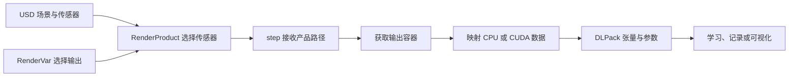

# ovrtx 的 RTX 传感器仿真流程

本页解释 [[nvidia-ovrtx|ovrtx]] 已归档 `0.3.0` 预发布版本的接口：以 OpenUSD 场景配置传感器，通过 `RenderProduct` 请求输出，再映射为 CPU／CUDA 上的 DLPack 张量。它是具体 SDK 的机制页，不代表所有 RTX 传感器系统共有同一 API。第二轮在固定提交 `29d11037fbcaed0f0f53e7f32d17bd0486fd453b` 上静态核对了步进、映射、DLPack 与释放的关键包装代码；没有运行 GPU 示例，也没有审计二进制传感器实现。

## 场景配置怎样变成输出

| 对象 | 职责 |
| --- | --- |
| 运行中的 USD 场景 | 由根层、行内 USDA 子层和后续引用组织；应用可写入或映射属性 |
| 传感器图元 | 描述相机、激光雷达或雷达 |
| `RenderProduct` | 通过 `rel camera` 指向传感器，以 `rel orderedVars` 指定输出变量；还配置分辨率、渲染模式、场景和可选 `deviceIds` |
| `RenderVar` | 通过 `sourceName` 绑定渲染器输出，复合输出可选择通道 |
| 输出容器 | 保存名称、类型、版本、状态、同步提示、具名张量和 CPU 参数 |

`camera` 是关系名称，并不意味着只能连接相机。调用 `step` 要传 `RenderProduct` 路径，不能直接传传感器路径；未包含在本次请求中的产品会丢弃累积渲染历史。[[nvidia-ovrtx|ovrtx 来源页]]

```mermaid
flowchart LR
  U[USD 场景与传感器] --> P[RenderProduct 选择传感器]
  V[RenderVar 选择输出] --> P
  P --> S[step 接收产品路径]
  S --> O[获取输出容器]
  O --> M[映射 CPU 或 CUDA 数据]
  M --> D[DLPack 张量与参数]
  D --> A[学习、记录或可视化]
```

配置描述“产生什么”，输出契约描述“怎样读取”。例如 `LdrColor` 通常是形状为 $(H,W,4)$ 的张量，其中 $H,W$ 为图像高宽；激光雷达／雷达 `PointCloud` 则含 `Coordinates`、`Intensity` 或 `RCS`、`RadialVelocityMs`、`Counts`、`Flags` 等通道，不能统一当成一张稠密图像。[[nvidia-ovrtx|ovrtx 来源页]]

## 模式与场景修改

`Real-Time Path-Tracing` 是归档版本的默认高保真路径，`PathTracing` 面向逐步收敛的参考质量渲染，`Minimal` 面向高吞吐量、分割和调试。模式按产品配置，允许同一场景的不同传感器采用不同设置；这不构成跨任务性能保证。

应用可以通过场景组合与属性接口改相机位姿、焦距、曝光、灯光、材质绑定、实例变换及渲染场景。现有来源页没有记录内置域随机化调度器，也没有列出创建刚体、关节系统或可变形物体的高层辅助接口。哪些变量如何采样，应由上层环境或数据生成代码决定；详细证据边界见 [[ovrtx-api-boundary|ovrtx API 边界]]。

## 输出读取中最容易出错的地方

| 检查点 | 归档版本的接口要求或限制 |
| --- | --- |
| 预热 | 场景加载、重置或变更后需考虑纹理加载和追踪累积；既有来源记录40帧为保守默认，不能当作所有场景的收敛保证 |
| 点云长度 | 张量形状表示最大容量，实际条目数由 `Counts` 给出 |
| 有效标志 | 用 `Flags[i] & 0x40` 检查有效位；不能要求所有位恰好等于 `0x40` |
| CUDA 同步 | 本版本 DLPack 包装忽略消费者传入的 `stream`；应在实际消费流上设置 `sync_stream`、调用 `wait_on`，或 CPU 阻塞等待 |
| 资源生命周期 | C 取消映射后原始指针失效；Python 取消映射后不能创建新视图，既有消费者保活缓冲至最后引用释放；渲染器销毁仍是外层限制 |
| 插件注册 | 与其他 USD 子系统共进程时，需在模式注册表首次初始化前注册路径；`ovrtx_register_schema_paths` 首次调用生效 |
| 视口拾取 | `0.3.0` 限于 CUDA 可见设备0上的产品，相应配置为 `deviceIds = [0]` |
| 已知问题 | 来源记录相机 `DepthSD` 的 C 端回读问题，不能假定所有输出通道同样成熟 |

这些约束来自 [[nvidia-ovrtx|归档来源页]]，不推断后续版本是否仍相同。

## 同步与释放是两条不同的依赖链

**教学解释：** 假设渲染流 A 写图像、学习流 B 读图像。先要让 B 等待生产完成事件，保证读到本帧像素；B 计算结束后，还要让释放操作知道消费已完成，避免重用仍在使用的内存。DLPack 只是共享视图协议，地址与形状可用不等于上述两条依赖都已经满足。

静态核查发现，`types.py` 的 `MappedRenderVar.__dlpack__` 与具名张量包装均忽略消费者 `stream`；同步由 `map(sync_stream=...)`、`wait_on(stream)` 或 `wait()` 完成。`unmap(event=...)`／`unmap(stream=...)` 则记录消费端释放条件，第一次调用生效。Python 的 `with` 退出只是无参数 `unmap()`；需要释放同步时，应在退出前明确记录提示。代码定位与版本均见 [[nvidia-ovrtx|来源页的同步与所有权分析]]。

Python 包装在已有数组存活时延迟真正释放缓冲，因此“退出 `with` 后所有数组立即失效”也不准确。官方点云示例选择复制 CPU 数组，是把数据所有权明确交给后续代码的一种办法；既有 DLPack 视图保活和主动复制是不同的生命周期选择。该结论只适用于本次已核对的 Python 实现，不能推广为 C 原始指针的保证。

## 对机器人实验意味着什么

**工程解释：**把随机变量采样、场景写入、预热、渲染、同步与输出读取分别记录，能定位观察变化来自哪一步。属性可写并不证明整个执行过程确定；真实传感器分布、材质响应、标定、运动补偿和噪声仍需单独验证。

相关页面：[[OpenUSDSceneComposition|OpenUSD 场景组合]]、[[RoboticsSimulationInfrastructure|机器人仿真基础设施]]、[[SimulationRealityGap|仿真—现实差距]]。

## 研究归属

[[topics/assets-and-world-generation|三维资产与场景生成]] · [[topics/asset-representation|资产格式怎样保留仿真语义]]。
